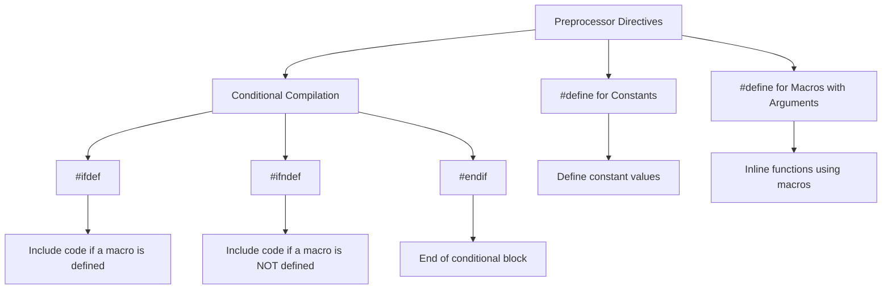

# Preprocessors and Macros in C

Preprocessor directives in C are commands that are processed before the compilation of the code begins. These directives provide instructions to the compiler, such as including files, defining constants, and conditionally compiling code.

## 1. Macros and `#define`

Macros in C are simple text replacements that allow you to define constants or create small functions using the `#define` directive. Macros are evaluated by the preprocessor before the actual compilation process.

### a. `#define` for Constants

`#define` is used to define constant values that are replaced by the preprocessor throughout the program wherever the macro name appears.

#### Syntax
```c
#define CONSTANT_NAME value
```

#### Example: Defining a Constant
```c copy
#include <stdio.h>

#define PI 3.14159  // Define a constant

int main() {
    printf("The value of PI is: %f\n", PI);
    return 0;
}
```

In this example, `PI` is a constant that is replaced with `3.14159` during preprocessing.

### b. `#define` for Macros with Arguments

Macros can also accept arguments, making them behave like inline functions. These are useful for creating short, reusable code snippets.

#### Syntax
```c
#define MACRO_NAME(parameters) expression
```

#### Example: Macro with Arguments
```c copy
#include <stdio.h>

#define SQUARE(x) (x * x)  // Define a macro with an argument

int main() {
    int num = 5;
    printf("The square of %d is: %d\n", num, SQUARE(num));
    return 0;
}
```

In this example, `SQUARE(x)` is a macro that calculates the square of `x`. When called, the preprocessor replaces `SQUARE(num)` with `(num * num)` before compilation.

## 2. Conditional Compilation

Conditional compilation allows you to compile code selectively based on certain conditions. This is useful for including or excluding parts of code depending on certain flags or conditions. Preprocessor directives like `#ifdef`, `#ifndef`, and `#endif` are used for this purpose.

### a. `#ifdef` and `#ifndef`

- `#ifdef`: Checks if a macro is defined.
- `#ifndef`: Checks if a macro is **not** defined.

These directives allow conditional inclusion of code depending on whether a macro is defined.

#### Syntax
```c
#ifdef MACRO_NAME
    // Code to compile if MACRO_NAME is defined
#endif
```

#### Example: Conditional Compilation Using `#ifdef` and `#ifndef`
```c copy
#include <stdio.h>

#define DEBUG  // Define a macro

int main() {
    #ifdef DEBUG
        printf("Debug mode is ON\n");
    #else
        printf("Debug mode is OFF\n");
    #endif

    return 0;
}
```

In this example, if `DEBUG` is defined, the program prints "Debug mode is ON". If `DEBUG` is not defined, it prints "Debug mode is OFF".

### b. `#endif`

`#endif` marks the end of a conditional block that starts with `#ifdef` or `#ifndef`.

#### Example: Using `#ifndef`
```c copy
#include <stdio.h>

#ifndef RELEASE
    #define DEBUG
#endif

int main() {
    #ifdef DEBUG
        printf("Debug mode is active\n");
    #endif

    return 0;
}
```

In this example, `DEBUG` is defined only if `RELEASE` is not defined. This is useful for having different configurations for development (`DEBUG`) and production (`RELEASE`) environments.

## Diagram for Preprocessors and Macros



## 3. Macros and Precedence

When writing macros, it's important to understand operator precedence. If not properly enclosed in parentheses, a macro could produce unexpected results.

#### Example: Common Mistake with Macros
```c copy
#define ADD(a, b) a + b

int main() {
    printf("%d\n", ADD(2, 3) * 4);  // Expected: 20, Actual: 14
    return 0;
}
```

In this case, `ADD(2, 3) * 4` becomes `2 + 3 * 4`, which evaluates to `14` instead of `20`. To avoid such issues, always use parentheses around macro arguments.

#### Correct Version
```c
#define ADD(a, b) ((a) + (b))

int main() {
    printf("%d\n", ADD(2, 3) * 4);  // Correct: 20
    return 0;
}
```

## 4. Advantages and Disadvantages of Macros

### Advantages:
- **Inline Substitution**: Macros avoid function call overhead by substituting code directly into the program.
- **Code Reusability**: Macros help reduce code duplication by providing reusable code snippets.

### Disadvantages:
- **Lack of Type Checking**: Unlike functions, macros don't perform type checking, which can lead to subtle bugs.
- **Complexity in Debugging**: Since macros are expanded by the preprocessor, debugging macro issues can be more challenging.

## Summary of Preprocessors and Macros

- **`#define`**: Used for defining constants or macros with arguments.
- **`#ifdef`**: Conditional compilation if a macro is defined.
- **`#ifndef`**: Conditional compilation if a macro is not defined.
- **`#endif`**: Marks the end of a conditional block.

### Best Practices:
- Always enclose macro arguments in parentheses to ensure correct operator precedence.
- Use conditional compilation to create separate debugging and release versions of your program.
- Minimize the use of complex macros to avoid debugging challenges.

