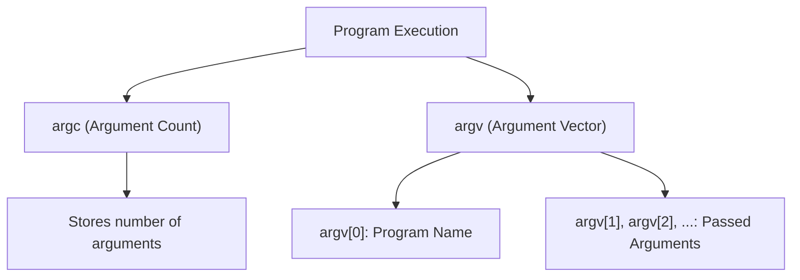

# Command Line Arguments in C

Command line arguments are parameters passed to a program when it is executed from the command line. These arguments are captured by `argc` (argument count) and `argv` (argument vector), which are parameters to the `main()` function.

## 1. Understanding `argc` and `argv`

- **`argc` (Argument Count)**: It represents the number of arguments passed to the program, including the program name.
- **`argv` (Argument Vector)**: It is an array of character pointers (strings) that holds all the arguments passed to the program.

### Syntax

```c
int main(int argc, char *argv[])
{
    // Code
}
```

- `argc` gives the number of arguments.
- `argv` is an array of pointers to strings (char pointers) representing the actual arguments passed.

### Example: Basic Program with Command Line Arguments

```c copy
#include <stdio.h>

int main(int argc, char *argv[]) {
    printf("Number of arguments: %d\n", argc);
    
    // Print all command line arguments
    for (int i = 0; i < argc; i++) {
        printf("Argument %d: %s\n", i, argv[i]);
    }
    
    return 0;
}
```

#### Output
When executed with the command:
```bash
./program arg1 arg2 arg3
```

The output will be:
```
Number of arguments: 4
Argument 0: ./program
Argument 1: arg1
Argument 2: arg2
Argument 3: arg3
```

- `argv[0]`: The name of the program (`./program`).
- `argv[1]`, `argv[2]`, and `argv[3]`: The arguments passed (`arg1`, `arg2`, `arg3`).

## 2. Handling Command Line Inputs

You can use `argc` to check how many arguments are provided, and `argv` to access them.

### Example: Checking Number of Arguments

```c copy
#include <stdio.h>

int main(int argc, char *argv[]) {
    if (argc < 2) {
        printf("No arguments passed.\n");
        return 1;  // Exit with error
    } else {
        printf("Arguments passed.\n");
    }
    
    return 0;
}
```

### Example: Using Command Line Arguments for Calculations

```c copy
#include <stdio.h>
#include <stdlib.h>  // For atoi()

int main(int argc, char *argv[]) {
    if (argc != 3) {
        printf("Usage: %s num1 num2\n", argv[0]);
        return 1;
    }

    int num1 = atoi(argv[1]);  // Convert string to integer
    int num2 = atoi(argv[2]);

    int sum = num1 + num2;
    printf("Sum: %d\n", sum);

    return 0;
}
```

#### Output
When executed with the command:
```bash
./program 5 7
```

The output will be:
```
Sum: 12
```

### Explanation:
- The program checks if exactly two numbers are passed.
- `atoi()` converts the command line argument from string to integer.
- It calculates the sum of the two numbers.

## 3. Diagram for Command Line Arguments



- `argc` stores the total count of arguments passed.
- `argv` stores the actual arguments in an array, where `argv[0]` is the program's name, and `argv[1]`, `argv[2]`, etc., store the user-passed arguments.

## 4. Accessing Command Line Arguments

Arguments are accessed using `argv[index]`, where `index` is an integer starting from 0.

- `argv[0]`: Contains the name of the program.
- `argv[1]` to `argv[argc-1]`: Contain the arguments passed by the user.

### Example: Command Line Arguments with String Inputs

```c copy
#include <stdio.h>

int main(int argc, char *argv[]) {
    if (argc != 2) {
        printf("Usage: %s <name>\n", argv[0]);
        return 1;
    }

    printf("Hello, %s!\n", argv[1]);
    return 0;
}
```

#### Output
When executed with the command:
```bash
./program John
```

The output will be:
```
Hello, John!
```

### Handling Input Errors
You can check for incorrect inputs and prompt the user to use the program correctly.

```c copy
#include <stdio.h>

int main(int argc, char *argv[]) {
    if (argc < 2) {
        printf("Error: No arguments provided.\n");
    } else if (argc > 2) {
        printf("Error: Too many arguments provided.\n");
    } else {
        printf("Argument: %s\n", argv[1]);
    }
    
    return 0;
}
```

## 5. Summary of Command Line Arguments

- **`argc`**: The count of arguments passed to the program (including the program name).
- **`argv`**: An array of strings holding the actual arguments passed.
- **Handling Inputs**: You can use `argc` and `argv` to handle different numbers of inputs and perform tasks based on the arguments.

### Best Practices:
- Always check the number of arguments (`argc`) to prevent errors.
- Use appropriate conversions when dealing with numbers (`atoi`, `atof`, etc.).
- Provide clear usage messages when incorrect arguments are passed.

