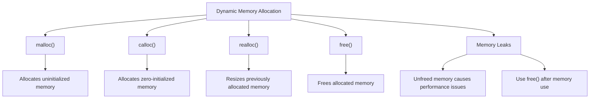

# Dynamic Memory Allocation in C

Dynamic memory allocation in C enables programs to allocate memory at runtime. This gives flexibility in memory management, unlike static memory allocation (e.g., arrays) where the size must be known at compile time.

## 1. Functions for Dynamic Memory Allocation

### a. `malloc()`

`malloc()` (memory allocation) allocates a block of memory of a specified size and returns a pointer to the beginning of the block. The memory is uninitialized.

#### Syntax
```c
void* malloc(size_t size);
```

#### Example
```c copy
#include <stdio.h>
#include <stdlib.h>

int main() {
    int *ptr;
    ptr = (int*) malloc(5 * sizeof(int));  // Allocating memory for 5 integers

    if (ptr == NULL) {
        printf("Memory allocation failed\n");
        return 1;
    }

    for (int i = 0; i < 5; i++) {
        ptr[i] = i + 1;
        printf("%d ", ptr[i]);
    }

    free(ptr); // Deallocating memory
    return 0;
}
```

### b. `calloc()`

`calloc()` (contiguous allocation) allocates memory for an array of elements and initializes all bytes to zero.

#### Syntax
```c
void* calloc(size_t num, size_t size);
```

#### Example
```c copy
#include <stdio.h>
#include <stdlib.h>

int main() {
    int *ptr;
    ptr = (int*) calloc(5, sizeof(int));  // Allocating memory for 5 integers, initialized to 0

    if (ptr == NULL) {
        printf("Memory allocation failed\n");
        return 1;
    }

    for (int i = 0; i < 5; i++) {
        printf("%d ", ptr[i]);  // All elements are initialized to 0
    }

    free(ptr); // Deallocating memory
    return 0;
}
```

### c. `realloc()`

`realloc()` (reallocate memory) is used to resize previously allocated memory blocks without losing the original data.

#### Syntax
```c
void* realloc(void* ptr, size_t new_size);
```

#### Example
```c copy
#include <stdio.h>
#include <stdlib.h>

int main() {
    int *ptr;
    ptr = (int*) malloc(5 * sizeof(int));  // Allocating memory for 5 integers

    if (ptr == NULL) {
        printf("Memory allocation failed\n");
        return 1;
    }

    for (int i = 0; i < 5; i++) {
        ptr[i] = i + 1;
    }

    // Resizing memory block to hold 10 integers
    ptr = (int*) realloc(ptr, 10 * sizeof(int));

    for (int i = 5; i < 10; i++) {
        ptr[i] = i + 1;
    }

    for (int i = 0; i < 10; i++) {
        printf("%d ", ptr[i]);
    }

    free(ptr);  // Deallocating memory
    return 0;
}
```

### d. `free()`

`free()` deallocates previously allocated memory, making it available for future use.

#### Syntax
```c
void free(void* ptr);
```

#### Example
```c copy
int* ptr = (int*) malloc(5 * sizeof(int));
// Use the allocated memory...
free(ptr); // Free the allocated memory
```

## 2. Memory Leaks and Best Practices

A **memory leak** occurs when dynamically allocated memory is not deallocated using `free()`. This can cause programs to consume increasing amounts of memory, leading to performance issues.

### a. Identifying Memory Leaks

Memory leaks often occur when:
- Memory is allocated but never freed.
- Pointers to dynamically allocated memory are overwritten without first freeing the memory.

#### Example of a Memory Leak
```c copy
int* ptr = (int*) malloc(5 * sizeof(int));
ptr = (int*) malloc(10 * sizeof(int));  // Memory leak: previous memory is lost
free(ptr);  // Only the second block is freed
```

### b. Best Practices for Memory Management

- Always match every `malloc()`, `calloc()`, and `realloc()` call with a `free()` to avoid memory leaks.
- Avoid memory leaks by ensuring that allocated memory is freed before reassigning a pointer.
- Initialize pointers to `NULL` after `free()` to prevent dangling pointers.
- Use tools like **Valgrind** to detect memory leaks during testing.

### Memory Leak Prevention Example
```c copy
int *ptr = (int*) malloc(5 * sizeof(int));
if (ptr == NULL) {
    printf("Memory allocation failed\n");
    return 1;
}

// Always free allocated memory when it's no longer needed
free(ptr);
ptr = NULL;  // Prevent dangling pointer
```

## Diagram for Dynamic Memory Allocation



## Summary of Dynamic Memory Allocation Functions

- **`malloc()`**: Allocates memory but leaves it uninitialized.
- **`calloc()`**: Allocates memory and initializes it to zero.
- **`realloc()`**: Resizes a previously allocated memory block.
- **`free()`**: Deallocates memory to avoid memory leaks.

### Best Practices:
- Always free memory after use to prevent memory leaks.
- Avoid losing pointers to dynamically allocated memory by freeing them before reassignment.
- Use debugging tools to monitor memory usage.

