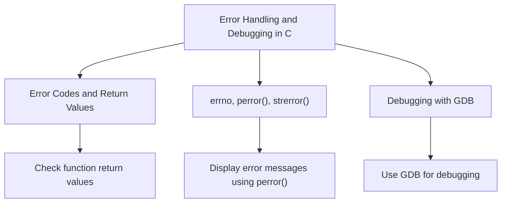

# Error Handling and Debugging in C

Error handling is a critical aspect of any robust C program. C provides several mechanisms for error handling and debugging, including return codes, `errno`, `perror()`, `strerror()`, and debugging tools like GDB.

## 1. Error Codes and Return Values

In C, functions typically indicate success or failure through return values. A function may return `0` for success and a non-zero value (often `-1`) for failure. These return values can be checked to handle errors gracefully.

### Example: Checking Return Values

```c copy
#include <stdio.h>

int divide(int a, int b) {
    if (b == 0) {
        return -1; // Error: Division by zero
    }
    return a / b;
}

int main() {
    int result = divide(10, 0);
    if (result == -1) {
        printf("Error: Division by zero\n");
    } else {
        printf("Result: %d\n", result);
    }
    return 0;
}
```

### Explanation:
- The `divide()` function returns `-1` if the denominator is zero, signaling an error.
- The error is handled by checking the return value in the `main()` function.

#### Output:
```
Error: Division by zero
```

## 2. errno, perror(), and strerror()

In addition to return values, C provides the `errno` variable, which stores error codes set by system calls and library functions when an error occurs. The `perror()` and `strerror()` functions are used to display human-readable error messages.

### Using `errno`

`errno` is a global variable that stores the error code when a function encounters an error.

```c copy
#include <stdio.h>
#include <errno.h>
#include <string.h>

int main() {
    FILE *file = fopen("non_existent_file.txt", "r");

    if (file == NULL) {
        // Print the error code and message
        printf("Error code: %d\n", errno);
        printf("Error message: %s\n", strerror(errno));
    }

    return 0;
}
```

### Explanation:
- `fopen()` fails because the file does not exist, setting `errno` to the corresponding error code.
- `strerror(errno)` returns a human-readable string describing the error.

#### Output:
```
Error code: 2
Error message: No such file or directory
```

### Using `perror()`

`perror()` is a simpler way to print an error message directly based on `errno`.

```c copy
#include <stdio.h>

int main() {
    FILE *file = fopen("non_existent_file.txt", "r");

    if (file == NULL) {
        // Print the error message using perror
        perror("File error");
    }

    return 0;
}
```

### Explanation:
- `perror()` automatically prints an error message corresponding to the current value of `errno`.

#### Output:
```
File error: No such file or directory
```

## 3. Debugging with GDB

GDB (GNU Debugger) is a powerful tool for debugging C programs. It allows you to step through your code, inspect variables, set breakpoints, and more.

### Basic GDB Commands

1. **Compile with debugging symbols**: Add the `-g` flag when compiling.
   ```bash
   gcc -g program.c -o program
   ```

2. **Start GDB**: Run GDB on your executable.
   ```bash
   gdb ./program
   ```

3. **Set a breakpoint**: Pause execution at a specific line.
   ```bash
   (gdb) break main
   ```

4. **Run the program**:
   ```bash
   (gdb) run
   ```

5. **Step through the code**: Use `next` to execute the next line of code.
   ```bash
   (gdb) next
   ```

6. **Inspect variables**: Print the value of variables.
   ```bash
   (gdb) print var_name
   ```

7. **Continue execution**: Resume program execution.
   ```bash
   (gdb) continue
   ```

8. **Quit GDB**:
   ```bash
   (gdb) quit
   ```

### Example: Using GDB to Debug a Segmentation Fault

Consider the following buggy code:

```c copy
#include <stdio.h>

int main() {
    int *ptr = NULL;
    *ptr = 10;  // Dereferencing a null pointer (causes segmentation fault)

    return 0;
}
```

### Debugging Steps:

1. **Compile the code with debugging symbols**:
   ```bash
   gcc -g segfault.c -o segfault
   ```

2. **Run the program with GDB**:
   ```bash
   gdb ./segfault
   ```

3. **Set a breakpoint at `main()`**:
   ```bash
   (gdb) break main
   ```

4. **Run the program**:
   ```bash
   (gdb) run
   ```

5. **Step through the code** using `next` and identify the line causing the segmentation fault.

6. **Inspect the value of `ptr`** to see that it is `NULL`.

#### GDB Output Example:
```
Program received signal SIGSEGV, Segmentation fault.
0x00000000004004c7 in main () at segfault.c:6
6       *ptr = 10;
(gdb) print ptr
$1 = (int *) 0x0
```

### Explanation:
- GDB shows that the segmentation fault occurred at line 6 (`*ptr = 10`).
- Inspecting `ptr` with `print ptr` reveals that `ptr` is `NULL`, which causes the crash.

## 4. Diagram for Error Handling and Debugging



## 5. Recap

- **Error Codes and Return Values**: Functions indicate success or failure with return values.
- **errno**: Stores error codes set by functions when errors occur.
- **perror() and strerror()**: Functions for printing human-readable error messages.
- **GDB**: A powerful tool for debugging C programs.

These tools and techniques provide a structured way to handle errors and debug issues in C programs, ensuring better code reliability and maintainability.

