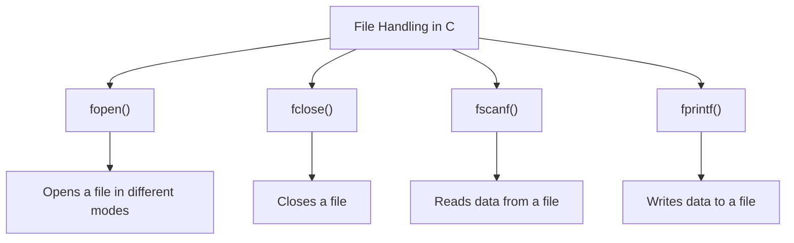

# File Handling in C

File handling in C enables programs to create, read, and write to files on disk. This allows data persistence beyond the program's runtime, facilitating the storage of large amounts of data.

## 1. Opening and Closing Files

Before performing any operations on a file, it must be opened using `fopen()`. After operations are complete, the file must be closed using `fclose()` to free resources.

### a. Opening a File (`fopen()`)

`fopen()` is used to open a file and returns a pointer to the file. If the file cannot be opened, it returns `NULL`. It takes two arguments:
- File name (as a string).
- Mode (as a string), which determines how the file is opened (read, write, append, etc.).

#### Syntax
```c
FILE *fopen(const char *filename, const char *mode);
```

#### File Opening Modes
- `"r"`: Open a file for reading (file must exist).
- `"w"`: Open a file for writing (creates file if it doesn’t exist, overwrites existing file).
- `"a"`: Open a file for appending (creates file if it doesn’t exist).
- `"r+"`: Open a file for both reading and writing.
- `"w+"`: Open a file for reading and writing (overwrites existing file).
- `"a+"`: Open a file for reading and appending.

#### Example: Opening a File
```c copy
#include <stdio.h>

int main() {
    FILE *file;
    file = fopen("example.txt", "r");  // Open file for reading

    if (file == NULL) {
        printf("File could not be opened\n");
        return 1;
    }

    // Perform file operations...

    fclose(file);  // Close the file
    return 0;
}
```

### b. Closing a File (`fclose()`)

`fclose()` is used to close an open file. It ensures that any data written to the file is saved and that system resources are released.

#### Syntax
```c
int fclose(FILE *stream);
```

#### Example: Closing a File
```c copy
fclose(file);
```

## 2. Reading and Writing to Files

C provides various functions to read from and write to files. These functions can handle formatted and unformatted data.

### a. Reading from a File (`fscanf()`)

`fscanf()` reads data from a file in a formatted manner, similar to how `scanf()` works for console input.

#### Syntax
```c
int fscanf(FILE *stream, const char *format, ...);
```

#### Example: Reading from a File
```c copy
#include <stdio.h>

int main() {
    FILE *file;
    int num;
    file = fopen("example.txt", "r");

    if (file == NULL) {
        printf("File could not be opened\n");
        return 1;
    }

    fscanf(file, "%d", &num);  // Read an integer from the file
    printf("Number from file: %d\n", num);

    fclose(file);
    return 0;
}
```

### b. Writing to a File (`fprintf()`)

`fprintf()` writes formatted output to a file, similar to how `printf()` works for console output.

#### Syntax
```c
int fprintf(FILE *stream, const char *format, ...);
```

#### Example: Writing to a File
```c copy
#include <stdio.h>

int main() {
    FILE *file;
    file = fopen("example.txt", "w");

    if (file == NULL) {
        printf("File could not be opened\n");
        return 1;
    }

    fprintf(file, "Hello, world!\n");  // Write a string to the file

    fclose(file);
    return 0;
}
```

## 3. File Handling Functions in Detail

### a. `fopen()`

`fopen()` is used to open a file. It takes two arguments: the file name and the mode (e.g., read, write).

#### Example
```c copy
FILE *file = fopen("data.txt", "r");
```

### b. `fclose()`

`fclose()` is used to close an open file, ensuring that any data in memory is written to disk and that resources are freed.

#### Example
```c copy
fclose(file);
```

### c. `fscanf()`

`fscanf()` is used to read data from a file in a formatted manner. It takes a file pointer and a format string as arguments.

#### Example
```c copy
int value;
fscanf(file, "%d", &value);  // Reads an integer from the file
```

### d. `fprintf()`

`fprintf()` is used to write formatted data to a file. It takes a file pointer and a format string as arguments.

#### Example
```c copy
fprintf(file, "%s", "Data to write");  // Writes a string to the file
```

## Diagram for File Handling in C



## 4. Error Handling

When working with files, it’s crucial to handle errors, such as failure to open a file or unexpected end-of-file conditions. Always check if the file pointer returned by `fopen()` is `NULL`.

#### Example: Error Handling
```c
FILE *file = fopen("nonexistent.txt", "r");
if (file == NULL) {
    printf("File could not be opened\n");
}
```

## Summary of File Handling Functions

- **`fopen()`**: Opens a file in specified mode (`r`, `w`, `a`, etc.).
- **`fclose()`**: Closes an open file, releasing resources.
- **`fscanf()`**: Reads formatted input from a file.
- **`fprintf()`**: Writes formatted output to a file.

### Best Practices:
- Always check if `fopen()` returns `NULL` before performing file operations.
- Always call `fclose()` to release resources after file operations.
- Use proper format specifiers when using `fscanf()` and `fprintf()` to avoid data corruption.

