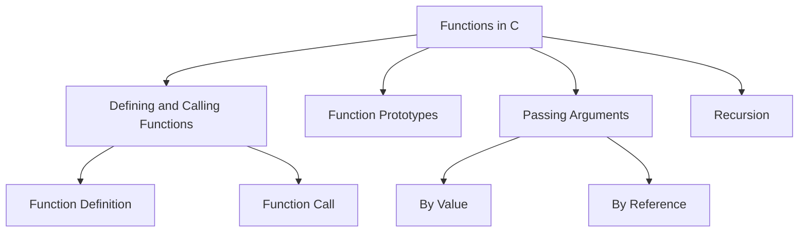

# Functions in C

Functions are essential in C programming as they allow you to modularize your code, making it easier to read, maintain, and reuse. They encapsulate a set of instructions that can be executed whenever needed.

## 1. Defining and Calling Functions

### a. Defining a Function

A function in C is defined with a specific syntax that includes the return type, function name, parameters (if any), and the function body.

#### Syntax
```c
return_type function_name(parameter_type parameter_name) {
    // code to be executed
    return value; // if return_type is not void
}
```

#### Example
```c copy
#include <stdio.h>

// Function definition
int add(int a, int b) {
    return a + b;
}

int main() {
    int sum = add(5, 10); // Function call
    printf("Sum: %d\n", sum);
    return 0;
}
```

### b. Calling a Function

To call a function, simply use its name followed by parentheses containing any arguments required.

#### Example
```c copy
int result = add(5, 10); // Calling the add function
```

## 2. Function Prototypes

A function prototype declares a function before its actual definition, allowing you to call the function before defining it.

#### Syntax
```c
return_type function_name(parameter_type parameter_name);
```

#### Example
```c copy
#include <stdio.h>

// Function prototype
int add(int a, int b);

int main() {
    int sum = add(5, 10);
    printf("Sum: %d\n", sum);
    return 0;
}

// Function definition
int add(int a, int b) {
    return a + b;
}
```

## 3. Passing Arguments

In C, you can pass arguments to functions in two main ways: by value and by reference.

### a. Passing Arguments by Value

When you pass arguments by value, a copy of the variable is made, and any modifications inside the function do not affect the original variable.

#### Example
```c copy
#include <stdio.h>

void modifyValue(int x) {
    x = x + 10; // Modifies only the local copy
}

int main() {
    int a = 5;
    modifyValue(a);
    printf("Value of a: %d\n", a); // Output: 5
    return 0;
}
```

### b. Passing Arguments by Reference

When you pass arguments by reference, you pass the address of the variable, allowing the function to modify the original variable.

#### Example
```c copy
#include <stdio.h>

void modifyValue(int *x) {
    *x = *x + 10; // Modifies the original variable
}

int main() {
    int a = 5;
    modifyValue(&a); // Pass the address of a
    printf("Value of a: %d\n", a); // Output: 15
    return 0;
}
```

## 4. Recursion in C

Recursion is a technique where a function calls itself to solve a smaller instance of the same problem. Recursive functions must have a base case to avoid infinite recursion.

### Example
```c copy
#include <stdio.h>

// Function to calculate factorial using recursion
int factorial(int n) {
    if (n == 0) // Base case
        return 1;
    else
        return n * factorial(n - 1); // Recursive call
}

int main() {
    int num = 5;
    printf("Factorial of %d: %d\n", num, factorial(num));
    return 0;
}
```

## Diagram of Functions in C



## Summary of Functions in C

- **Defining and Calling Functions**: Functions are defined with a return type, name, parameters, and body. They can be called by using their name and passing the required arguments.
- **Function Prototypes**: Allow the function to be declared before its definition, enabling calls to the function before its implementation.
- **Passing Arguments**: Can be done by value (copying the variable) or by reference (passing the variable's address).
- **Recursion**: A method where a function calls itself to solve problems, requiring a base case to prevent infinite calls.

Understanding functions is crucial for organizing code and enabling code reuse in C programming.


### Key Points:
- Functions allow modular code organization.
- Prototypes help with early function calls.
- Arguments can be passed by value or reference.
- Recursion simplifies solving problems by breaking them into smaller parts.

