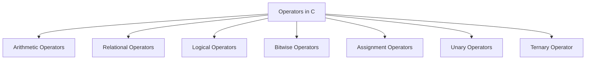

# Operators in C

Operators are special symbols in C that perform operations on variables and values. C provides a rich set of operators to handle arithmetic, logical, bitwise, and other operations.

## 1. Types of Operators

C operators can be classified into several categories based on their functionality:

### a. **Arithmetic Operators**

These operators are used to perform basic mathematical operations.

| Operator | Description           | Example          |
|----------|-----------------------|-------------------|
| `+`      | Addition              | `a + b`           |
| `-`      | Subtraction           | `a - b`           |
| `*`      | Multiplication        | `a * b`           |
| `/`      | Division              | `a / b`           |
| `%`      | Modulus (Remainder)   | `a % b`           |

**Example:**
```c
int a = 10, b = 3;
int sum = a + b;       // 13
int diff = a - b;      // 7
int product = a * b;   // 30
int quotient = a / b;  // 3
int remainder = a % b; // 1
```

### b. **Relational Operators**

These operators are used to compare two values.

| Operator | Description           | Example        |
|----------|-----------------------|-----------------|
| `==`     | Equal to              | `a == b`       |
| `!=`     | Not equal to          | `a != b`       |
| `>`      | Greater than          | `a > b`        |
| `<`      | Less than             | `a < b`        |
| `>=`     | Greater than or equal | `a >= b`       |
| `<=`     | Less than or equal    | `a <= b`       |

**Example:**
```c
if (a > b) {
    printf("a is greater than b");
}
```

### c. **Logical Operators**

Logical operators are used to combine multiple conditions.

| Operator | Description              | Example             |
|----------|---------------------------|----------------------|
| `&&`     | Logical AND               | `(a > b && b > c)` |
| `\|\|`     | Logical OR                | `(a > b \|\| b > c)` |
| `!`      | Logical NOT               | `!(a > b)`           |

**Example:**
```c
if (a > b && b > c) {
    printf("Both conditions are true");
}
```

### d. **Bitwise Operators**

These operators perform operations on bits and are used for low-level programming.

| Operator | Description            | Example      |
|----------|------------------------|--------------|
| `&`      | Bitwise AND            | `a & b`      |
| `\|`      | Bitwise OR             | `a \| b`      |
| `^`      | Bitwise XOR            | `a ^ b`      |
| `~`      | Bitwise NOT            | `~a`         |
| `<<`     | Left Shift             | `a << 1`     |
| `>>`     | Right Shift            | `a >> 1`     |

**Example:**
```c
int x = 5;  // (Binary: 0101)
int y = 3;  // (Binary: 0011)
int andResult = x & y; // (Binary: 0001) => 1
int orResult = x | y;  // (Binary: 0111) => 7
```

### e. **Assignment Operators**

These operators are used to assign values to variables.

| Operator | Description         | Example         |
|----------|---------------------|------------------|
| `=`      | Simple assignment    | `a = b`         |
| `+=`     | Add and assign       | `a += b` (same as `a = a + b`) |
| `-=`     | Subtract and assign  | `a -= b` (same as `a = a - b`) |
| `*=`     | Multiply and assign   | `a *= b` (same as `a = a * b`) |
| `/=`     | Divide and assign     | `a /= b` (same as `a = a / b`) |
| `%=`     | Modulus and assign    | `a %= b` (same as `a = a % b`) |

**Example:**
```c
int a = 5;
a += 3; // a becomes 8
```

### f. **Unary Operators**

Unary operators operate on a single operand.

| Operator | Description               | Example      |
|----------|---------------------------|--------------|
| `++`     | Increment                 | `++a` or `a++` |
| `--`     | Decrement                 | `--a` or `a--` |
| `-`      | Unary minus (negation)    | `-a`          |
| `&`      | Address-of operator        | `&a`          |
| `*`      | Dereference operator       | `*ptr`        |

**Example:**
```c
int a = 5;
int b = ++a; // b is 6, a is also 6
```

### g. **Ternary Operator**

The ternary operator is a shorthand for the `if-else` statement.

**Syntax:**
```c
condition ? expression1 : expression2;
```

**Example:**
```c
int max = (a > b) ? a : b; // If a is greater than b, max is a; otherwise, max is b.
```

### Diagram of Operators in C:



---

## Summary of Operators in C

Operators are fundamental to C programming, allowing you to perform various operations on data. Understanding the different types of operators and their uses is crucial for effective programming.

### Key Takeaways:
- **Arithmetic Operators** perform mathematical calculations.
- **Relational Operators** compare values.
- **Logical Operators** combine conditions.
- **Bitwise Operators** manipulate bits.
- **Assignment Operators** assign values to variables.
- **Unary Operators** operate on a single operand.
- **Ternary Operator** provides a shorthand for `if-else`.

