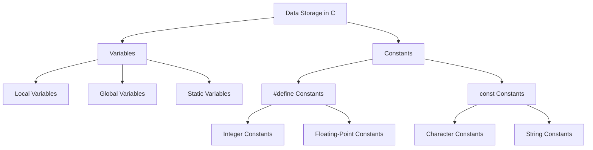

# Variables and Constants in C

In C programming, **variables** and **constants** are used to store data values. Variables allow us to change the value during program execution, while constants hold values that remain fixed throughout the program.

## 1. Variables in C

A **variable** is a storage location in memory, identified by a name, where data can be stored, modified, and retrieved during program execution.

### Declaring a Variable

To declare a variable, we specify the **data type** followed by the **variable name**. A variable can be declared without initialization or with an initial value.

```c
int age;            // Declaration without initialization
int age = 25;       // Declaration with initialization
```

### Rules for Naming Variables

- A variable name must start with a letter (a-z, A-Z) or underscore (_).
- The name can contain letters, digits, and underscores.
- C is **case-sensitive**, so `age` and `Age` are different variables.
- Keywords cannot be used as variable names.

**Example:**

```c
int age = 20;      // Valid
float _height = 5.9; // Valid
int 1stRank = 1;   // Invalid, cannot start with a digit
```

### Types of Variables

Variables in C are classified into three main types based on their scope, lifetime, and visibility:

#### a. **Local Variables**

Local variables are declared inside a function or block and can only be accessed within that function or block.

```c
void function() {
    int localVar = 10;  // Local variable
}
```

#### b. **Global Variables**

Global variables are declared outside any function, typically at the top of the program. They can be accessed by any function within the program.

```c
int globalVar = 50;   // Global variable

void function1() {
    printf("%d", globalVar); // Accessible here
}

void function2() {
    globalVar = 100; // Can be modified
}
```

#### c. **Static Variables**

Static variables maintain their value across function calls. If declared inside a function, they are not re-initialized when the function is called again.

```c
void function() {
    static int counter = 0;
    counter++;
    printf("%d", counter); // Will retain its value across calls
}
```

## 2. Constants in C

A **constant** is a value that, once defined, cannot be changed during the execution of the program. Constants help ensure that certain values remain fixed.

### Defining Constants

#### a. **Using `#define` Preprocessor Directive**

`#define` is a preprocessor directive used to define constant values before the program is compiled. It does not use any memory.

```c
#define PI 3.14159
#define MAX_VALUE 100
```

**Example:**

```c
int radius = 5;
float area = PI * radius * radius;
```

#### b. **Using `const` Keyword**

The `const` keyword is used to declare constant variables, which behave like regular variables but cannot be modified after initialization.

```c
const int DAYS_IN_WEEK = 7;
```

### Types of Constants

#### a. **Integer Constants**

Integer constants are whole numbers without any fractional part.

```c
#define MAX_AGE 100
const int MIN_AGE = 18;
```

#### b. **Floating-Point Constants**

Floating-point constants are numbers with a fractional part.

```c
#define GRAVITY 9.81
const float PI = 3.14159;
```

#### c. **Character Constants**

Character constants are enclosed in single quotes and represent a single character.

```c
const char GRADE = 'A';
```

#### d. **String Constants**

String constants are enclosed in double quotes and represent sequences of characters.

```c
const char NAME[] = "John Doe";
```

### Why Use Constants?

- **Readability**: Constants make the code easier to understand by giving meaningful names to values.
- **Maintainability**: You can update the value in one place if needed, instead of updating it throughout the program.
- **Safety**: Constants prevent accidental modification of values that should remain fixed.

## Summary

In C programming, variables and constants are fundamental for storing and managing data. While variables allow dynamic changes in values during program execution, constants provide fixed values that cannot be altered.

### Diagram of Variables and Constants in C


