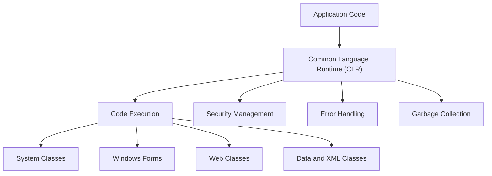

# Introducing .NET Framework

The **.NET Framework** is a software development platform developed by Microsoft for building and running applications on Windows. It supports web development, distributed computing, and internet-based services.

## 1. Web Development with .NET

.NET provides tools and libraries specifically designed for building robust, scalable web applications.

### Microsoft Web Development
- **ASP.NET**: A powerful framework within .NET for building dynamic websites, web applications, and web services.
  
### Moving from Workstation to Distributed Computing
- The .NET platform enables applications to scale from a single workstation to a distributed environment, allowing multiple users and systems to interact over a network.

### The Internet Factor
- .NET facilitates the development of internet-based applications, providing built-in support for web standards such as HTTP, XML, and SOAP (Simple Object Access Protocol).

---

## 2. Importance of .NET Platform

The .NET platform introduces several key advantages that make it essential for modern application development.

### OS Neutral Environment
- .NET Core (a cross-platform version of .NET) allows applications to run on different operating systems, including Windows, Linux, and macOS.

### Device Independence
- Applications built with .NET can run on a variety of devices, including desktops, mobile devices, and cloud environments.

### Wide Language Support
- .NET supports multiple programming languages like **C#**, **VB.NET**, **F#**, and more, enabling developers to work in the language of their choice.

### Internet-Based Component Services
- .NET provides integrated services that simplify building distributed applications using **SOAP**-based web services and **RESTful APIs**.

---

# .NET Framework Overview

The .NET Framework consists of several key components that facilitate application development and management.

## 1. Common Language Runtime (CLR)

The **Common Language Runtime (CLR)** is the core runtime environment of the .NET Framework, responsible for the execution and management of .NET programs.

### Code Management and Execution
- The CLR handles code compilation, execution, and runtime services like memory management and type safety.
  
### Security Support
- The CLR enforces code security through mechanisms like **Code Access Security (CAS)** and role-based security, ensuring that applications run in a secure environment.

### Error Handling
- The .NET Framework provides structured **exception handling** to manage errors and unexpected events in a controlled manner.

### Garbage Collection
- Automatic memory management is handled by the **Garbage Collector (GC)**, which periodically frees up memory used by objects that are no longer needed by the application.

---

## 2. .NET Framework Class Libraries

The **.NET Framework Class Libraries** (FCL) are a collection of reusable classes, libraries, and APIs that provide a range of functionalities.

### System Classes
- These provide the fundamental building blocks of .NET applications, including base types like strings, arrays, collections, and threading.

### Data and XML Classes
- .NET provides powerful data handling capabilities, including classes for managing **databases**, handling **XML documents**, and performing data access using **ADO.NET**.

### Windows Form and Drawing Classes
- For building **GUI (Graphical User Interface)** applications, the **Windows Forms** library is used, while the **System.Drawing** namespace provides tools for drawing graphics and images.

### Web Classes
- Classes in **ASP.NET** are used for building web-based applications, including support for HTML, CSS, JavaScript, and server-side processing.

---

# Features of .NET Framework

The .NET Framework introduces numerous features that simplify web development and enhance application performance.

## 1. ASP.NET Web Forms and Web Services

### ASP.NET Web Forms
- **Web Forms** are a rapid development model for building dynamic, data-driven web applications. They offer a drag-and-drop interface and server-side controls to build web applications efficiently.

### Web Services
- .NET supports creating and consuming **Web Services** to allow communication between applications over the web using **XML** and **SOAP**.

---

## 2. Web Page Authoring & Server Controls

### Web Page Authoring
- .NET simplifies **web page authoring** by allowing developers to create interactive web pages using a combination of **HTML**, **CSS**, and **ASP.NET** server controls.

### Server Controls
- Server controls in **ASP.NET** are objects that run on the server and render HTML on the client side. Examples include **TextBox**, **Button**, **GridView**, and custom controls.

---

## 3. ASP.NET Infrastructure

The ASP.NET infrastructure provides key services that make building and running web applications easy:

- **Session Management**: Manages user state across different web pages.
- **Caching**: Improves performance by storing frequently accessed data in memory.
- **Authentication and Authorization**: Provides built-in security features for managing user access.
  
---

## .NET Framework Components Diagram

