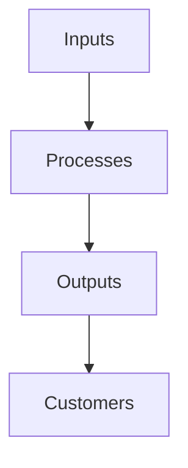

# Concepts of Business

Business encompasses a wide range of activities aimed at producing and selling goods and services. Understanding the various elements within business helps us see how different factors interact to achieve economic and commercial success.

---

## 1. Commerce and Industry

**Commerce** and **Industry** form the foundation of business activities.

### Commerce
- Commerce refers to the buying and selling of goods and services. It bridges the gap between producers and consumers, ensuring the smooth flow of goods.
- **Examples of Commerce**:
  - Retail transactions (e.g., supermarkets)
  - Online shopping (e.g., e-commerce platforms like Amazon)

### Industry
- Industry focuses on producing goods and materials, which can be further classified into:
  - **Primary Industry**: Involves extraction of natural resources (e.g., mining, agriculture).
  - **Secondary Industry**: Focuses on manufacturing goods from raw materials (e.g., car manufacturing).
  - **Tertiary Industry**: Provides services (e.g., banking, tourism).
- **Example of Industry**: A steel manufacturing plant (secondary industry) that produces raw materials used by other sectors.

---

## 2. Business Environment

The **Business Environment** consists of all external factors that impact business operations and decision-making.

### Macro Environment
- Refers to large-scale external factors affecting all businesses.
- Key elements include **economic conditions**, **technological advancements**, **political/legal influences**, and **cultural/social trends**.

  ```mermaid
  graph LR
      A[Macro Environment] --> B[Economy]
      A --> C[Technology]
      A --> D[Politics & Law]
      A --> E[Social Trends]
  ```

  **Example**: An economic recession (macro factor) could reduce consumer spending, affecting businesses across various industries.

### Micro Environment
- Involves immediate factors directly influencing a business.
- Components include **customers**, **suppliers**, **competitors**, and **intermediaries** (e.g., distributors).

  ```mermaid
  graph LR
      F[Micro Environment] --> G[Customers]
      F --> H[Suppliers]
      F --> I[Competitors]
      F --> J[Intermediaries]
  ```

  **Example**: A business may change its product pricing due to increased competition (micro factor).

---

## 3. Business System

The **Business System** is the interconnected structure of resources, processes, and people that work together to achieve business goals.

### Key Components
- **Inputs**: Resources such as capital, labor, and materials.
- **Processes**: The methods by which inputs are transformed into outputs (production, marketing).
- **Outputs**: Finished goods or services delivered to customers.



**Example**: In a clothing business, inputs include fabric and labor, processes involve sewing and packaging, and outputs are the finished clothes ready for sale.

---

## 4. Forms of Business Organization

Businesses can operate under various organizational structures, each with unique characteristics, benefits, and limitations.

### 1. Sole Proprietorship
- **Description**: Owned and managed by a single person.
- **Pros**: Easy to set up, full control by the owner.
- **Cons**: Limited capital, unlimited liability.
  
  **Example**: A local bakery owned by one individual.

### 2. Partnership
- **Description**: Business owned by two or more people who share profits and responsibilities.
- **Pros**: More capital, shared responsibilities.
- **Cons**: Risk of disagreements, shared liability.
  
  **Example**: A law firm with multiple partners.

### 3. Corporation
- **Description**: A legal entity separate from its owners, offering limited liability.
- **Pros**: Limited liability, easier to raise capital.
- **Cons**: Complex setup, subject to corporate tax.
  
  **Example**: A multinational company like Apple Inc.

### 4. Cooperative
- **Description**: Owned and operated by a group of individuals for mutual benefit.
- **Pros**: Focus on members' welfare, democratic control.
- **Cons**: Limited capital, less competitive.
  
  **Example**: Agricultural cooperatives where farmers pool resources.

