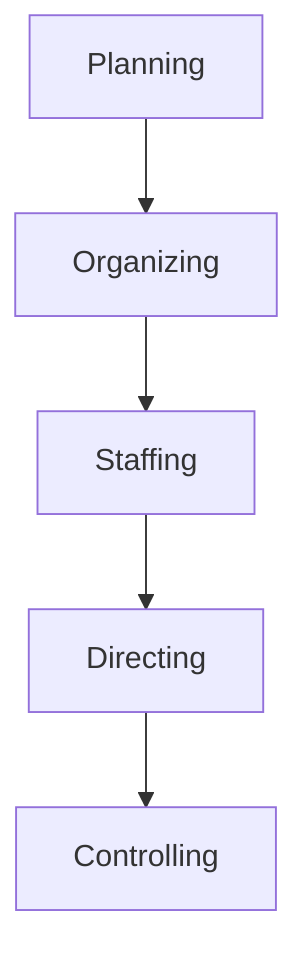
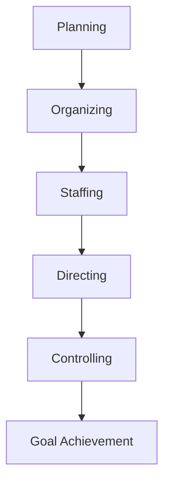

# Management: Meaning, Definition, and Importance

**Management** is the process of coordinating and overseeing the activities within an organization to achieve its objectives effectively and efficiently.

### Definition of Management
- Management can be defined as the art and science of getting things done through people to achieve organizational goals.
- **Example**: Managing a team to complete a project within budget and on time.

### Importance of Management
- **Goal Achievement**: Helps in reaching the organization's goals by planning, organizing, and directing resources.
- **Efficient Resource Use**: Ensures optimal use of resources, including time, money, and human talent.
- **Organizational Growth**: Facilitates growth by setting strategic directions and fostering innovation.
  
---

## 1. Management Concept

The **Management Concept** includes ideas and strategies that guide how managers plan, direct, and control organizational resources.

### Key Ideas
- **Leadership**: Inspires and guides team members to work towards goals.
- **Decision-Making**: Managers make key decisions impacting the organization's operations.
- **Coordination**: Ensures that different departments and individuals work together seamlessly.

---

## 2. Functions of Management

The **Functions of Management** are essential activities that help achieve organizational objectives.

### 1. Planning
- Setting objectives and determining the course of action to achieve them.
- **Example**: A manager planning a new product launch.

### 2. Organizing
- Arranging resources and tasks to achieve goals.
- **Example**: Assigning roles within a project team.

### 3. Staffing
- Recruiting, selecting, and training employees to fill various roles.
- **Example**: Hiring skilled team members for a software development project.

### 4. Directing
- Leading and motivating employees to achieve organizational goals.
- **Example**: A manager motivating a team to meet sales targets.

### 5. Controlling
- Monitoring performance and making adjustments as needed.
- **Example**: Reviewing monthly sales reports to track progress.

---

## 3. Principles of Management

**Principles of Management** are guidelines that help managers make effective decisions and lead organizations.

### Key Principles
- **Division of Work**: Assigning specific tasks to individuals for efficiency.
- **Authority and Responsibility**: Ensuring managers have the power and accountability to lead.
- **Unity of Command**: Each employee should receive instructions from only one manager to avoid confusion.
- **Scalar Chain**: A clear line of authority from top management to each employee.

**Example**: Following the unity of command in a company to maintain clear communication channels.

---

## 4. Management Process

The **Management Process** involves a series of steps that managers follow to achieve organizational goals.

### Steps in the Management Process
1. **Planning**: Identifying goals and deciding on strategies.
2. **Organizing**: Setting up the structure of the organization.
3. **Staffing**: Filling roles with the right people.
4. **Directing**: Guiding and motivating employees.
5. **Controlling**: Assessing results and making necessary changes.

Each of these stages is essential in ensuring that the organization runs smoothly and achieves its objectives.
