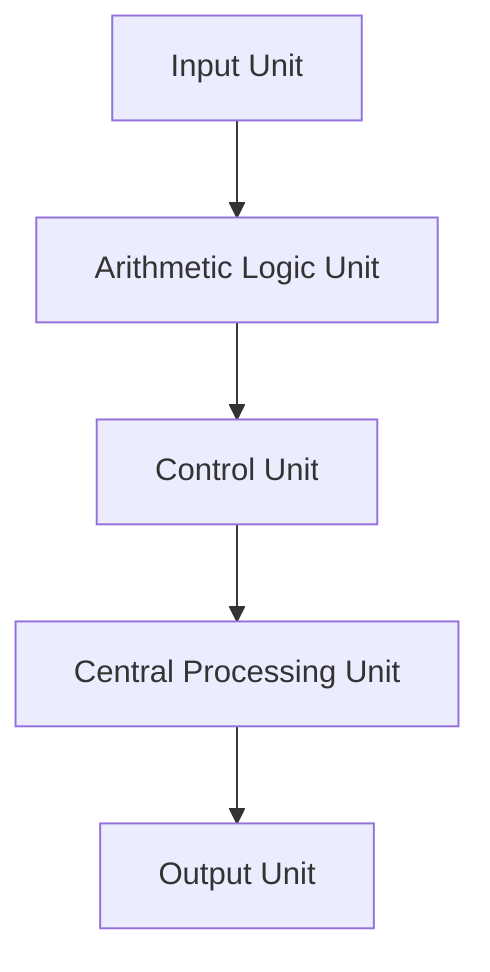

# Computer Fundamentals

## Introduction

Computers are electronic devices that manipulate data and perform calculations at high speeds. They have transformed how we live and work, becoming an essential part of daily life.

## Characteristics of Computers

- **Speed**: Computers can process data at incredible speeds, performing millions of calculations per second.
- **Accuracy**: They provide high accuracy in calculations and data processing, with errors typically arising from human input.
- **Automation**: Once programmed, computers can perform tasks automatically without human intervention.
- **Storage**: They can store vast amounts of data and retrieve it quickly, making data management efficient.
- **Versatility**: Computers can perform a wide variety of tasks, from simple calculations to complex simulations.
- **Diligence**: Unlike humans, computers do not suffer from fatigue and can work continuously without losing performance.

## Evolution of Computers

### 1. First Generation (1940-1956)

- Utilized **vacuum tubes** for circuitry and magnetic drums for memory.
- **Example**: ENIAC (Electronic Numerical Integrator and Computer).

### 2. Second Generation (1956-1963)

- Utilized **transistors**, making computers smaller, faster, and more energy-efficient.
- **Example**: IBM 1401.

### 3. Third Generation (1964-1971)

- Integrated circuits replaced transistors, further reducing size and cost while increasing power.
- **Example**: IBM System/360.

### 4. Fourth Generation (1971-Present)

- **Microprocessors** brought about the personal computer revolution, with thousands of integrated circuits on a single chip.
- **Example**: Intel 4004.

### 5. Fifth Generation (Present and Beyond)

- Focuses on **artificial intelligence**, machine learning, and advanced computing technologies.
- **Example**: Quantum computing.

## Capabilities and Limitations of Computers

### Capabilities

- **Data Processing**: Able to process large volumes of data quickly and accurately.
- **Complex Calculations**: Can perform complex mathematical operations and simulations.
- **Data Storage**: Capable of storing large amounts of information in various formats.
- **Connectivity**: Can connect to networks and communicate with other devices.

### Limitations

- **Lack of Creativity**: Computers cannot think creatively or intuitively like humans.
- **Dependency on Input**: They rely entirely on the data and instructions provided by users.
- **No Emotional Intelligence**: Computers do not possess the ability to understand human emotions or context.

## Generations of Computers

- **First Generation**: Vacuum tubes, large, expensive, and power-hungry.
- **Second Generation**: Transistors, smaller, more reliable, and less power consumption.
- **Third Generation**: Integrated circuits, faster, more efficient, and smaller in size.
- **Fourth Generation**: Microprocessors, personal computers, and portable devices.
- **Fifth Generation**: AI and quantum computing.

## Types of Computers

- **Microcomputers**: Small, personal computers designed for individual use.
  - **Example**: Laptops, desktops.
- **Minicomputers**: Mid-sized computers, often used in businesses for specific tasks.
  - **Example**: PDP-11.
- **Mainframe Computers**: Powerful machines used by large organizations for bulk data processing and critical applications.
  - **Example**: IBM Z Series.
- **Supercomputers**: Extremely fast computers used for scientific simulations and complex calculations.
  - **Example**: Summit.

## Block Diagram of a Computer

## Basic Components of a Computer System

1. **Input Unit**: Devices that allow users to input data into a computer (e.g., keyboard, mouse).
2. **Output Unit**: Devices that output data from a computer (e.g., monitor, printer).
3. **Arithmetic Logic Unit (ALU)**: Performs all arithmetic and logical operations.
4. **Control Unit (CU)**: Directs the operation of the processor and coordinates activities within the computer.
5. **Central Processing Unit (CPU)**: The brain of the computer, consisting of the ALU and CU, responsible for executing instructions.
6. **Instruction Set**: A set of commands that the CPU can execute, determining its capabilities.
7. **Registers**: Small, fast storage locations within the CPU used to hold temporary data and instructions.
8. **Processor Speed**: Measured in hertz (Hz), indicating how many instructions a CPU can process in a given time.
9. **Types of Processors**: Include single-core, multi-core, and specialized processors (e.g., graphics processing units or GPUs).
