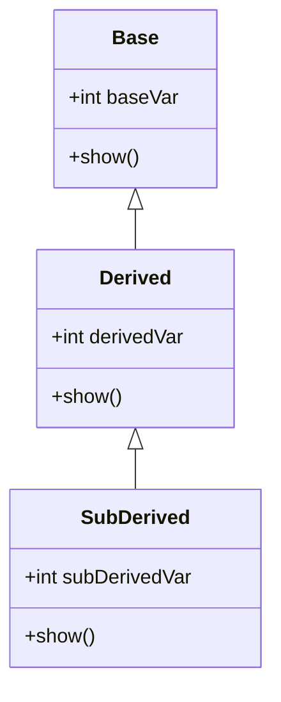

# Operator Overloading in C++

## 1. Overloading Unary Operators
In C++, you can overload unary operators like `-` or `++` to perform operations on user-defined types like objects.

### 1.1. The `operator` Keyword
To overload an operator, use the `operator` keyword followed by the symbol of the operator.
```cpp
class Counter {
  private:
    int count;
  public:
    Counter() { count = 0; }

    // Overloading the unary operator++
    void operator++() {
        ++count;
    }

    int getCount() {
        return count;
    }
};

Counter c;
++c;  // Calls the overloaded operator++
```

### 1.2. Operator Arguments and Return Values
Operators can take arguments, and return values can be used for further calculations.

**Example:**
```cpp
class Complex {
  private:
    int real, imag;
  public:
    Complex(int r = 0, int i = 0) : real(r), imag(i) {}

    // Overloading the unary operator-
    Complex operator-() {
        return Complex(-real, -imag);
    }

    void display() {
        cout << real << " + " << imag << "i" << endl;
    }
};

Complex c1(5, 4);
Complex c2 = -c1;  // Calls overloaded - operator
c2.display();
```

### 1.3. Limitation of Increment Operators
For unary increment (`++`) and decrement (`--`) operators, post-increment has to return an object before the increment. Hence, using these with objects can have limitations and result in the creation of temporary unnamed objects.

---

## 2. Overloading Binary Operators
Binary operators like `+`, `-`, `*`, and `/` can also be overloaded.

```cpp
class Complex {
  private:
    int real, imag;
  public:
    Complex(int r = 0, int i = 0) : real(r), imag(i) {}

    // Overloading the binary operator+
    Complex operator+(const Complex& c) {
        return Complex(real + c.real, imag + c.imag);
    }

    void display() {
        cout << real << " + " << imag << "i" << endl;
    }
};

Complex c1(3, 2), c2(1, 7);
Complex c3 = c1 + c2;  // Calls overloaded + operator
c3.display();
```

### 2.1. Data Conversion
Operators can be overloaded to handle conversions between types. This is useful when you want to implicitly convert one data type to another while performing operations.

### 2.2. Pitfalls of Operator Overloading
- Overloading too many operators can make the code harder to understand.
- Complex expressions can be difficult to debug.
- Can lead to unexpected behaviors if not handled carefully.

---

# Inheritance in C++

## 1. Derived Class and Base Class
**Inheritance** allows a class (derived class) to acquire properties and behavior (members) of another class (base class).

```cpp
class Base {
  public:
    int baseVar;
    void show() {
        cout << "Base class variable: " << baseVar << endl;
    }
};

class Derived : public Base {
  public:
    int derivedVar;
    void show() {
        cout << "Derived class variable: " << derivedVar << endl;
    }
};
```

---

## 2. Accessing Base Class Members
Derived classes can access public members of the base class directly.
```cpp
Derived d;
d.baseVar = 10;   // Access base class member
d.derivedVar = 20;
d.show();         // Calls Derived class's show method
```

---

## 3. Derived Class Constructors
When a derived class object is created, the base class constructor is called first, followed by the derived class constructor.

```cpp
class Base {
  public:
    Base() { cout << "Base constructor" << endl; }
};

class Derived : public Base {
  public:
    Derived() { cout << "Derived constructor" << endl; }
};
```

### 3.1. Overriding Member Functions
In inheritance, derived classes can override base class methods to change their behavior.
```cpp
class Base {
  public:
    void show() {
        cout << "Base class show function" << endl;
    }
};

class Derived : public Base {
  public:
    void show() {
        cout << "Derived class show function" << endl;
    }
};

Derived d;
d.show();  // Calls Derived's show function
```

---

## 4. Class Hierarchies and Types of Inheritance
- **Single Inheritance:** A class inherits from one base class.
- **Multiple Inheritance:** A class inherits from multiple base classes.
- **Multilevel Inheritance:** A derived class is further inherited by another class.

---

### Diagram: Levels of Inheritance



---

## 5. Public and Private Inheritance
- **Public Inheritance:** The public members of the base class become public in the derived class.
- **Private Inheritance:** The public members of the base class become private in the derived class.

```cpp
class Base {
  public:
    int a;
};

class PublicDerived : public Base {
  // 'a' is public in PublicDerived
};

class PrivateDerived : private Base {
  // 'a' is private in PrivateDerived
};
```

---

## 6. Multiple Inheritance and Ambiguity
In **multiple inheritance**, a derived class can inherit from more than one base class, which can lead to ambiguity when the same function is inherited from multiple base classes.
```cpp
class A {
  public:
    void display() {
        cout << "Class A display" << endl;
    }
};

class B {
  public:
    void display() {
        cout << "Class B display" << endl;
    }
};

class C : public A, public B {
  public:
    void display() {
        A::display();  // Resolves ambiguity
    }
};
```

---

## 7. Aggregation: Classes Within Classes
Aggregation represents a "has-a" relationship where a class contains objects of other classes.

```cpp
class Engine {
  public:
    void start() {
        cout << "Engine started" << endl;
    }
};

class Car {
  private:
    Engine engine;
  public:
    void startCar() {
        engine.start();
        cout << "Car started" << endl;
    }
};
```

---

## Difference Between Public and Private Inheritance

| Feature                | Public Inheritance       | Private Inheritance      |
|------------------------|--------------------------|--------------------------|
| **Access to Base Class**| Public members remain public | Public members become private |
| **Visibility**          | Base class members visible | Base class members hidden  |
| **Flexibility**         | More flexible              | Less flexible              |
