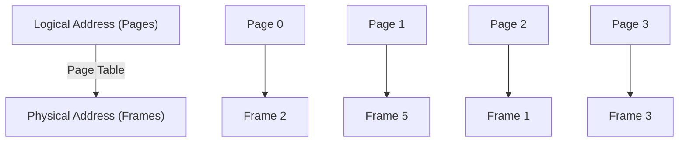
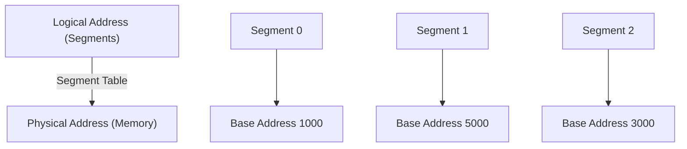

# Memory Management

Memory management is a critical function of the operating system, ensuring the efficient allocation, use, and deallocation of memory during the execution of processes.

---

## 1. Partition

In **Partitioning**, the main memory is divided into fixed or variable-sized blocks, known as partitions, which are allocated to processes. There are two types:

- **Fixed-size partitions**: Divides memory into fixed-sized blocks. However, it may cause **internal fragmentation**, where unused memory in a partition cannot be utilized.
- **Variable-size partitions**: Memory is divided dynamically based on the needs of the processes. It may lead to **external fragmentation**, where free memory is available but is not contiguous.

---

## 2. Paging

**Paging** is a memory management scheme that eliminates external fragmentation by dividing both memory and processes into fixed-size blocks called **pages** (for processes) and **frames** (for memory). The process's pages are loaded into available memory frames.

- **Page Table**: A table maintained by the operating system to map a process's logical address (page) to its physical address (frame).
- **Fragmentation**: Paging avoids external fragmentation but may cause **internal fragmentation** if the last page does not completely fill a frame.

---

## 3. Segmentation

**Segmentation** divides memory into variable-sized segments based on the logical division of a program, like functions, arrays, or data structures. Each segment has a base address and a limit that indicates its size.

- **Segment Table**: Maps logical segments to physical memory locations.
- **Fragmentation**: Segmentation avoids internal fragmentation but may cause **external fragmentation** since segments are of variable size.

---

## 4. Types of Memory Management Schemes

There are several types of memory management schemes that operating systems employ:

1. **Single Contiguous Allocation**: All processes are loaded into contiguous memory. Simplifies management but wastes memory.
2. **Partitioned Allocation**: Memory is divided into fixed or variable-sized partitions allocated to processes.
3. **Paged Memory Management**: Divides memory into fixed-sized pages to avoid external fragmentation.
4. **Segmented Memory Management**: Divides memory based on the logical structure of programs.

---

## 5. Bare Machine

A **Bare Machine** is an early memory management model where the operating system does not intervene in memory allocation. There is no memory protection or management, so programs can overwrite each other’s data.

---

## 6. Resident Monitor

In a **Resident Monitor** system, part of the operating system resides in memory permanently. It manages job scheduling and I/O tasks, ensuring that jobs execute in sequence and do not interfere with one another.

---

## 7. Swapping

**Swapping** is a memory management technique in which a process is temporarily moved out of the main memory to a secondary storage (like a hard disk) and then brought back into memory when required.

- **Context Switching**: Involves saving the state of the process when it is swapped out and restoring it when swapped back in.
- **Performance**: Frequent swapping can lead to **thrashing**, where excessive swapping reduces system performance.

---

## 8. Multiple Partition

In the **Multiple Partition** scheme, the memory is divided into several partitions that can be allocated to different processes. The allocation can be either:

1. **Fixed Partitioning**: Memory is divided into fixed partitions, leading to potential internal fragmentation.
2. **Dynamic Partitioning**: Memory is divided dynamically, based on the needs of processes, but this can lead to external fragmentation.

---

## 9. Virtual Memory

**Virtual Memory** allows a system to execute processes that may not completely fit into physical memory by using a combination of **hardware** and **software** to manage memory. Parts of a program are loaded into physical memory only when needed.

- **Page Replacement Algorithms**: Manage which pages to swap out of physical memory when a new page is needed, e.g., **Least Recently Used (LRU)**, **First-In-First-Out (FIFO)**.

---

## 10. Demand Paging

**Demand Paging** is a technique of virtual memory where pages of a process are loaded into memory only when required, reducing memory usage and enabling large programs to run efficiently.

- **Page Fault**: Occurs when a process accesses a page that is not currently in memory, causing the operating system to load the page from secondary storage.
- **Example**:
  Let’s say a program requires 10 pages, but only 4 can fit into the physical memory at once. Initially, 4 pages are loaded, and if any of the other 6 pages are accessed, they are brought into memory (causing a **page fault**).

---

## Memory Management Diagrams

### Paging Diagram

### Segmentation Diagram

