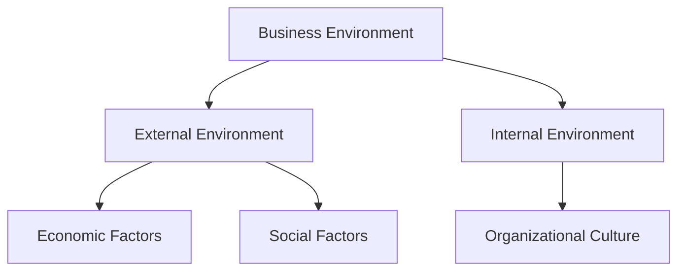
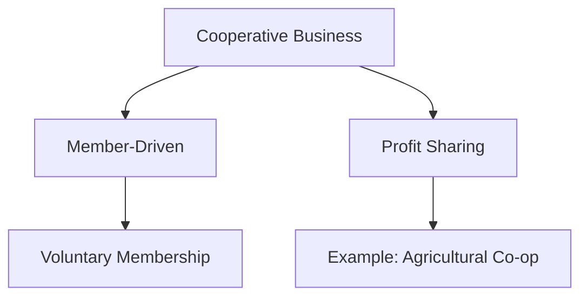
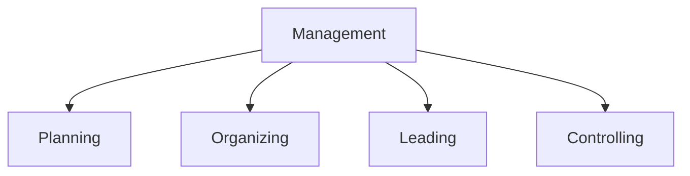
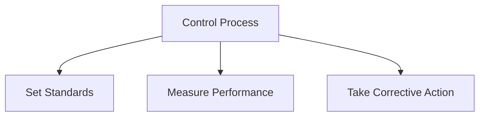
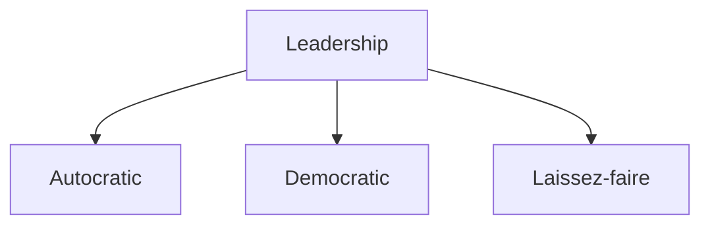
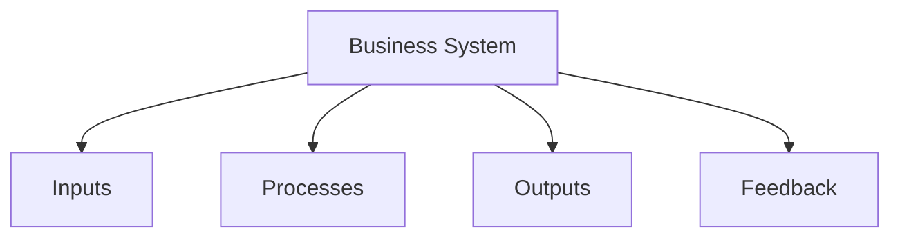
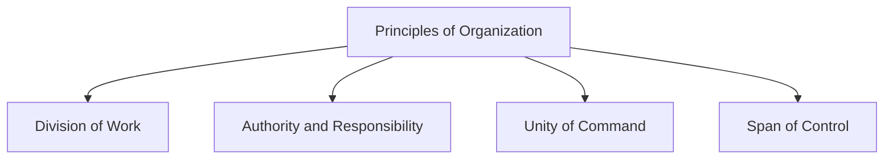
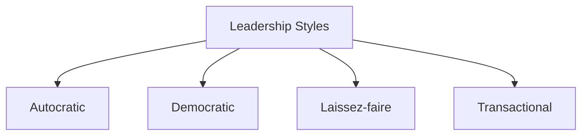
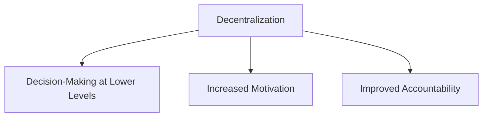
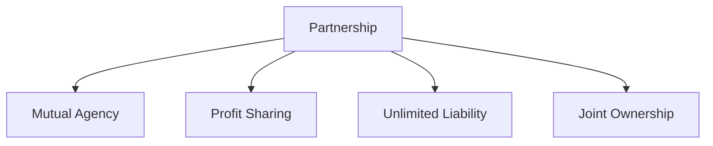

# Short Answer Questions

In this guide, you'll find a collection of essential Business Practice and Management short answer questions and their concise, exam-focused answers. These cover important questions asked in previous held exams and important questions from exam point of view.

---

### Question: Define Business Environment.

Answer: The **business environment** refers to the set of external and internal factors that influence an organization’s decision-making, performance, and strategies. These factors can be categorized as follows:

- **External Environment**: Includes **economic** factors (interest rates, inflation), **social** factors (cultural trends), **technological** factors (innovation), **political** factors (government policies), and **legal** factors (laws and regulations).
- **Internal Environment**: Refers to factors within the organization, such as the organizational culture, internal policies, and employee morale.

**Example**:  
For instance, a rise in interest rates can impact consumer spending, which might reduce demand for certain products.

---

### Question: What do you understand by the Cooperative Form of Business Organization?

Answer: A **cooperative** is a voluntary association of individuals who join forces to meet common economic, social, or cultural needs. It is owned and operated by its members, who share in the profits and benefits equally.

- **Characteristics**:
  - **Member-Driven**: Controlled by members, not external shareholders.
  - **Profit Sharing**: Profits are distributed equally among members, based on their contribution.
  - **Voluntary Membership**: Anyone who shares the goals of the cooperative can join.

**Example**:  
An agricultural cooperative where farmers pool their resources to buy fertilizers at discounted prices, share equipment, and sell their products collectively.

---

### Question: What is the Importance of Management?

Answer: Management is essential for achieving organizational goals effectively and efficiently. It ensures that resources are used optimally and that the organization's activities are aligned with its objectives.

- **Key Functions**:
  - **Planning**: Setting objectives and determining the actions needed to achieve them.
  - **Organizing**: Allocating resources and assigning tasks.
  - **Leading**: Motivating and guiding employees.
  - **Controlling**: Monitoring performance and making necessary adjustments.

**Example**:  
In a manufacturing company, effective management ensures that production targets are met while minimizing costs and maintaining product quality.

---

### Question: Define Control.

Answer: Control is a management function that involves setting standards, measuring actual performance, and taking corrective actions to ensure that the organization’s goals are achieved.

- **Control Process**:
  1. **Setting Standards**: Establish benchmarks for performance.
  2. **Measuring Performance**: Monitor and evaluate actual results.
  3. **Corrective Action**: Implement changes if results deviate from standards.

**Example**:  
A company sets monthly sales targets. If the sales performance is below target, management may adjust marketing strategies to improve sales.

---

### Question: What do you understand by Leadership in the Context of Organizations?

Answer: **Leadership** in organizations refers to the ability to influence and guide individuals or teams to achieve organizational goals. Effective leadership involves communication, decision-making, and inspiring employees.

- **Types of Leadership**:
  - **Autocratic**: Leader makes decisions unilaterally.
  - **Democratic**: Leader involves team members in decision-making.
  - **Laissez-faire**: Leader allows employees autonomy in their work.

**Example**:  
A team leader in a sales department motivates employees by setting clear goals, recognizing achievements, and providing necessary resources.

---

### Question: Business System

Answer: A **business system** is a set of interrelated components or processes that work together to achieve the objectives of an organization. It involves the coordination of people, resources, processes, and technology to produce goods or services that meet market demands.

- **Components of a Business System**:  
  - **Inputs**: Resources such as materials, labor, and capital.
  - **Processes**: Operations that transform inputs into outputs.
  - **Outputs**: The final products or services delivered to customers.
  - **Feedback**: Information from the market or consumers used to adjust the system.

**Example**:  
A manufacturing business system may include raw materials, production machinery, workers, and a distribution network.

---

### Question: Principles of Organization

Answer: The **principles of organization** are guidelines that help in structuring an organization effectively. These principles ensure efficient use of resources and proper coordination among different levels of management.

- **Common Principles**:  
  1. **Division of Work**: Assigning specific tasks to individuals to improve efficiency.
  2. **Authority and Responsibility**: Authority should match responsibility to avoid confusion.
  3. **Unity of Command**: Employees should receive orders from only one superior.
  4. **Scalar Chain**: The hierarchy of authority should be clear and unbroken.
  5. **Span of Control**: The number of subordinates a manager can effectively supervise.

**Example**:  
In a retail business, the manager delegates specific tasks to employees, with a clear reporting structure.

---

### Question: Leadership Styles

Answer: **Leadership styles** refer to the approaches leaders use to manage and motivate their teams. These styles vary based on the leader's behavior and the situation.

- **Types of Leadership Styles**:
  1. **Autocratic**: The leader makes decisions without consulting others.
  2. **Democratic**: The leader involves team members in decision-making.
  3. **Laissez-faire**: The leader gives employees the freedom to make decisions.
  4. **Transformational**: The leader inspires and motivates employees to exceed their expectations.
  5. **Transactional**: The leader focuses on short-term tasks and rewards for performance.

**Example**:  
A team leader in a project management scenario may use a democratic style by seeking input from team members before making decisions.

---

### Question: Decentralization

Answer: **Decentralization** is the process of delegating authority from central management to lower levels of the organization. This allows subordinates to make decisions within their areas of responsibility, leading to quicker responses and flexibility.

- **Benefits of Decentralization**:  
  1. **Faster Decision-Making**: Local managers can make decisions without waiting for approval from higher-ups.
  2. **Increased Motivation**: Empowering employees boosts morale and commitment.
  3. **Improved Accountability**: Managers at lower levels are responsible for their decisions.

**Example**:  
A retail chain with multiple stores may decentralize authority by allowing store managers to make purchasing decisions.

---

### Question: Partnership

Answer: A **partnership** is a form of business organization where two or more individuals come together to conduct business and share its profits and losses. The partnership is governed by an agreement that outlines the terms of the partnership, rights, and responsibilities.

- **Key Features**:
  1. **Mutual Agency**: Each partner can bind the firm to contracts.
  2. **Profit Sharing**: Profits and losses are shared as per the agreement.
  3. **Unlimited Liability**: Partners are personally liable for business debts.
  4. **Joint Ownership**: Partners share ownership of the business assets.

**Example**:  
A law firm formed by two lawyers who share the profits, responsibilities, and risks involved.

