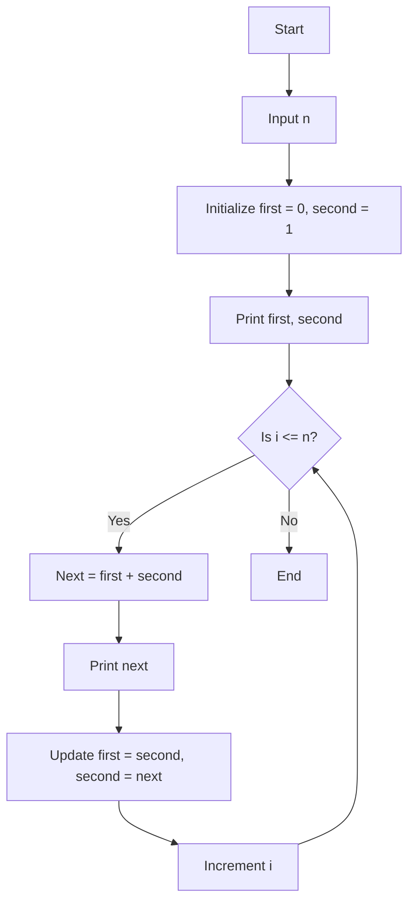

# Long Answer Questions

In this guide, you'll find a collection of essential C language long answer questions and their concise, exam-focused answers. These cover important questions asked in previous held exams and important questions from exam point of view.

---

### Question: Write an Algorithm and draw flow chart to Find and Print Fibonacci Sequence.

Answer: The Fibonacci sequence is a series of numbers where each number (after the first two) is the sum of the two preceding ones. Here's the algorithm to generate the Fibonacci sequence up to `n` terms:

1. **Start**
2. Declare variables `n`, `first = 0`, `second = 1`, `next`.
3. Input the value of `n` (the number of terms to be printed).
4. Print `first` and `second`.
5. Repeat steps 6-8 for `i = 3` to `n`.
6. Calculate the next term as:  
   `next = first + second`.
7. Print `next`.
8. Update `first = second` and `second = next`.
9. End.

### Example:

For `n = 5`, the output will be: `0 1 1 2 3`

### Flowchart to Find and Print Fibonacci Sequence

Below is the flowchart that represents the algorithm:



This flowchart provides a visual representation of how the Fibonacci sequence is generated step-by-step.

---

### Question: What is a Data Type?

Answer: In C, a **data type** defines the type of data a variable can store, specifying the size and type of values the variable can hold. C offers several built-in data types for managing different kinds of data like integers, floating-point numbers, and characters.

### Types of Data Types in C

1. **Primitive Data Types (Basic Data Types)**
2. **Derived Data Types**
3. **User-Defined Data Types**

---

### 1. Primitive Data Types (Basic Data Types)

These are the fundamental data types provided by the C language. They define the basic characteristics of data such as integer numbers, floating-point numbers, and characters.

#### (i) Integer (`int`)

The `int` data type is used to store whole numbers (positive or negative). The size of `int` is typically 4 bytes, but it may vary depending on the system.

#### Example:

```c
int age = 25;
```

Here, `age` is an integer variable that stores the value 25.

- **Signed int**: Can store both negative and positive integers.
- **Unsigned int**: Can store only positive numbers (and zero), but with a wider range.

```c
unsigned int num = 100;  // Can store only positive integers
```

#### (ii) Character (`char`)

The `char` data type is used to store individual characters. It occupies 1 byte of memory, and each character is represented by an ASCII value.

#### Example:

```c
char grade = 'A';
```

Here, the variable `grade` stores the character 'A'.

- **Signed char**: Stores characters or small integers with negative and positive values.
- **Unsigned char**: Stores only positive characters or integers.

#### (iii) Floating-point (`float`, `double`)

These data types are used to store decimal numbers. The `float` occupies 4 bytes, while `double` (which stands for double-precision floating-point) occupies 8 bytes, allowing for more precision.

#### Example:

```c
float price = 25.75;
double distance = 123456.789123;
```

- **Float**: Stores single-precision floating-point numbers.
- **Double**: Stores double-precision floating-point numbers.

#### (iv) Void (`void`)

The `void` data type is used to indicate that a function does not return any value or that a pointer has no associated type.

#### Example:

```c
void displayMessage() {
    printf("Hello, World!");
}
```

---

### 2. Derived Data Types

Derived data types are formed using basic data types and include arrays, pointers, functions, and structures.

#### (i) Arrays

An array is a collection of elements of the same data type, stored in contiguous memory locations.

#### Example:

```c
int numbers[5] = {1, 2, 3, 4, 5};
```

Here, `numbers` is an array of integers with 5 elements.

#### (ii) Pointers

Pointers store the memory address of a variable. The pointer data type depends on the type of the variable it points to (e.g., `int*`, `char*`).

#### Example:

```c
int a = 10;
int *ptr = &a;  // Pointer storing the address of variable 'a'
```

#### (iii) Functions

A function is a block of code that performs a specific task and may or may not return a value. Functions can also accept arguments and return values of different data types.

#### Example:

```c
int sum(int a, int b) {
    return a + b;
}
```

---

### 3. User-Defined Data Types

These are data types defined by the user based on the requirements of the program. C allows users to define their own data types, such as `struct`, `union`, and `enum`.

#### (i) Structure (`struct`)

A structure is used to group different types of variables under a single name.

#### Example:

```c
struct Student {
    int id;
    char name[50];
    float grade;
};
```

Here, `Student` is a structure that contains an integer `id`, a character array `name`, and a float `grade`.

#### (ii) Union (`union`)

A union is similar to a structure, but it allows storing different data types in the same memory location. Only one member can be accessed at a time.

#### Example:

```c
union Data {
    int i;
    float f;
    char str[20];
};
```

#### (iii) Enumerations (`enum`)

An `enum` is a user-defined data type consisting of named integer constants.

#### Example:

```c
enum Days { Sunday, Monday, Tuesday, Wednesday, Thursday, Friday, Saturday };
```

Here, `Days` is an enumeration with constant values representing the days of the week.

---

### Summary of Data Types in C:

| Data Type | Size    | Range (for 32-bit system)       | Example Declaration          |
| --------- | ------- | ------------------------------- | ---------------------------- |
| `int`     | 4 bytes | -2,147,483,648 to 2,147,483,647 | `int num = 100;`             |
| `char`    | 1 byte  | -128 to 127 (signed)            | `char letter = 'A';`         |
| `float`   | 4 bytes | 3.4E-38 to 3.4E+38              | `float price = 19.99;`       |
| `double`  | 8 bytes | 1.7E-308 to 1.7E+308            | `double distance = 1234.56;` |
| `void`    | 0 bytes | No value                        | `void display();`            |

---

### Question: What is an Operator?

Answer: An **operator** in C is a symbol that tells the compiler to perform specific mathematical, relational, or logical operations on one or more operands. Operators are fundamental in programming as they enable developers to manipulate data and variables effectively.

### Types of Operators in C

C language includes several types of operators, categorized based on their functionality. The major types are:

1. **Arithmetic Operators**
2. **Relational Operators**
3. **Logical Operators**
4. **Bitwise Operators**
5. **Assignment Operators**
6. **Conditional (Ternary) Operator**
7. **Special Operators**

---

### 1. Arithmetic Operators

Arithmetic operators are used to perform mathematical calculations.

| Operator | Description         | Example |
| -------- | ------------------- | ------- |
| `+`      | Addition            | `a + b` |
| `-`      | Subtraction         | `a - b` |
| `*`      | Multiplication      | `a * b` |
| `/`      | Division            | `a / b` |
| `%`      | Modulus (Remainder) | `a % b` |

#### Example:

```c
int a = 10, b = 3;
int sum = a + b;         // sum = 13
int remainder = a % b;   // remainder = 1
```

### 2. Relational Operators

Relational operators are used to compare two values. They return either true (1) or false (0).

| Operator | Description           | Example  |
| -------- | --------------------- | -------- |
| `==`     | Equal to              | `a == b` |
| `!=`     | Not equal to          | `a != b` |
| `>`      | Greater than          | `a > b`  |
| `<`      | Less than             | `a < b`  |
| `>=`     | Greater than or equal | `a >= b` |
| `<=`     | Less than or equal    | `a <= b` |

#### Example:

```c
if (a > b) {
    printf("a is greater than b");
}
```

### 3. Logical Operators

Logical operators are used to combine multiple boolean expressions.

| Operator | Description | Example  |
| -------- | ----------- | -------- |
| `&&`     | Logical AND | `a && b` |
| `\|\|`   | Logical OR  | `a \|\| b` |
| `!`      | Logical NOT | `!a`     |

#### Example:

```c
if (a > b && a > 0) {
    printf("a is positive and greater than b");
}
```

### 4. Bitwise Operators

Bitwise operators perform operations on bits and are used to manipulate binary numbers.

| Operator | Description | Example    |
| -------- | ----------- | ---------- |
| `&`      | Bitwise AND | `a & b`    |
| `\|`   | Bitwise OR  | `a \| b`   |
| `^`      | Bitwise XOR | `a ^ b`    |
| `~`      | Bitwise NOT | `~a`       |
| `<<`     | Left Shift  | `a << 2`   |
| `>>`     | Right Shift | `a >> 2`   |

#### Example:

```c
int a = 5;  // 0101 in binary
int b = 3;  // 0011 in binary
int result = a & b; // result = 1 (0001 in binary)
```

### 5. Assignment Operators

Assignment operators are used to assign values to variables. The basic assignment operator is `=`.

| Operator | Description         | Example                        |
| -------- | ------------------- | ------------------------------ |
| `=`      | Simple assignment   | `a = b`                        |
| `+=`     | Add and assign      | `a += b` (same as `a = a + b`) |
| `-=`     | Subtract and assign | `a -= b` (same as `a = a - b`) |
| `*=`     | Multiply and assign | `a *= b` (same as `a = a * b`) |
| `/=`     | Divide and assign   | `a /= b` (same as `a = a / b`) |
| `%=`     | Modulus and assign  | `a %= b` (same as `a = a % b`) |

#### Example:

```c
int a = 10;
a += 5;  // a = 15
```

### 6. Conditional (Ternary) Operator

The conditional operator is a shorthand way of expressing conditional statements. It takes three operands.

#### Syntax:

```c
condition ? expression_if_true : expression_if_false;
```

#### Example:

```c
int a = 5, b = 10;
int max = (a > b) ? a : b;  // max = 10
```

### 7. Special Operators

These include operators like sizeof, comma, pointer, and member selection operators.

| Operator | Description                     | Example              |
| -------- | ------------------------------- | -------------------- |
| `sizeof` | Returns the size of a data type | `sizeof(int)`        |
| `,`      | Comma operator                  | `a = (b = 3, b + 2)` |
| `->`     | Member selection (pointer)      | `ptr->member`        |
| `.`      | Member selection                | `structVar.member`   |

#### Example:

```c
int size = sizeof(a);  // Returns the size of variable 'a'
```

---

### Question: What are formatted and unformatted input/output functions used in C. Explain in detail by taking examples.

Answer: In C, input/output (I/O) functions are used to take input from the user and display output on the screen. These functions are broadly categorized into two types:

1. **Formatted I/O Functions**
2. **Unformatted I/O Functions**

---

### 1. Formatted I/O Functions

**Formatted I/O functions** allow the programmer to specify the data type of input or output using format specifiers. These functions provide more control over how data is entered and displayed, making them flexible and powerful.

The two most commonly used formatted I/O functions are:

- `scanf()`
- `printf()`

#### **`printf()` Function**

The `printf()` function is used for displaying output on the console. It takes a format string followed by a list of variables to be printed according to the specified format.

#### Syntax:

```c
printf("format string", variable1, variable2, ...);
```

#### Format Specifiers:

| Specifier | Description    | Example                  |
| --------- | -------------- | ------------------------ |
| `%d`      | Integer        | `printf("%d", 25);`      |
| `%f`      | Floating-point | `printf("%f", 3.14);`    |
| `%c`      | Character      | `printf("%c", 'A');`     |
| `%s`      | String         | `printf("%s", "Hello");` |

#### Example:

```c
#include <stdio.h>

int main() {
    int age = 25;
    float salary = 55000.50;
    printf("Age: %d\n", age);
    printf("Salary: %.2f\n", salary);  // "%.2f" limits decimal to 2 places
    return 0;
}
```

#### **`scanf()` Function**

The `scanf()` function is used for accepting input from the user. Similar to `printf()`, it requires format specifiers to read the appropriate data types.

#### Syntax:

```c
scanf("format string", &variable1, &variable2, ...);
```

#### Example:

```c
#include <stdio.h>

int main() {
    int age;
    float salary;
    printf("Enter age: ");
    scanf("%d", &age);
    printf("Enter salary: ");
    scanf("%f", &salary);
    printf("Age: %d, Salary: %.2f\n", age, salary);
    return 0;
}
```

---

### 2. Unformatted I/O Functions

**Unformatted I/O functions** are used to read and write single characters or strings without using any format specifiers. These functions are simpler but provide less control over the input/output format.

Common unformatted I/O functions include:

- `getchar()`
- `putchar()`
- `gets()`
- `puts()`

#### **`getchar()` and `putchar()`**

- **`getchar()`**: Reads a single character from the user.
- **`putchar()`**: Outputs a single character to the console.

#### Example:

```c
#include <stdio.h>

int main() {
    char ch;
    printf("Enter a character: ");
    ch = getchar();  // Reads a single character
    printf("You entered: ");
    putchar(ch);  // Prints the single character
    return 0;
}
```

#### **`gets()` and `puts()`**

- **`gets()`**: Reads an entire line of input (string) from the user until a newline character is encountered.
- **`puts()`**: Outputs a string to the console, automatically adding a newline character.

#### Example:

```c
#include <stdio.h>

int main() {
    char name[50];
    printf("Enter your name: ");
    gets(name);  // Reads a string
    printf("Hello, ");
    puts(name);  // Prints the string followed by a newline
    return 0;
}
```

> **Note**: The use of `gets()` is generally discouraged due to security risks, as it does not check for buffer overflow. Use `fgets()` as a safer alternative.

---

### Comparison Between Formatted and Unformatted I/O

| **Feature**                   | **Formatted I/O**                                      | **Unformatted I/O**                                 |
| ----------------------------- | ------------------------------------------------------ | --------------------------------------------------- |
| **Control over input/output** | More control using format specifiers                   | Limited control                                     |
| **Functions used**            | `printf()`, `scanf()`                                  | `getchar()`, `putchar()`, `gets()`, `puts()`        |
| **Use cases**                 | Suitable for numerical and formatted text input/output | Suitable for reading/writing characters and strings |

---

### Question: Write a menu driven program with the following options: 

   - Biggest of three numbers
   - Positive or negative number 
   - Factorial of a number  
   - Exit

Answer: This program presents a menu of four options to the user and performs the corresponding action based on the selection.

```c
#include <stdio.h>

// Function declarations
int biggestOfThree(int a, int b, int c);
void positiveOrNegative(int num);
int factorial(int num);

int main() {
    int choice, num, a, b, c;

    do {
        // Display the menu
        printf("\nMenu:");
        printf("\n1. Biggest of three numbers");
        printf("\n2. Positive or negative number");
        printf("\n3. Factorial of a number");
        printf("\n4. Exit");
        printf("\nEnter your choice (1-4): ");
        scanf("%d", &choice);

        switch (choice) {
            case 1:
                // Biggest of three numbers
                printf("Enter three numbers: ");
                scanf("%d %d %d", &a, &b, &c);
                printf("The biggest number is: %d\n", biggestOfThree(a, b, c));
                break;
                
            case 2:
                // Positive or negative number
                printf("Enter a number: ");
                scanf("%d", &num);
                positiveOrNegative(num);
                break;
                
            case 3:
                // Factorial of a number
                printf("Enter a number to find its factorial: ");
                scanf("%d", &num);
                if (num < 0) {
                    printf("Factorial of negative numbers is undefined.\n");
                } else {
                    printf("Factorial of %d is %d\n", num, factorial(num));
                }
                break;
                
            case 4:
                // Exit
                printf("Exiting the program...\n");
                break;
                
            default:
                printf("Invalid choice! Please enter a valid option.\n");
        }
    } while (choice != 4);

    return 0;
}

// Function to find the biggest of three numbers
int biggestOfThree(int a, int b, int c) {
    if (a >= b && a >= c)
        return a;
    else if (b >= a && b >= c)
        return b;
    else
        return c;
}

// Function to check if the number is positive or negative
void positiveOrNegative(int num) {
    if (num > 0)
        printf("%d is a positive number.\n", num);
    else if (num < 0)
        printf("%d is a negative number.\n", num);
    else
        printf("The number is zero.\n");
}

// Function to calculate the factorial of a number
int factorial(int num) {
    if (num == 0 || num == 1)
        return 1;
    else
        return num * factorial(num - 1);
}
```

### Explanation:

1. **Menu**: The program displays a menu of four options, and the user selects the option by entering a number from 1 to 4.
2. **Biggest of Three Numbers**: The function `biggestOfThree()` compares three numbers and returns the largest.
3. **Positive or Negative Number**: The function `positiveOrNegative()` checks whether the entered number is positive, negative, or zero.
4. **Factorial of a Number**: The function `factorial()` calculates the factorial of a given non-negative integer recursively.
5. **Exit**: The program exits when the user selects option 4.

---

### Sample Output:

```
Menu:
1. Biggest of three numbers
2. Positive or negative number
3. Factorial of a number
4. Exit
Enter your choice (1-4): 1
Enter three numbers: 5 12 8
The biggest number is: 12

Menu:
1. Biggest of three numbers
2. Positive or negative number
3. Factorial of a number
4. Exit
Enter your choice (1-4): 2
Enter a number: -7
-7 is a negative number.

Menu:
1. Biggest of three numbers
2. Positive or negative number
3. Factorial of a number
4. Exit
Enter your choice (1-4): 3
Enter a number to find its factorial: 5
Factorial of 5 is 120

Menu:
1. Biggest of three numbers
2. Positive or negative number
3. Factorial of a number
4. Exit
Enter your choice (1-4): 4
Exiting the program...
```

---

### Question: What are Control Statement ? Explain different types of control statements.

Answer: Control statements are used in programming to control the flow of execution in a program. They allow the program to make decisions, repeat certain actions, or execute code conditionally based on logical conditions.

C provides several types of control statements, which can be classified into the following categories:

## 1. Conditional Control Statements

These statements allow the program to make decisions and execute different blocks of code based on conditions.

### a) `if` Statement

The `if` statement checks a condition, and if it's true, the associated block of code is executed. If it's false, the program skips that block.

```c
if (condition) {
    // code to execute if condition is true
}
```

**Example:**

```c
int a = 10;
if (a > 5) {
    printf("a is greater than 5\n");
}
```

### b) `if-else` Statement

The `if-else` statement provides an alternate block of code to execute if the condition is false.

```c
if (condition) {
    // code to execute if condition is true
} else {
    // code to execute if condition is false
}
```

**Example:**

```c
int a = 3;
if (a > 5) {
    printf("a is greater than 5\n");
} else {
    printf("a is less than or equal to 5\n");
}
```

### c) `else-if` Ladder

When multiple conditions are to be checked, `else if` is used.

```c
if (condition1) {
    // code for condition1
} else if (condition2) {
    // code for condition2
} else {
    // code if none of the conditions are true
}
```

**Example:**

```c
int a = 8;
if (a == 10) {
    printf("a is 10\n");
} else if (a > 5) {
    printf("a is greater than 5\n");
} else {
    printf("a is less than or equal to 5\n");
}
```

### d) `switch-case` Statement

The `switch` statement is used when a variable is compared against a list of values, each associated with a specific block of code.

```c
switch (expression) {
    case constant1:
        // code to execute if expression equals constant1
        break;
    case constant2:
        // code to execute if expression equals constant2
        break;
    default:
        // code to execute if no case matches
}
```

**Example:**

```c
int a = 2;
switch (a) {
    case 1:
        printf("a is 1\n");
        break;
    case 2:
        printf("a is 2\n");
        break;
    default:
        printf("a is neither 1 nor 2\n");
}
```

## 2. Loop Control Statements

Loop control statements allow repeated execution of a block of code until a condition is satisfied.

### a) `for` Loop

The `for` loop is used when the number of iterations is known.

```c
for (initialization; condition; increment/decrement) {
    // code to execute in each iteration
}
```

**Example:**

```c
for (int i = 0; i < 5; i++) {
    printf("%d\n", i);
}
```

### b) `while` Loop

The `while` loop is used when the number of iterations is not known in advance, and the loop continues until the condition becomes false.

```c
while (condition) {
    // code to execute as long as condition is true
}
```

**Example:**

```c
int i = 0;
while (i < 5) {
    printf("%d\n", i);
    i++;
}
```

### c) `do-while` Loop

The `do-while` loop is similar to the `while` loop, but the condition is checked after the execution of the loop, ensuring that the loop is executed at least once.

```c
do {
    // code to execute
} while (condition);
```

**Example:**

```c
int i = 0;
do {
    printf("%d\n", i);
    i++;
} while (i < 5);
```

## 3. Jump Control Statements

Jump control statements are used to transfer control to different parts of the program.

### a) `break` Statement

The `break` statement is used to exit from loops or switch-case structures prematurely, stopping the execution of the loop or case.

```c
for (int i = 0; i < 10; i++) {
    if (i == 5)
        break;
    printf("%d\n", i);
}
```

**Example:**

If `i` becomes 5, the loop terminates, and no further iterations are performed.

### b) `continue` Statement

The `continue` statement skips the remaining code inside the loop for the current iteration and moves to the next iteration.

```c
for (int i = 0; i < 5; i++) {
    if (i == 3)
        continue;
    printf("%d\n", i);
}
```

**Example:**

When `i` is 3, the `continue` statement skips the print statement and moves to the next iteration.

### c) `goto` Statement

The `goto` statement is used to transfer control to a labeled part of the program. It is generally discouraged as it can make the program harder to follow and maintain.

```c
goto label;
label:
    // code to execute when goto label is reached
```

---

### Question: What is the need for functions ? What are different ways of passing arguments to a function ? 

Answer: Functions are essential in C programming for several reasons:

1. **Modularity**: Functions allow you to break down complex problems into smaller, manageable units or modules. Each function performs a specific task, making the code easier to understand and maintain.

2. **Code Reusability**: Once a function is defined, it can be reused multiple times across the program. This reduces redundancy and the chances of errors.

3. **Maintainability**: If changes need to be made, they can be applied directly to the function, which automatically updates all instances where the function is used.

4. **Improved Debugging**: Functions make it easier to isolate and debug parts of the code since each function is an independent block of logic.

5. **Better Code Organization**: Functions help organize the code logically, making it simpler to understand the flow of a program and manage large codebases.

### Ways of Passing Arguments to a Function

C provides two main ways to pass arguments to a function:

### 1. Call by Value

In **call by value**, a copy of the actual argument's value is passed to the function. Changes made to the parameter inside the function do not affect the actual argument.

```c
void swap(int x, int y) {
    int temp = x;
    x = y;
    y = temp;
}

int main() {
    int a = 5, b = 10;
    swap(a, b);
    printf("a = %d, b = %d\n", a, b);  // Output: a = 5, b = 10
}
```

In this example, `a` and `b` remain unchanged in the `main()` function, because only their copies are passed to the `swap()` function.

### 2. Call by Reference

In **call by reference**, the address of the actual argument is passed to the function, allowing the function to modify the original value. This is typically done using pointers.

```c
void swap(int *x, int *y) {
    int temp = *x;
    *x = *y;
    *y = temp;
}

int main() {
    int a = 5, b = 10;
    swap(&a, &b);
    printf("a = %d, b = %d\n", a, b);  // Output: a = 10, b = 5
}
```

Here, `a` and `b` are modified because their addresses are passed to the `swap()` function. The function directly changes the original values through pointer dereferencing.

---

### Question: What are the advantages of using pointers ? What are the various operations permitted on pointers ? 

Answer: Pointers are a powerful feature of C that offer several advantages:

1. **Efficient Memory Management**: Pointers allow direct access to memory and help in dynamic memory allocation, enabling efficient use of available memory.

2. **Passing Large Data Structures**: When passing large data structures like arrays or structures to a function, using pointers is more efficient than copying the entire data. Instead of passing by value, pointers reduce overhead by passing the memory address.

3. **Dynamic Memory Allocation**: Pointers are essential for dynamic memory allocation using functions like `malloc()`, `calloc()`, `realloc()`, and `free()`. This allows flexible memory allocation based on the program's needs.

4. **Data Structures**: Pointers are widely used in implementing complex data structures such as linked lists, stacks, queues, and trees. They allow efficient management and manipulation of these structures.

5. **Array Manipulation**: Pointers provide efficient ways to iterate and manipulate arrays, especially when dealing with multi-dimensional arrays.

6. **Function Efficiency**: Using pointers, functions can modify the values of arguments passed to them, allowing more efficient data handling and reducing the overhead of passing large data by value.

### Operations Permitted on Pointers

Several operations can be performed on pointers:

### 1. Pointer Assignment

You can assign the address of a variable to a pointer using the address-of operator `&`.

```c
int x = 10;
int *ptr = &x;  // Pointer 'ptr' now holds the address of 'x'
```

### 2. Pointer Dereferencing

Using the dereference operator `*`, you can access the value stored at the pointer's address.

```c
int x = 10;
int *ptr = &x;
printf("%d", *ptr);  // Outputs: 10
```

### 3. Pointer Arithmetic

You can perform arithmetic operations on pointers, like incrementing or decrementing their value. This is useful when working with arrays or iterating over memory locations.

- **Incrementing a Pointer**: Moves to the next memory location.

```c
int arr[5] = {1, 2, 3, 4, 5};
int *ptr = arr;
ptr++;  // Points to the second element in the array
```

- **Decrementing a Pointer**: Moves to the previous memory location.

```c
ptr--;  // Moves back to the first element
```

- **Pointer Addition and Subtraction**: You can add or subtract an integer value to move across memory locations.

```c
ptr += 2;  // Moves the pointer two steps forward
```

### 4. Comparison of Pointers

Pointers can be compared using relational operators like `==`, `!=`, `<`, and `>`. This is helpful in array traversal and linked list management.

```c
if (ptr1 == ptr2) {
    // Pointers point to the same memory location
}
```

### 5. Pointers to Pointers

C allows pointers to point to other pointers. These are called "pointer to pointer" or double pointers.

```c
int x = 10;
int *ptr = &x;
int **doublePtr = &ptr;  // 'doublePtr' holds the address of 'ptr'
```

### 6. Void Pointers

A `void` pointer is a generic pointer type that can point to any data type. However, it cannot be dereferenced directly.

```c
void *ptr;
int x = 10;
ptr = &x;  // Holds the address of 'x'
```

---

### Question: Explain the concept of declaration in C. What happens when a variable is declared ? 

Answer: In C, **declaration** refers to introducing a variable, function, or any other entity in a program by specifying its name and type. The purpose of a declaration is to inform the compiler about the type of data the program will use, as well as its intended purpose. 

### Syntax of a Variable Declaration

The syntax for declaring a variable involves specifying the data type, followed by the variable name (identifier). Here's a basic example:

```c
int num;
```

In this example:
- **int**: This specifies the data type (integer).
- **num**: This is the variable name (identifier).

The declaration doesn't assign a value to the variable; it only specifies its type and allocates the necessary memory.

When a variable is declared in C, the following happens:

1. **Memory Allocation**: The compiler allocates a specific amount of memory for the variable, based on its data type. For example, if an integer (`int`) is declared, 2 or 4 bytes (depending on the system architecture) will be reserved.

2. **Name Binding**: The declared variable is associated with a specific memory location. The variable name serves as a reference or handle to access that memory location.

3. **Undefined Value**: After declaration, the variable contains an undefined (garbage) value until it is explicitly initialized. Simply declaring a variable does not automatically initialize it with any specific value.

4. **Type Enforcement**: The compiler will enforce the type of the variable throughout the program. For example, an `int` variable will only store integer values, and trying to store another type (like a float) will result in a compilation error or warning.

### Example of Declaration

```c
float price;
char grade;
int quantity;
```

Here, the compiler allocates memory for:
- `price`: A float variable that will take up 4 bytes of memory.
- `grade`: A character variable that will take up 1 byte.
- `quantity`: An integer variable that will take 2 or 4 bytes, depending on the system.

### Variable Initialization During Declaration

Variables can be initialized at the time of declaration, providing them with an initial value immediately.

```c
int num = 5;
float price = 9.99;
```

In these examples:
- `num` is declared as an integer and initialized with the value `5`.
- `price` is declared as a float and initialized with the value `9.99`.

---

Question: What are String Handling Functions ? Explain two string input-output library funclions avanlable in C.

Answer: In C, **string handling functions** are part of the C Standard Library (declared in `<string.h>`) and are designed to manipulate strings. A string in C is essentially an array of characters that ends with a null terminator (`\0`). These functions help perform various operations such as copying, comparing, concatenating, and finding the length of strings.

String handling functions allow you to manipulate strings efficiently, simplifying common tasks like finding substrings, modifying characters, or appending one string to another.

### Common String Handling Functions

1. **`strlen()`**: Calculates the length of a string.
   ```c
   int len = strlen("Hello");  // len will be 5
   ```

2. **`strcpy()`**: Copies one string to another.
   ```c
   char dest[20];
   strcpy(dest, "Hello");
   ```

3. **`strcat()`**: Concatenates two strings.
   ```c
   char str1[20] = "Hello ";
   char str2[] = "World";
   strcat(str1, str2);  // str1 becomes "Hello World"
   ```

4. **`strcmp()`**: Compares two strings lexicographically.
   ```c
   int result = strcmp("Hello", "World");  // Returns < 0 since "Hello" is less than "World"
   ```

### Two String Input-Output Functions in C

Here are two key input-output string functions provided in C:

### 1. `gets()` – Input a String

`gets()` is used to read a string from standard input (keyboard) until a newline character is encountered. However, it does not perform bounds checking, which can lead to buffer overflow vulnerabilities. It is generally safer to use `fgets()` instead.

```c
#include <stdio.h>

int main() {
    char name[50];
    printf("Enter your name: ");
    gets(name);  // Reads string from input
    printf("Your name is: %s\n", name);
    return 0;
}
```

> **Note**: `gets()` is considered unsafe and has been removed in C11. Use `fgets()` for safer input handling.

### 2. `puts()` – Output a String

`puts()` is used to print a string followed by a newline (`\n`). Unlike `printf()`, you don't need to use format specifiers when using `puts()`.

```c
#include <stdio.h>

int main() {
    char name[] = "Hello, World!";
    puts(name);  // Prints the string and appends a newline
    return 0;
}
```

---

### Question: What are arrays ? How are values stored in an array ? 

Answer: In C, an **array** is a collection of elements of the same data type stored at contiguous memory locations. Arrays allow you to store multiple values under a single variable name, which can be accessed using an index. Arrays are particularly useful for managing a large number of similar items, such as a list of integers or characters.

### Syntax of Array Declaration

The general syntax for declaring an array in C is as follows:

```c
data_type array_name[size];
```

- **data_type**: The type of elements the array will hold (e.g., `int`, `char`, `float`).
- **array_name**: The name of the array.
- **size**: The number of elements the array can hold.

### Example of Array Declaration

```c
int numbers[5];
```

In this example, `numbers` is an integer array that can store 5 integer values.

### Values Stored in an Array

Values in an array are stored at **contiguous memory locations**, which means that the memory for the array elements is allocated sequentially in memory. Each element in the array can be accessed using its **index**, which starts from 0.

For example, in the `numbers[5]` array, the elements are stored as follows:

| Index  | Element  | Memory Address (hypothetical) |
|--------|----------|-------------------------------|
| 0      | numbers[0] | 1000                          |
| 1      | numbers[1] | 1004                          |
| 2      | numbers[2] | 1008                          |
| 3      | numbers[3] | 1012                          |
| 4      | numbers[4] | 1016                          |

> Each integer typically takes 4 bytes in memory (may vary based on the system), which is why there’s a difference of 4 bytes between consecutive memory addresses.

### Initializing and Accessing Array Elements

Values can be assigned to an array during declaration or later in the program. Here’s how you can initialize and access array elements:

#### Example 1: Initializing Array Elements Individually

```c
int numbers[5];
numbers[0] = 10;
numbers[1] = 20;
numbers[2] = 30;
numbers[3] = 40;
numbers[4] = 50;

printf("%d", numbers[2]);  // Output: 30
```

#### Example 2: Initializing Array During Declaration

```c
int numbers[5] = {10, 20, 30, 40, 50};
```

Here, the array is initialized with values `{10, 20, 30, 40, 50}` at the time of declaration.

### Accessing Array Elements

You can access an array element by using its index in square brackets `[]`. For example:

```c
printf("%d", numbers[0]);  // Output: 10
```

The index starts from 0 and goes up to `size-1`. So, for an array of size 5, valid indexes are from 0 to 4.

---

### Question: What are Functions ? Write a program to calculate the sum of 2 numbers to show a function accepts arguments and return a value. 

Answer: A **function** in C is a block of code that performs a specific task. It allows you to divide a program into smaller, reusable sections, making the program more modular and easier to manage. Functions can accept **arguments** (inputs) and return a **value** (output). Functions help in reducing code redundancy, improving readability, and enhancing maintainability.

### Function Declaration and Definition

A function in C is declared using the following syntax:

```c
return_type function_name(parameter_list);
```

- **return_type**: The type of value the function will return (e.g., `int`, `float`, `void` for no return).
- **function_name**: The name of the function.
- **parameter_list**: The list of parameters (inputs) that the function accepts, enclosed in parentheses. If there are no parameters, the parentheses are left empty.

#### Example of Function Declaration:

```c
int sum(int a, int b);
```

### Function Definition

The definition of the function is where the actual implementation or body of the function is written:

```c
int sum(int a, int b) {
    return a + b;
}
```

Here, the function `sum` accepts two integer arguments, `a` and `b`, and returns their sum.

### Program to Calculate the Sum of Two Numbers

Below is a simple C program that demonstrates the use of a function to calculate the sum of two numbers. The function accepts arguments and returns the result.

### Example Program:

```c
#include <stdio.h>

// Function declaration
int sum(int a, int b);

int main() {
    int num1, num2, result;

    // Taking input from user
    printf("Enter first number: ");
    scanf("%d", &num1);

    printf("Enter second number: ");
    scanf("%d", &num2);

    // Function call
    result = sum(num1, num2);

    // Printing the result
    printf("The sum of %d and %d is: %d\n", num1, num2, result);

    return 0;
}

// Function definition
int sum(int a, int b) {
    return a + b;
}
```

### Explanation of the Program:

1. **Function Declaration**: `int sum(int a, int b);` declares the `sum` function, which takes two integer parameters and returns their sum.
2. **User Input**: The program takes two numbers as input from the user using `scanf()`.
3. **Function Call**: The `sum` function is called in the `main` function, passing `num1` and `num2` as arguments.
4. **Return Value**: The function returns the sum of `num1` and `num2`, which is stored in the variable `result`.
5. **Output**: The sum is displayed using `printf()`.

---

### Question: What are Pointers ? How are pointers to an array declared ?

Answer: A **pointer** in C is a variable that stores the memory address of another variable. Instead of holding a data value directly, a pointer holds the address where the data is stored in memory. Pointers are a powerful feature of C that allow for dynamic memory management, array manipulation, and efficient function argument passing.

### Pointer Syntax

- **Declaration**: A pointer is declared using the `*` symbol before the pointer variable. For example, `int *ptr;` declares a pointer `ptr` that can store the address of an integer.
  
- **Dereferencing**: Dereferencing a pointer means accessing the value stored at the memory address the pointer is pointing to. This is done using the `*` operator. For example, `*ptr` gives the value stored at the address `ptr` is pointing to.

### Example:

```c
int a = 10;
int *ptr;
ptr = &a; // Pointer ptr now holds the address of variable a
printf("Value of a: %d\n", *ptr); // Dereferencing the pointer to get the value of a
```

In this example:
- `&a` gets the memory address of `a` and stores it in the pointer `ptr`.
- `*ptr` accesses the value stored at the memory address `ptr` is pointing to, which is `10`.

### Pointers to an Array

A pointer can also point to the first element of an array. When working with arrays, pointers allow you to access array elements by using pointer arithmetic.

### Declaring Pointers to an Array

A pointer to an array can be declared in two ways:

1. **Pointer to an Array of Fixed Size**:
   - If you want to declare a pointer to an array of a fixed size, you need to declare it like this:
   
   ```c
   int arr[5] = {1, 2, 3, 4, 5};
   int *ptr = arr; // Pointer to the first element of the array
   ```

   - Here, `arr` is an array, and `ptr` is a pointer that holds the address of the first element of the array (`arr[0]`). Since arrays in C are stored in contiguous memory locations, `ptr` can be used to access all elements of the array through pointer arithmetic.

2. **Pointer to an Array with a Specific Size**:
   - To declare a pointer to an array with a specific size (e.g., 5 elements), you can use the following syntax:

   ```c
   int (*ptr)[5]; // Pointer to an array of 5 integers
   ```

   - This declares `ptr` as a pointer to an array of 5 integers. It can now point to any array of size 5, and you can access its elements through pointer dereferencing.

### Accessing Array Elements via Pointers

You can access array elements using the pointer like this:

```c
#include <stdio.h>

int main() {
    int arr[5] = {10, 20, 30, 40, 50};
    int *ptr = arr; // Pointer to the first element of the array

    printf("First element: %d\n", *ptr);        // Dereferencing to get the first element
    printf("Second element: %d\n", *(ptr + 1)); // Pointer arithmetic to get the second element

    return 0;
}
```

In this example:
- `*ptr` gives the first element of the array (`arr[0]`).
- `*(ptr + 1)` gives the second element (`arr[1]`), utilizing pointer arithmetic.

