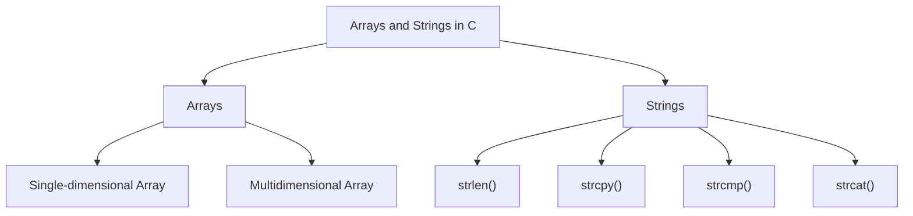

# Arrays and Strings in C

Arrays and strings are fundamental data structures in C programming. Arrays store collections of elements of the same type, while strings are essentially arrays of characters ending with a null terminator (`\0`).

## 1. Introduction to Arrays

An array is a collection of elements of the same data type stored in contiguous memory locations.

### a. Declaring an Array

To declare an array, specify the data type, array name, and size in square brackets.

#### Syntax

```c
data_type array_name[size];
```

#### Example

```c copy
#include <stdio.h>

int main() {
    int numbers[5]; // Declares an integer array with 5 elements
    numbers[0] = 10; // Assigns value to the first element
    numbers[1] = 20; // Assigns value to the second element

    printf("First element: %d\n", numbers[0]);
    printf("Second element: %d\n", numbers[1]);

    return 0;
}
```

### b. Initializing an Array

You can initialize an array at the time of declaration.

#### Example

```c copy
#include <stdio.h>

int main() {
    int numbers[5] = {10, 20, 30, 40, 50}; // Array initialization

    for (int i = 0; i < 5; i++) {
        printf("Element %d: %d\n", i, numbers[i]);
    }

    return 0;
}
```

## 2. Multidimensional Arrays

A multidimensional array is an array of arrays. The most common multidimensional array is the two-dimensional array, which can be thought of as a matrix.

### a. Declaring a Two-Dimensional Array

#### Syntax

```c
data_type array_name[rows][columns];
```

#### Example

```c copy
#include <stdio.h>

int main() {
    int matrix[2][3] = {{1, 2, 3}, {4, 5, 6}}; // 2x3 matrix

    // Printing matrix elements
    for (int i = 0; i < 2; i++) {
        for (int j = 0; j < 3; j++) {
            printf("%d ", matrix[i][j]);
        }
        printf("\n");
    }

    return 0;
}
```

### b. Multidimensional Array Example

You can have arrays of more than two dimensions.

#### Example

```c copy
#include <stdio.h>

int main() {
    int cube[2][2][2] = {
        {{1, 2}, {3, 4}},
        {{5, 6}, {7, 8}}
    };

    // Accessing elements of a 3D array
    printf("cube[1][0][1]: %d\n", cube[1][0][1]);

    return 0;
}
```

## 3. String Handling Functions

Strings in C are arrays of characters that end with a null terminator (`\0`). C provides several string-handling functions to manipulate strings.

### a. `strlen()` - String Length

The `strlen()` function returns the length of the string (excluding the null terminator).

#### Example

```c copy
#include <stdio.h>
#include <string.h>

int main() {
    char str[] = "Hello, World!";
    printf("Length of the string: %lu\n", strlen(str));

    return 0;
}
```

### b. `strcpy()` - String Copy

The `strcpy()` function copies a string from the source to the destination.

#### Example

```c copy
#include <stdio.h>
#include <string.h>

int main() {
    char src[] = "Hello";
    char dest[20];

    strcpy(dest, src);
    printf("Copied string: %s\n", dest);

    return 0;
}
```

### c. `strcmp()` - String Comparison

The `strcmp()` function compares two strings lexicographically. It returns `0` if they are equal, a positive value if the first string is greater, and a negative value if the second string is greater.

#### Example

```c copy
#include <stdio.h>
#include <string.h>

int main() {
    char str1[] = "Apple";
    char str2[] = "Banana";

    int result = strcmp(str1, str2);

    if (result == 0) {
        printf("Strings are equal.\n");
    } else if (result < 0) {
        printf("str1 is less than str2.\n");
    } else {
        printf("str1 is greater than str2.\n");
    }

    return 0;
}
```

### d. `strcat()` - String Concatenation

The `strcat()` function appends the source string to the destination string.

#### Example

```c copy
#include <stdio.h>
#include <string.h>

int main() {
    char str1[20] = "Hello";
    char str2[] = ", World!";

    strcat(str1, str2);
    printf("Concatenated string: %s\n", str1);

    return 0;
}
```

## Diagram of Arrays and Strings in C



## Summary of Arrays and Strings in C

- **Arrays**: Collections of elements of the same data type, stored in contiguous memory locations.
  - Single-dimensional arrays store data in a linear form.
  - Multidimensional arrays store data in a grid-like structure.
- **Strings**: Arrays of characters ending with a null terminator (`\0`).
  - **String Handling Functions**:
    - `strlen()`: Calculates string length.
    - `strcpy()`: Copies one string to another.
    - `strcmp()`: Compares two strings lexicographically.
    - `strcat()`: Concatenates two strings.

Arrays and strings are essential for handling collections of data and text manipulation in C.

### Key Points:

- Arrays allow storing collections of similar data types.
- Strings are essentially arrays of characters with special handling.
- String handling functions make manipulating strings easier.
