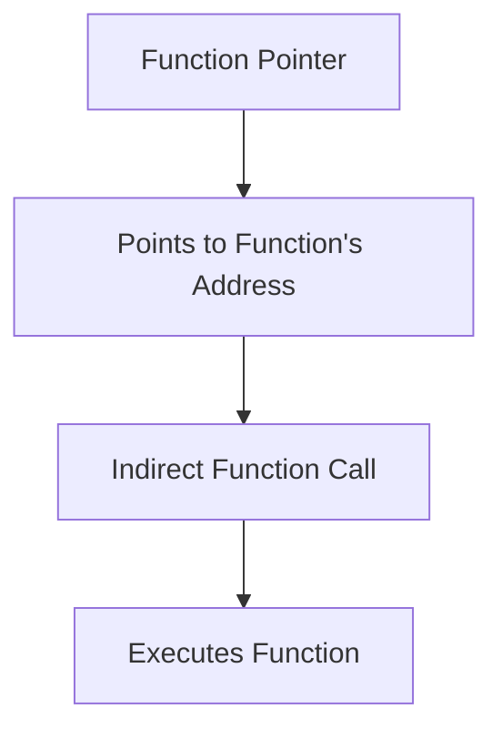

# Advanced Pointer Concepts in C

In C, pointers are not just limited to pointing to variables but can also point to functions. This allows for dynamic function calls and can be useful in callback mechanisms, function tables, and more.

## 1. Function Pointers

A **function pointer** is a pointer that points to the address of a function. Like normal pointers, function pointers store addresses, but in this case, the address belongs to a function.

### Syntax of Function Pointers

To declare a pointer to a function that returns a specific type and takes specific parameters, use the following syntax:

```c
return_type (*pointer_name)(parameter_list);
```

### Example: Basic Function Pointer

```c copy
#include <stdio.h>

int add(int a, int b) {
    return a + b;
}

int main() {
    // Declare a function pointer
    int (*func_ptr)(int, int);

    // Assign the address of the 'add' function to the pointer
    func_ptr = &add;

    // Use the pointer to call the function
    int result = func_ptr(5, 3);  // Equivalent to add(5, 3)
    printf("Sum: %d\n", result);

    return 0;
}
```

### Explanation:
- `func_ptr` is a function pointer that can point to a function returning `int` and taking two `int` parameters.
- `func_ptr = &add;` assigns the address of the `add` function to the function pointer.
- `func_ptr(5, 3);` calls the `add` function indirectly through the pointer.

#### Output:
```
Sum: 8
```

## 2. Pointer to Functions

Function pointers can also be passed to other functions as arguments, allowing us to call different functions dynamically.

### Example: Passing Function Pointers as Arguments

```c copy
#include <stdio.h>

// Function definitions
int add(int a, int b) {
    return a + b;
}

int subtract(int a, int b) {
    return a - b;
}

// Function that accepts a function pointer as a parameter
void execute_operation(int (*operation)(int, int), int x, int y) {
    int result = operation(x, y);
    printf("Result: %d\n", result);
}

int main() {
    // Call execute_operation with different function pointers
    execute_operation(add, 10, 5);      // Calls add(10, 5)
    execute_operation(subtract, 10, 5); // Calls subtract(10, 5)

    return 0;
}
```

### Explanation:
- The `execute_operation()` function accepts a function pointer as a parameter and uses it to perform the operation.
- The function pointer `operation` is passed to `execute_operation()`, allowing dynamic execution of the `add()` or `subtract()` function.

#### Output:
```
Result: 15
Result: 5
```

## 3. Diagram for Function Pointers



- The function pointer points to the address of a function, enabling indirect function calls.
- The function is executed when the pointer is used to invoke the function.

## 4. Real-World Use Case: Callback Functions

Function pointers are often used in **callback functions**—functions that are passed as arguments to another function and executed at a later time.

### Example: Callback with Function Pointers

```c copy
#include <stdio.h>

void greetMorning() {
    printf("Good Morning!\n");
}

void greetEvening() {
    printf("Good Evening!\n");
}

void greet(void (*greetingFunc)()) {
    // Calling the function passed as an argument
    greetingFunc();
}

int main() {
    // Passing different functions as callbacks
    greet(greetMorning);
    greet(greetEvening);

    return 0;
}
```

#### Output:
```
Good Morning!
Good Evening!
```

### Explanation:
- The `greet()` function accepts a function pointer `greetingFunc` and calls it.
- Depending on the function passed (`greetMorning` or `greetEvening`), a different greeting is printed.

## 5. Function Pointers in Arrays

You can also create an array of function pointers to store multiple functions and invoke them dynamically.

### Example: Array of Function Pointers

```c copy
#include <stdio.h>

int add(int a, int b) { return a + b; }
int subtract(int a, int b) { return a - b; }
int multiply(int a, int b) { return a * b; }

int main() {
    // Array of function pointers
    int (*operations[])(int, int) = {add, subtract, multiply};

    int x = 10, y = 5;

    // Loop through and call each function via the pointer array
    for (int i = 0; i < 3; i++) {
        printf("Result: %d\n", operations[i](x, y));
    }

    return 0;
}
```

#### Output:
```
Result: 15
Result: 5
Result: 50
```

### Explanation:
- `operations[]` is an array of function pointers pointing to the `add()`, `subtract()`, and `multiply()` functions.
- The array allows calling different functions based on their index.

## 6. Pointers to Pointers (Advanced Topic)

Sometimes, you may need pointers that point to other pointers. This is especially useful in situations where you need to manipulate arrays dynamically or pass pointers to functions.

```c copy
#include <stdio.h>

int main() {
    int x = 10;
    int *ptr = &x;     // Pointer to integer
    int **ptr2 = &ptr; // Pointer to pointer

    // Accessing the value of x using ptr2
    printf("Value of x: %d\n", **ptr2);

    return 0;
}
```

#### Output:
```
Value of x: 10
```

### Explanation:
- `ptr2` is a pointer to a pointer, and it holds the address of the pointer `ptr`.
- `**ptr2` dereferences `ptr2` twice to get the value of `x`.

## 7. Recap of Function Pointers

- **Function pointers** store the address of functions and allow indirect function calls.
- Function pointers can be passed to functions to implement callback mechanisms.
- Arrays of function pointers allow dynamic function execution.

Function pointers are a powerful feature of C that adds flexibility to your code. They are particularly useful in callback systems, event handling, and implementing function tables.

