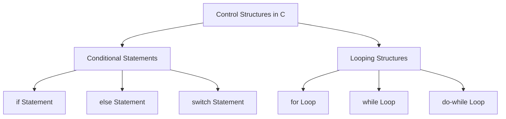

# Control Structures in C

Control structures are essential for controlling the flow of execution in a C program. They allow you to make decisions (conditional statements) and repeat actions (looping structures).

## 1. Conditional Statements

### a. `if` Statement

The `if` statement is used to execute a block of code if a specified condition is true.

#### Syntax
```c
if (condition) {
    // code to be executed if the condition is true
}
```

#### Example
```c copy
#include <stdio.h>

int main() {
    int a = 5;

    if (a > 0) {
        printf("a is positive.\n");
    }

    return 0;
}
```

### b. `else` Statement

The `else` statement provides an alternative block of code to execute if the condition in the `if` statement is false.

#### Syntax
```c
if (condition) {
    // code to be executed if the condition is true
} else {
    // code to be executed if the condition is false
}
```

#### Example
```c copy
#include <stdio.h>

int main() {
    int a = -5;

    if (a > 0) {
        printf("a is positive.\n");
    } else {
        printf("a is non-positive.\n");
    }

    return 0;
}
```

### c. `switch` Statement

The `switch` statement is used to execute one block of code among many options based on the value of a variable.

#### Syntax
```c
switch (expression) {
    case constant1:
        // code to be executed if expression == constant1
        break;
    case constant2:
        // code to be executed if expression == constant2
        break;
    default:
        // code to be executed if none of the constants match
}
```

#### Example
```c copy
#include <stdio.h>

int main() {
    int day = 3;

    switch (day) {
        case 1:
            printf("Monday\n");
            break;
        case 2:
            printf("Tuesday\n");
            break;
        case 3:
            printf("Wednesday\n");
            break;
        default:
            printf("Invalid day\n");
    }

    return 0;
}
```

## 2. Looping Structures

### a. `for` Loop

The `for` loop is used to execute a block of code a specific number of times.

#### Syntax
```c
for (initialization; condition; increment/decrement) {
    // code to be executed
}
```

#### Example
```c copy
#include <stdio.h> 

int main() {
    for (int i = 0; i < 5; i++) {
        printf("%d\n", i);
    }

    return 0;
}
```

### b. `while` Loop

The `while` loop repeatedly executes a block of code as long as a specified condition is true.

#### Syntax
```c
while (condition) {
    // code to be executed
}
```

#### Example
```c copy
#include <stdio.h>

int main() {
    int i = 0;

    while (i < 5) {
        printf("%d\n", i);
        i++;
    }

    return 0;
}
```

### c. `do-while` Loop

The `do-while` loop is similar to the `while` loop, but it guarantees that the block of code is executed at least once.

#### Syntax
```c
do {
    // code to be executed
} while (condition);
```

#### Example
```c copy
#include <stdio.h>

int main() {
    int i = 0;

    do {
        printf("%d\n", i);
        i++;
    } while (i < 5);

    return 0;
}
```

## Diagram of Control Structures in C



## Summary of Control Structures in C

- **Conditional Statements**:
    - **`if`**: Executes code if the condition is true.
    - **`else`**: Executes alternative code if the condition is false.
    - **`switch`**: Executes code based on the value of a variable.

- **Looping Structures**:
    - **`for`**: Repeats code a specific number of times.
    - **`while`**: Repeats code as long as the condition is true.
    - **`do-while`**: Repeats code at least once, checking the condition afterward.

Understanding these control structures is crucial for implementing logic in C programs.


### Key Points:
- Conditional statements allow for decision-making in code.
- Looping structures enable repeated execution of code blocks based on certain conditions.

