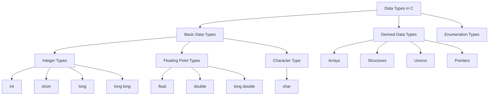

# Data Types in C

In C programming, **data types** define the kind of data a variable can hold. They specify how much memory to allocate and how to interpret the data stored in that memory. Understanding data types is essential for effective programming in C.

## 1. Basic Data Types

C has several built-in data types that can be classified into the following categories:

### a. **Integer Types**

Integer types are used to store whole numbers. The sizes of integer types can vary based on the system architecture, but the following are commonly used:

| Data Type  | Size (bytes) | Range                                           |
|------------|--------------|-------------------------------------------------|
| `int`      | 4            | -2,147,483,648 to 2,147,483,647                |
| `short`    | 2            | -32,768 to 32,767                              |
| `long`     | 4 or 8       | Typically -2,147,483,648 to 2,147,483,647 or larger |
| `long long`| 8            | At least -9,223,372,036,854,775,808 to 9,223,372,036,854,775,807 |

**Example:**

```c
int age = 25;          // Integer
short count = 100;    // Short Integer
long population = 1000000; // Long Integer
long long distance = 1234567890123; // Long Long Integer
```

### b. **Floating Point Types**

Floating point types are used to store numbers with decimal points. The common floating-point types are:

| Data Type  | Size (bytes) | Precision               |
|------------|--------------|-------------------------|
| `float`    | 4            | Single precision (6-7 decimal digits) |
| `double`   | 8            | Double precision (15-16 decimal digits) |
| `long double` | 10, 12, or 16 | Extended precision (varies by system) |

**Example:**

```c
float temperature = 36.6;    // Single Precision
double pi = 3.141592653589793; // Double Precision
long double preciseValue = 1.234567890123456789; // Long Double
```

### c. **Character Type**

The character type is used to store single characters.

| Data Type | Size (bytes) | Description            |
|-----------|--------------|------------------------|
| `char`    | 1            | Stores a single character (ASCII value) |

**Example:**

```c
char letter = 'A'; // Character
```

## 2. Derived Data Types

C also supports derived data types, which are built from the basic data types.

### a. **Arrays**

An array is a collection of elements of the same data type, with a fixed size.

**Example:**

```c
int numbers[5] = {1, 2, 3, 4, 5}; // Array of integers
char letters[4] = {'A', 'B', 'C', 'D'}; // Array of characters
```

### b. **Structures**

A structure is a user-defined data type that groups variables of different types under a single name.

**Example:**

```c
struct Student {
    char name[50];
    int age;
    float grade;
};

struct Student student1 = {"John Doe", 20, 88.5};
```

### c. **Unions**

A union is similar to a structure, but it allows storing different data types in the same memory location. Only one member can contain a value at any given time.

**Example:**

```c
union Data {
    int intValue;
    float floatValue;
    char charValue;
};

union Data data;
data.intValue = 5; // Only this member can hold a value at a time
```

### d. **Pointers**

A pointer is a variable that stores the memory address of another variable.

**Example:**

```c
int num = 10;
int *ptr = &num; // Pointer to an integer
```

## 3. Enumeration Types

Enumeration (enum) is a user-defined data type that consists of integral constants. It helps to define variables that can hold a set of predefined constants.

**Example:**

```c
enum Color {
    RED,
    GREEN,
    BLUE
};

enum Color favoriteColor = GREEN; // favoriteColor can take values RED, GREEN, or BLUE
```

## Summary

Understanding data types in C is crucial for:

- **Memory management**: Allocating the right amount of memory.
- **Data manipulation**: Knowing how to handle different types of data.

## Diagram of Data Types in C


