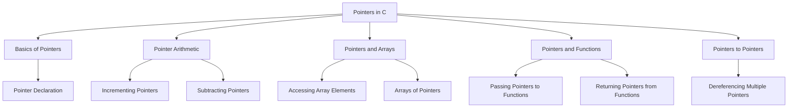

# Pointers in C

Pointers are one of the most powerful and flexible features in C. They store the memory address of a variable, allowing you to directly access and modify memory.

## 1. Basics of Pointers

A pointer is a variable that holds the address of another variable.

### a. Declaring a Pointer

To declare a pointer, use the `*` symbol before the pointer variable name.

#### Syntax
```c 
data_type *pointer_name;
```

#### Example
```c copy
#include <stdio.h>

int main() {
    int a = 10;
    int *ptr = &a; // Pointer to integer a

    printf("Value of a: %d\n", a);
    printf("Address of a: %p\n", ptr); // %p is used to print addresses
    printf("Value pointed by ptr: %d\n", *ptr); // Dereferencing pointer

    return 0;
}
```

### b. Pointer and Dereferencing

A pointer stores the address of a variable, and you can access the value at that address using the dereference operator `*`.

#### Example
```c copy
int a = 5;
int *ptr = &a; // ptr stores the address of a
printf("Value of a: %d\n", *ptr); // Dereferencing pointer to get the value of a
```

## 2. Pointer Arithmetic

Pointer arithmetic allows you to perform operations on pointers, like adding or subtracting integers to navigate through memory.

### a. Incrementing and Decrementing Pointers

When you increment or decrement a pointer, it moves by the size of the data type it points to.

#### Example
```c copy
#include <stdio.h>

int main() {
    int arr[] = {10, 20, 30, 40, 50};
    int *ptr = arr; // Pointer to the first element of arr

    printf("Pointer at arr[0]: %d\n", *ptr);
    ptr++; // Incrementing pointer to point to the next element
    printf("Pointer at arr[1]: %d\n", *ptr);

    return 0;
}
```

In this case, the pointer moves by `sizeof(int)` (typically 4 bytes) each time it is incremented.

### b. Subtracting Pointers

You can also subtract one pointer from another to find the number of elements between them.

#### Example
```c copy
#include <stdio.h>

int main() {
    int arr[] = {10, 20, 30, 40, 50};
    int *ptr1 = &arr[0];
    int *ptr2 = &arr[4];

    printf("Difference between pointers: %ld\n", ptr2 - ptr1); // Output: 4

    return 0;
}
```

## 3. Pointers and Arrays

Pointers and arrays are closely related because the name of an array is essentially a pointer to its first element.

### a. Accessing Array Elements via Pointers

You can use pointers to access and manipulate array elements.

#### Example
```c copy
#include <stdio.h>

int main() {
    int arr[] = {10, 20, 30, 40, 50};
    int *ptr = arr; // Pointer to the first element of arr

    for (int i = 0; i < 5; i++) {
        printf("Element %d: %d\n", i, *(ptr + i)); // Accessing array elements
    }

    return 0;
}
```

### b. Arrays of Pointers

You can also create arrays that store pointers.

#### Example
```c copy
#include <stdio.h>

int main() {
    int a = 10, b = 20, c = 30;
    int *arr[3] = {&a, &b, &c}; // Array of pointers

    for (int i = 0; i < 3; i++) {
        printf("Value of element %d: %d\n", i, *arr[i]);
    }

    return 0;
}
```

## 4. Pointers and Functions

Pointers can be passed to functions to modify the original variable rather than its copy.

### a. Passing Pointers to Functions

By passing pointers to functions, you can modify the original values.

#### Example
```c copy
#include <stdio.h>

void modifyValue(int *ptr) {
    *ptr = 100; // Modifying the original value
}

int main() {
    int a = 10;
    modifyValue(&a); // Passing the address of a
    printf("Modified value of a: %d\n", a); // Output: 100

    return 0;
}
```

### b. Returning Pointers from Functions

You can also return pointers from functions, but make sure the pointer is not pointing to a local variable inside the function, as local variables get destroyed when the function ends.

#### Example
```c copy
#include <stdio.h>

int* getPointerToValue() {
    static int a = 10; // static variable stays in memory after the function ends
    return &a;
}

int main() {
    int *ptr = getPointerToValue();
    printf("Value pointed by ptr: %d\n", *ptr);

    return 0;
}
```

## 5. Pointers to Pointers

A pointer to a pointer is a form of multiple indirection, where one pointer points to another pointer.

### a. Declaring a Pointer to a Pointer

#### Syntax
```c
data_type **pointer_name;
```

#### Example
```c copy
#include <stdio.h>

int main() {
    int a = 10;
    int *ptr = &a; // Pointer to a
    int **pptr = &ptr; // Pointer to pointer

    printf("Value of a: %d\n", a);
    printf("Value using *ptr: %d\n", *ptr);
    printf("Value using **pptr: %d\n", **pptr); // Dereferencing twice

    return 0;
}
```

## Diagram of Pointers in C



## Summary of Pointers in C

- **Basics of Pointers**: Pointers store the address of variables, and using the dereference operator `*`, you can access the value at that address.
- **Pointer Arithmetic**: You can increment or decrement pointers to traverse memory.
- **Pointers and Arrays**: The name of an array acts as a pointer to its first element.
- **Pointers and Functions**: Passing pointers to functions allows you to modify the original variable, and pointers can also be returned from functions.
- **Pointers to Pointers**: A pointer to a pointer stores the address of another pointer, and you can dereference it multiple times to access the actual value.

Pointers are essential for dynamic memory allocation, passing data efficiently, and working with complex data structures in C.


### Key Points:
- Pointers enable efficient memory manipulation by accessing and modifying data directly.
- Pointer arithmetic helps in traversing arrays and memory locations.
- Pointers and functions provide flexibility in modifying original variables.
- Pointers to pointers allow handling multiple levels of indirection.


