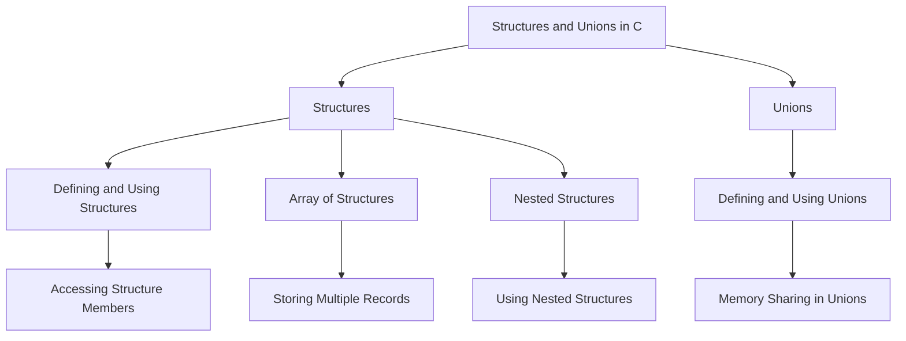

# Structures and Unions in C

In C programming, **structures** and **unions** allow you to group variables of different data types together, enabling better management of complex data.

## 1. Defining and Using Structures

A **structure** in C is a user-defined data type that groups variables of different data types under a single name. Each variable within a structure is called a **member**.

### a. Defining a Structure

#### Syntax
```c 
struct structure_name {
    data_type member1;
    data_type member2;
    // Additional members...
};
```

#### Example
```c copy
#include <stdio.h>

struct Student {
    char name[50];
    int roll_number;
    float marks;
};

int main() {
    struct Student student1;

    // Assigning values to members
    strcpy(student1.name, "John");
    student1.roll_number = 1;
    student1.marks = 95.5;

    // Accessing members
    printf("Name: %s\n", student1.name);
    printf("Roll Number: %d\n", student1.roll_number);
    printf("Marks: %.2f\n", student1.marks);

    return 0;
}
```

### b. Accessing Structure Members

You can access structure members using the dot (`.`) operator.

#### Example
```c copy
struct Student student1;
student1.roll_number = 10;
```

## 2. Array of Structures

You can create an array of structures to store multiple records, each of which has the same structure.

### a. Defining an Array of Structures

#### Example
```c copy
#include <stdio.h>

struct Student {
    char name[50];
    int roll_number;
    float marks;
};

int main() {
    struct Student students[3]; // Array of 3 students

    // Assigning values to the first student
    strcpy(students[0].name, "Alice");
    students[0].roll_number = 1;
    students[0].marks = 90.5;

    // Assigning values to the second student
    strcpy(students[1].name, "Bob");
    students[1].roll_number = 2;
    students[1].marks = 88.0;

    // Printing the data of all students
    for (int i = 0; i < 2; i++) {
        printf("Name: %s, Roll Number: %d, Marks: %.2f\n",
               students[i].name, students[i].roll_number, students[i].marks);
    }

    return 0;
}
```

### b. Accessing Array Elements

You can access and manipulate individual structure elements within the array using the index.

#### Example
```c copy
printf("First Student's Name: %s\n", students[0].name);
```

## 3. Nested Structures

A **nested structure** is when one structure contains another structure as its member. This allows better organization of data.

### a. Defining Nested Structures

#### Example
```c copy
#include <stdio.h>

struct Date {
    int day;
    int month;
    int year;
};

struct Student {
    char name[50];
    int roll_number;
    struct Date dob; // Nested structure
};

int main() {
    struct Student student1;

    // Assigning values
    strcpy(student1.name, "John");
    student1.roll_number = 1;
    student1.dob.day = 15;
    student1.dob.month = 8;
    student1.dob.year = 2000;

    // Accessing nested structure members
    printf("Name: %s\n", student1.name);
    printf("DOB: %02d-%02d-%d\n", student1.dob.day, student1.dob.month, student1.dob.year);

    return 0;
}
```

### b. Accessing Nested Members

You can access members of the nested structure using the dot operator.

#### Example
```c copy
student1.dob.day = 15;
```

## 4. Unions in C

A **union** is similar to a structure, but it stores different members in the **same memory location**. This means only one member can hold a value at a time.

### a. Defining a Union

#### Syntax
```c
union union_name {
    data_type member1;
    data_type member2;
    // Additional members...
};
```

#### Example
```c copy
#include <stdio.h>

union Data {
    int i;
    float f;
    char str[20];
};

int main() {
    union Data data;

    // Assigning and accessing values
    data.i = 10;
    printf("data.i: %d\n", data.i);

    data.f = 220.5;
    printf("data.f: %.2f\n", data.f);

    strcpy(data.str, "C Programming");
    printf("data.str: %s\n", data.str);

    return 0;
}
```

### b. Memory Sharing in Unions

In a union, the largest data type determines the size of the union, and all members share the same memory space. Assigning a value to one member overwrites the previous value.

#### Example
```c copy
#include <stdio.h>

union Data {
    int i;
    float f;
};

int main() {
    union Data data;
    
    data.i = 10;
    printf("data.i: %d\n", data.i);

    data.f = 220.5; // Overwrites the value of data.i
    printf("data.f: %.2f\n", data.f);
    printf("data.i after assigning data.f: %d\n", data.i); // Corrupted

    return 0;
}
```

## Diagram for Structures and Unions



## Summary of Structures and Unions

- **Structures**: Allow grouping of different data types together. Useful for managing complex data.
  - **Array of Structures**: Helps store multiple records.
  - **Nested Structures**: Structures within structures provide hierarchical data storage.
- **Unions**: Share memory between members, meaning only one member can store data at a time. Useful for memory efficiency when only one variable is needed at a time.

### Key Points:
- Structures allow grouping variables of different data types, making it easy to manage related data.
- Arrays of structures allow storage of multiple similar records.
- Nested structures provide a way to represent hierarchical data.
- Unions save memory by allowing different members to share the same memory space, though only one member holds a valid value at a time.

