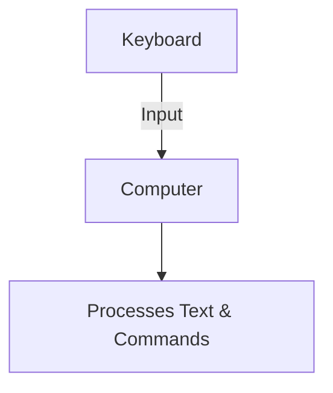
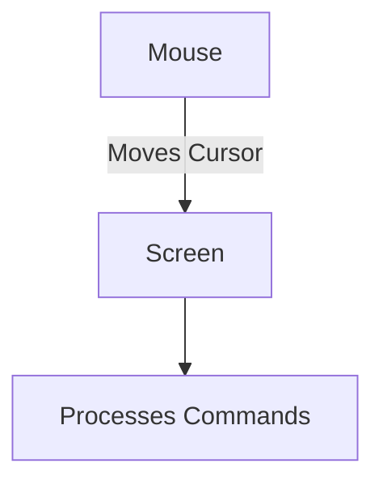
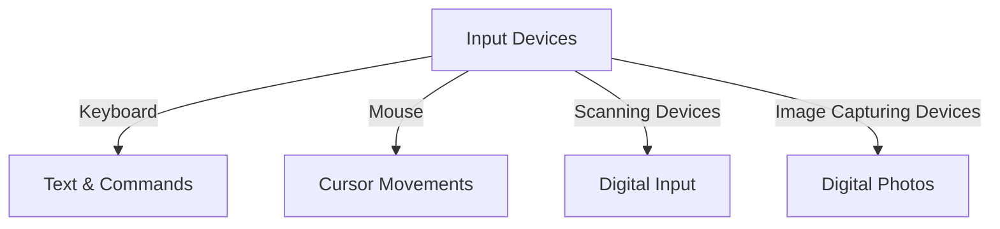
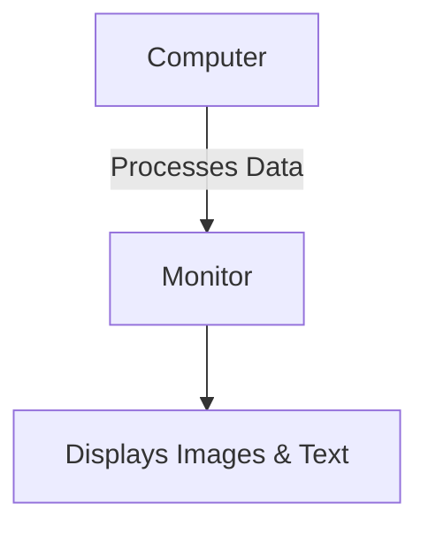
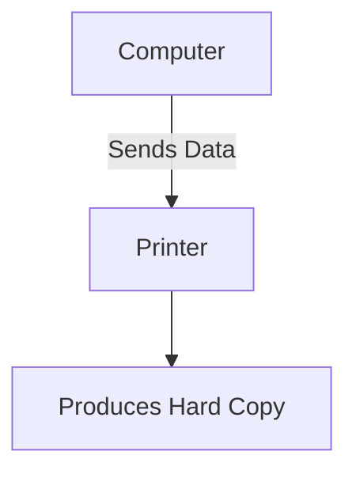
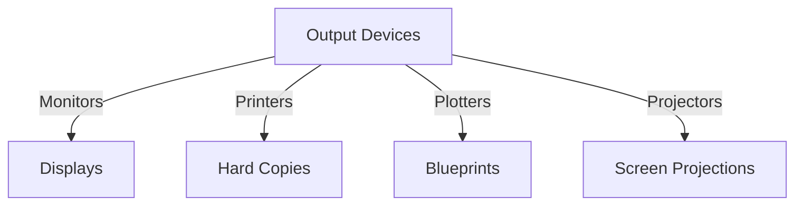

# Input and Output Devices

## Input Devices

Input devices allow users to interact with and send data to the computer system. These devices convert physical actions or signals into digital data that the computer can process.

### 1. Keyboard
- **Keyboard** is the most common input device used to enter text and commands into a computer.
- It contains a set of keys for letters, numbers, and functions.

**Diagram of Keyboard Interaction**:

---

### 2. Pointing Devices

Pointing devices allow users to interact with the graphical interface of a computer.

#### a. **Mouse**
- **Mouse** is a widely used pointing device that detects two-dimensional motion relative to a surface. It controls the cursor on the screen.
  
**Diagram**:

#### b. **Touch Screens**
- **Touch Screens** enable direct interaction with the display by sensing touch inputs. They are common in smartphones, tablets, and kiosks.

#### c. **Joystick**
- A **Joystick** is a control device often used in gaming and simulations. It allows directional control via a stick that moves in all directions.

#### d. **Electronic Pen**
- An **Electronic Pen** (or stylus) is used for precise inputs, typically on touchscreens or graphics tablets. It is commonly used in digital art and design.

#### e. **Trackball**
- A **Trackball** is a pointing device that consists of a ball placed in a socket. The ball can be rotated to move the cursor.

---

### 3. Scanning Devices

Scanning devices capture images or text and convert them into digital form.

#### a. **Optical Scanners**
- **Optical Scanners** digitize printed text, images, or documents. These include flatbed scanners and handheld scanners.

#### b. **OCR (Optical Character Recognition)**
- **OCR** is a technology that converts different types of documents, such as scanned paper documents or images, into editable and searchable data.

#### c. **OMR (Optical Mark Recognition)**
- **OMR** is used to capture human-marked data from documents like surveys or exams (e.g., multiple-choice tests).

#### d. **Bar Code Readers**
- **Bar Code Readers** scan bar codes, which represent data by varying the widths and spacing of parallel lines.

#### e. **MICR (Magnetic Ink Character Recognition)**
- **MICR** is used to verify the legitimacy of paper documents, particularly in banks for processing checks.

#### f. **Digitizer**
- A **Digitizer** converts analog information, such as a physical drawing, into a digital format.

#### g. **Electronic Card Reader**
- **Electronic Card Readers** are used to read credit or debit cards, often utilizing a magnetic stripe or a chip.

---

### 4. Image Capturing Devices

#### a. **Digital Cameras**
- **Digital Cameras** capture photographs and videos digitally. They are widely used for personal photography, professional media creation, and video conferencing.

**Diagram of Input Devices**:

---

## Output Devices

Output devices display or project data processed by the computer, converting it into a human-readable form.

### 1. Monitors

Monitors are the primary output devices used to display images, videos, and text.

#### a. **CRT (Cathode Ray Tube) Monitors**
- **CRT Monitors** are large, older monitors that use electron beams to create an image on a phosphorescent screen.

#### b. **LCD/TFT (Liquid Crystal Display/Thin Film Transistor) Monitors**
- **LCD/TFT Monitors** are flat, lightweight screens that use liquid crystals to create images. They are widely used in modern computers, laptops, and TVs.

**Diagram of Monitors**:

---

### 2. Printers

Printers produce hard copies of digital documents, images, or data.

#### a. **Dot Matrix Printer**
- **Dot Matrix Printers** create characters and images using a matrix of tiny dots. They are impact printers, commonly used for receipts and multi-part forms.

#### b. **Inkjet Printer**
- **Inkjet Printers** spray tiny droplets of ink onto paper to produce high-quality text and images. They are the most common printers for home and small office use.

#### c. **Laser Printer**
- **Laser Printers** use a laser beam to produce an image on a drum, which is then transferred to paper using toner. They are fast and efficient, especially for high-volume printing.

**Diagram of Printer Operation**:

---

### 3. Plotters

Plotters are used for large-scale, high-precision drawings like architectural blueprints and engineering designs.

#### a. **Drum Plotter**
- **Drum Plotters** move the paper back and forth on a drum while a pen moves across the surface to create precise line drawings.

#### b. **Flatbed Plotter**
- **Flatbed Plotters** place the paper flat on a surface while the pen moves across to produce drawings.

---

### 4. Screen Image Projector
- **Screen Image Projectors** are used to project images or presentations onto large screens. They are commonly used in classrooms, conference rooms, and movie theaters.

**Diagram of Output Devices**:

