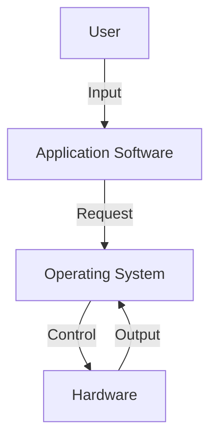
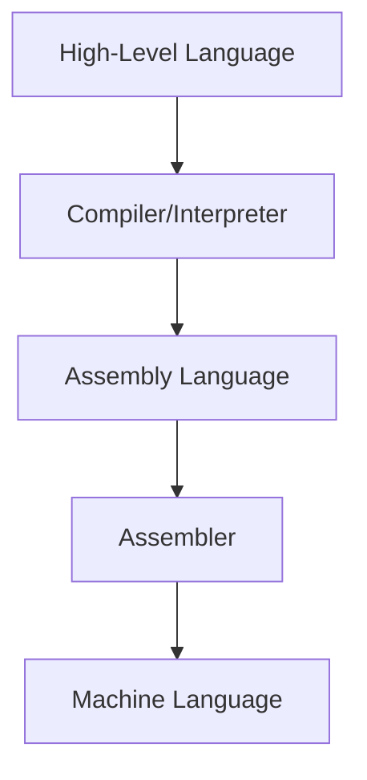
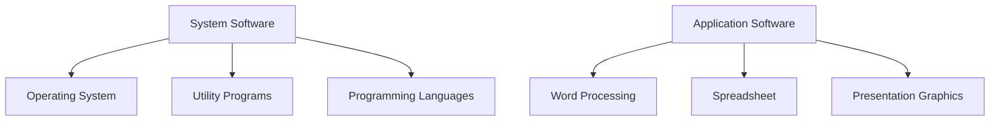
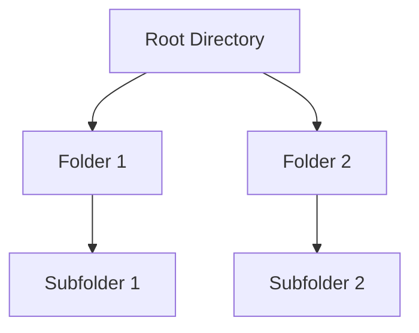
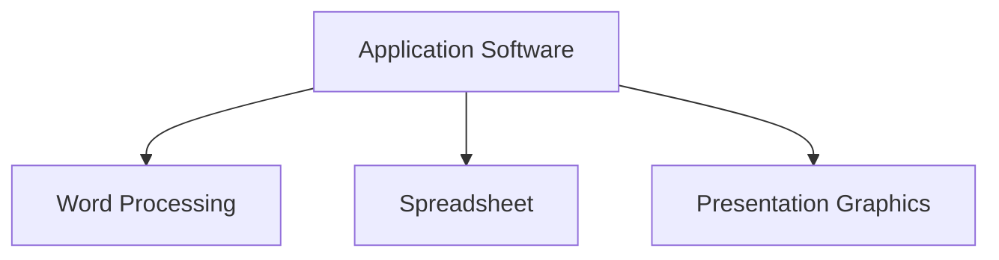

# Computer Software

## Software and Its Need

Software refers to a collection of instructions, programs, and data that enable the hardware to perform specific tasks. Without software, hardware components would not be able to function effectively.

- **Need for Software**: Software is essential to operate computers, manage files, and execute tasks efficiently. It bridges the gap between hardware and the user by providing instructions that the computer understands.

---

## Types of Software

Software is broadly classified into two types: 

### 1. System Software
System software is designed to manage and control the hardware components of a computer. It acts as a bridge between the hardware and the user applications.

#### a. **Operating System (OS)**
- An **Operating System** is the most important system software. It manages the hardware, software resources, and provides common services for application programs.
  
  **Examples**: Windows, Linux, macOS.

**Diagram of Operating System Functionality**:

---

#### b. **Utility Program**
- **Utility Programs** are specialized system software designed to help manage, maintain, and control computer resources. Examples include antivirus software, disk cleanup tools, and backup software.

#### c. **Programming Languages**
- Programming languages are used to write software. They can be classified into three main types:
  1. **Machine Language**: Binary code (0s and 1s) that the computer directly understands.
  2. **Assembly Language**: Low-level language using symbols and mnemonics to represent machine instructions.
  3. **High-Level Languages**: User-friendly languages like C, C++, Java, Python.
  4. **Fourth-Generation Languages (4GLs)**: Languages that are closer to human language, aimed at speeding up software development.

**Diagram of Language Levels**:

---

### 2. Application Software

Application software is designed to allow users to perform specific tasks like word processing, calculations, or multimedia tasks.

#### Types of Application Software

##### a. **Word Processing Software**
- **Word Processing Software** is used to create, edit, format, and print text documents.
  
  **Examples**: Microsoft Word, Google Docs.

##### b. **Spreadsheet Software**
- **Spreadsheet Software** is used for organizing, analyzing, and storing data in tabular form.
  
  **Examples**: Microsoft Excel, Google Sheets.

##### c. **Presentation Graphics Software**
- **Presentation Graphics Software** is used to create slideshows and visual aids for presentations.
  
  **Examples**: Microsoft PowerPoint, Google Slides.

**Diagram of Software Types**:

---

## Operating Systems for PCs

### 1. **DOS (Disk Operating System)**
- **DOS** is a command-line operating system, primarily used in early personal computers. It allowed users to perform file management, memory management, and device management tasks.

### 2. **Windows**
- **Windows** is a widely-used graphical operating system developed by Microsoft. It provides a user-friendly interface with icons, windows, and a start menu.

### 3. **Linux**
- **Linux** is an open-source operating system based on UNIX. It is known for its stability, security, and wide application in server environments.

---

## File Allocation Table (FAT & FAT32)

### FAT (File Allocation Table)
- **FAT** is a file system architecture used by operating systems to track the location of files on disk drives. Each file is divided into clusters, and FAT keeps track of which clusters belong to which files.

### FAT32
- **FAT32** is an enhanced version of the original FAT system, capable of supporting larger disk drives and file sizes.

---

## Files & Directory Structure and Naming Rules

A **file system** organizes files and directories on storage devices. 

### Directory Structure
- Files are organized into directories (folders) for easy access. Each directory can have subdirectories, creating a tree-like structure.

### Naming Rules
- **File Naming**: Names typically follow certain conventions, such as:
  - Limited character length (e.g., 255 characters in Windows).
  - Certain characters are restricted (e.g., `/`, `\`, `*`, `?`, etc.).

**Diagram of Directory Structure**:

---

## Programming Languages

### 1. **Machine Language**
- **Machine Language** is the most basic programming language, consisting only of binary code (0s and 1s). It is directly understood by the CPU but is difficult for humans to write and debug.

### 2. **Assembly Language**
- **Assembly Language** uses symbolic codes to represent machine instructions. It requires an **Assembler** to convert it into machine code.

### 3. **High-Level Languages**
- **High-Level Languages** like C, Java, Python are user-friendly languages that are closer to human languages and need to be translated into machine code using compilers or interpreters.

### 4. **Fourth-Generation Languages (4GL)**
- **4GL** are even higher-level languages that are more declarative and are designed to reduce the complexity of writing software. They are often used for database queries and report generation.

---

### Merits and Demerits of Programming Languages

#### Machine Language
- **Merits**: Direct communication with hardware, fast execution.
- **Demerits**: Complex and error-prone, difficult to write.

#### Assembly Language
- **Merits**: Faster than high-level languages, more readable than machine code.
- **Demerits**: Still complex, hardware-dependent.

#### High-Level Languages
- **Merits**: Easy to write and debug, portable across different hardware.
- **Demerits**: Slower compared to machine and assembly languages due to the need for translation.

#### Fourth-Generation Languages (4GL)
- **Merits**: Increased productivity, easier to learn and use.
- **Demerits**: Less control over hardware, slower execution.

---

## Application Software and Its Types

Application software allows users to perform various tasks depending on their needs.

### 1. **Word Processing**
- **Word Processing** software is used to create and format documents with text, images, and tables.
  **Example**: Microsoft Word.

### 2. **Spreadsheet**
- **Spreadsheet** software is used to create tables and perform calculations and data analysis.
  **Example**: Microsoft Excel.

### 3. **Presentation Graphics**
- **Presentation Graphics** software is used to create slideshows for visual presentations.
  **Example**: Microsoft PowerPoint.

**Diagram of Application Software Types**:

