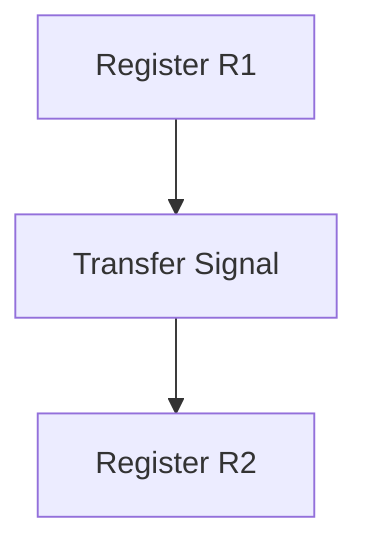
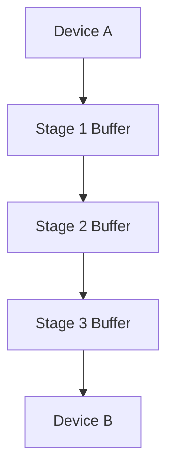
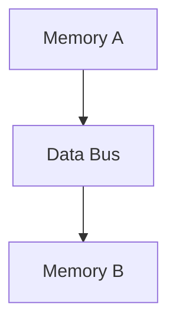
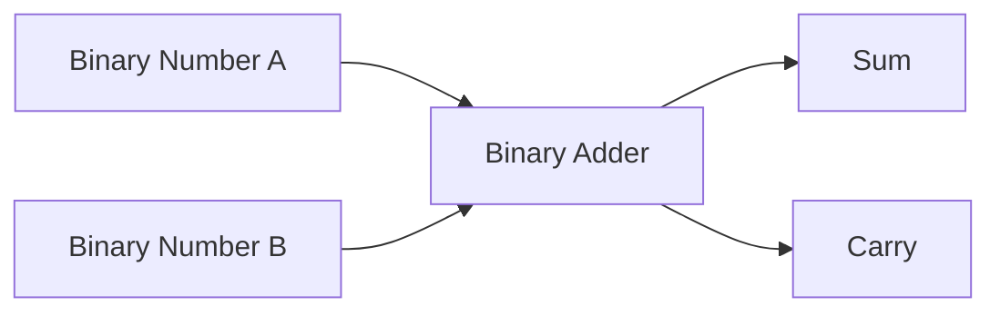
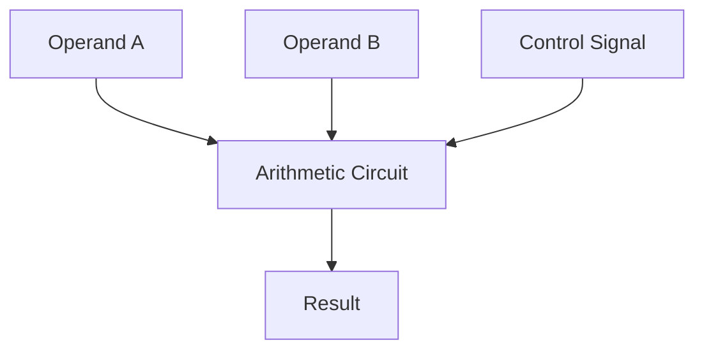
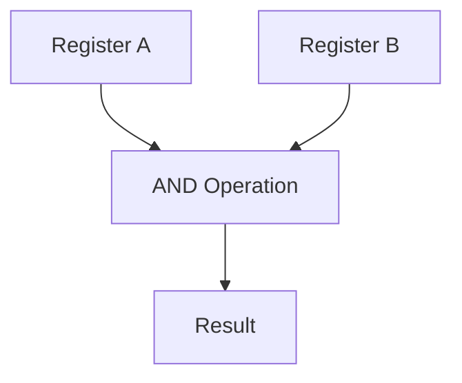
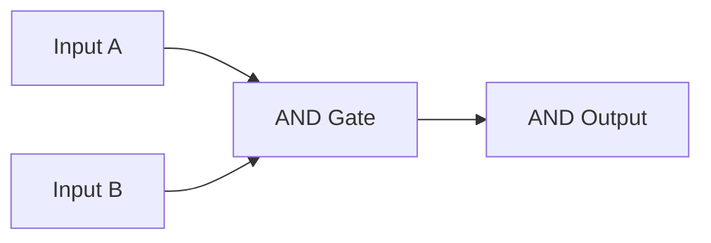
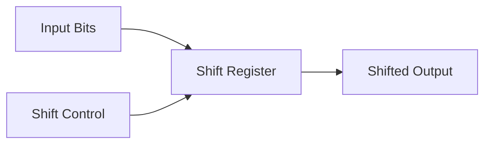
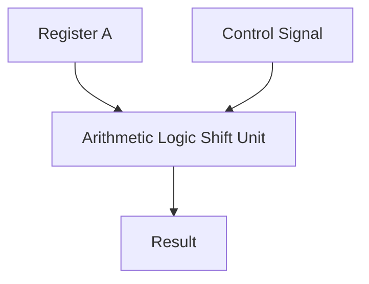

# Register Transfer Language

## 1. Register Transfer
**Register Transfer** describes the operations on the data stored in registers and how data is moved from one register to another. It involves signals that control the movement of data between registers.



- **Example**: If `R1` contains the value `5`, a transfer operation moves this value to `R2` based on a control signal.

---

## 2. Bus and Memory Transfer

### 2.1 Bus Transfer
A **Bus** is a communication system that transfers data between components inside a computer, or between computers. It is usually shared by multiple devices to communicate.

**Three-stage Bus Buffers**: Buffers control data flow between devices in multiple stages for proper communication.



### 2.2 Memory Transfer
Memory transfer refers to moving data between memory and registers or between different memory locations. It often uses buses to carry the data.



- **Example**: Transferring the contents of memory location `A` to memory location `B` via the data bus.

---

## 3. Arithmetic Micro-Operations

Arithmetic micro-operations perform simple arithmetic operations on numeric data stored in registers.

### 3.1 Binary Adder
A **Binary Adder** adds two binary numbers and produces a sum and a carry bit.



- **Example**: Adding binary `1101` and `1011`:
```
  1101
+ 1011
------
  11000 (Sum = 1000, Carry = 1)
```

### 3.2 Binary Adder-Subtractor
This circuit can perform both addition and subtraction using a control signal. Subtraction is achieved by adding the 2's complement of the number.

- **Example**: To subtract `5` from `7`, we add the 2’s complement of `5` to `7`.

### 3.3 Binary Incrementer
A **Binary Incrementer** adds `1` to a binary number.

- **Example**: Incrementing `0111`:
```
0111 + 1 = 1000
```

### 3.4 Arithmetic Circuit
An **Arithmetic Circuit** performs a variety of arithmetic operations like addition, subtraction, increment, and decrement.



---

## 4. Logic Micro-Operations

Logic micro-operations perform bitwise logical operations (AND, OR, NOT, etc.) on registers.

### 4.1 List of Logic Micro-Operations
- **AND**: Performs logical AND between two registers.
- **OR**: Performs logical OR between two registers.
- **NOT**: Complements the bits in a register.
- **XOR**: Performs logical XOR between two registers.



### 4.2 Hardware Implementation
Logic micro-operations can be implemented using logic gates. Each operation is performed by corresponding hardware logic.



---

## 5. Shift Micro-Operations

Shift micro-operations move bits in a register to the left or right. Shifts can be:
- **Logical Shift**: Shifts bits left or right, and fills the empty positions with zeros.
- **Arithmetic Shift**: Shifts bits while preserving the sign bit.
- **Circular Shift**: Rotates the bits so that shifted-out bits are reinserted into the opposite end.

### 5.1 Hardware Implementation
Hardware implementation of shift operations uses shift registers.



- **Example of Left Shift**:
```
1010 (binary) << 1 = 0100
```

---

## 6. Arithmetic Logic Shift Unit

An **Arithmetic Logic Shift Unit** combines arithmetic operations, logic operations, and shift operations into a single unit. This unit can perform all these operations based on control signals.



The Arithmetic Logic Shift Unit can be controlled to perform:
- Addition
- Subtraction
- Logical operations (AND, OR, NOT)
- Shifts (left, right, circular)

