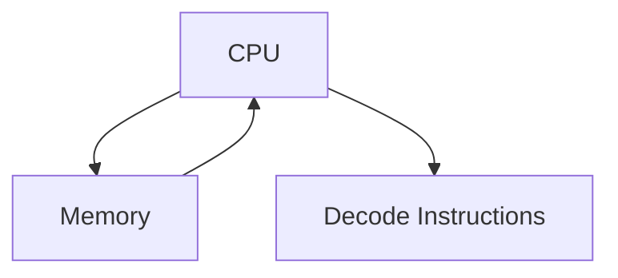
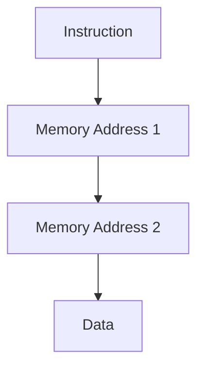
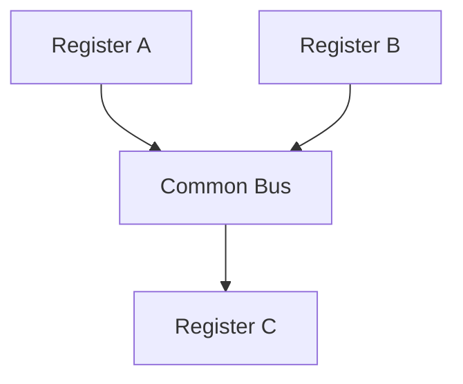
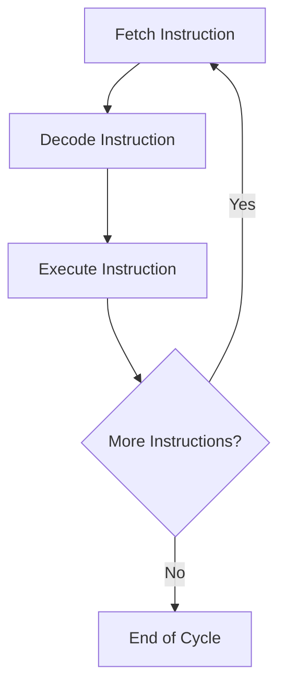
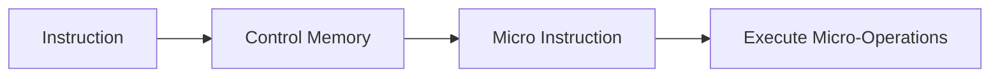
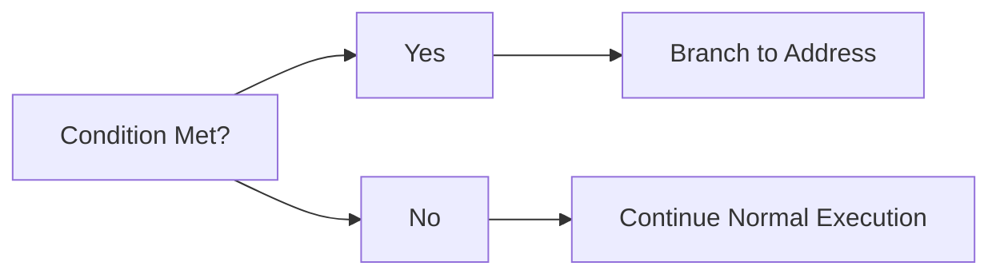
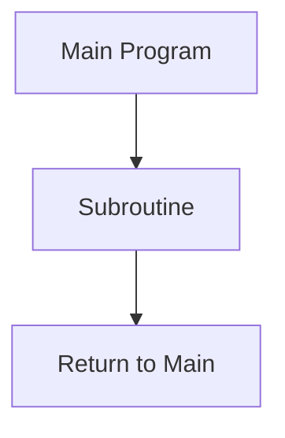

# Instruction Codes

## 1. Stored Program Organization

In a **Stored Program Organization**, both instructions and data are stored in the computer memory. The instructions are fetched from memory and executed sequentially or based on control logic.

- **Example**: In a program that adds two numbers, the instructions like "load", "add", and "store" are all fetched from memory and executed by the CPU.

---

## 2. Indirect Addressing

In **Indirect Addressing**, the address field of the instruction contains a memory location where the effective address is stored. The CPU fetches the address indirectly through another address.

- **Example**: If instruction at address `A` points to another address `B`, and `B` contains the actual data, then data is fetched indirectly.

---

## 3. Computer Registers

### 3.1 Common Bus System

The **Common Bus** is used for transferring data between registers. All registers are connected to this common bus, and the control unit directs the data flow.

- **Example**: Data from `Register A` is transferred to `Register C` via the common bus.

---

## 4. Computer Instructions

### 4.1 Instruction Set Completeness

An instruction set is considered complete if it can perform operations on data in any required manner. It includes data transfer, arithmetic, logical, and control instructions.

---

## 5. Timing and Control

The **Timing and Control Unit** generates signals for the proper timing of fetching and executing instructions. It ensures that the right operations are performed at the correct time.

---

## 6. Instruction Cycle

The **Instruction Cycle** is the process by which a computer retrieves an instruction from memory, decodes it, and executes it. This cycle repeats until the program is completed.

### 6.1 Fetch and Decode

- **Fetch**: The CPU fetches the next instruction from memory.
- **Decode**: The instruction is decoded to determine the operation to be performed.

### 6.2 Types of Instructions

- **Data Transfer Instructions**: Move data between registers or between memory and registers.
- **Arithmetic Instructions**: Perform arithmetic operations such as addition, subtraction.
- **Logical Instructions**: Perform bitwise logical operations.
- **Control Instructions**: Control the flow of the program (e.g., jump, call, return).

---

## 7. Register-Reference Instructions

**Register-Reference Instructions** operate directly on registers. These instructions typically perform operations like clearing, complementing, or shifting the contents of registers.

- **Example**: `CLA` (Clear Accumulator) instruction clears the content of the accumulator register.

---

## 8. Microprogrammed Control

### 8.1 Control Memory

In **Microprogrammed Control**, a sequence of micro-operations is stored in control memory. The control memory holds the micro-instructions that are fetched and executed to carry out the machine instruction.

### 8.2 Address Sequencing

**Address Sequencing** involves determining the sequence of addresses for fetching instructions during the execution cycle. The sequence can vary based on the type of instruction and control signals.

---

### 9. Addressing Modes

#### 9.1 Conditional Branching

Conditional branching allows the program to branch to a different memory location if a specified condition is met.

#### 9.2 Subroutine Call

A **Subroutine** is a block of code that performs a specific task and can be called by other parts of the program.

---

## 10. Mapping of Instructions

The **Mapping of Instructions** refers to converting a high-level instruction into a corresponding set of machine instructions that can be executed by the computer.

- **Example**: A high-level `if` statement could be mapped to a conditional branch instruction in machine code.
