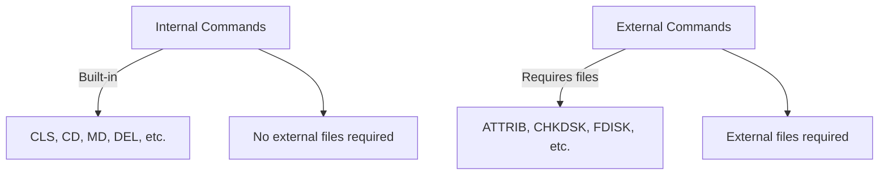
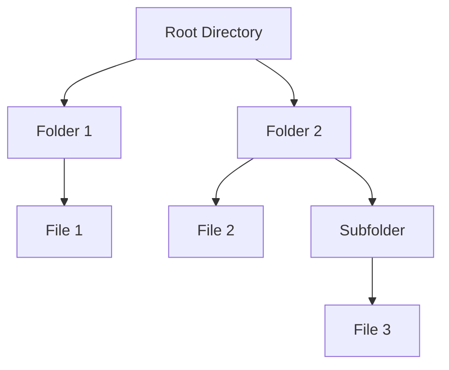
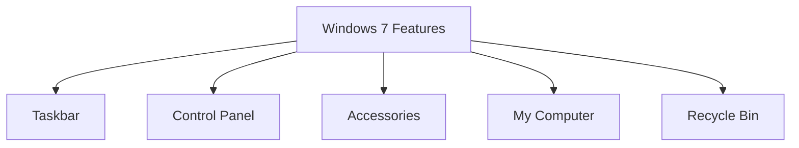
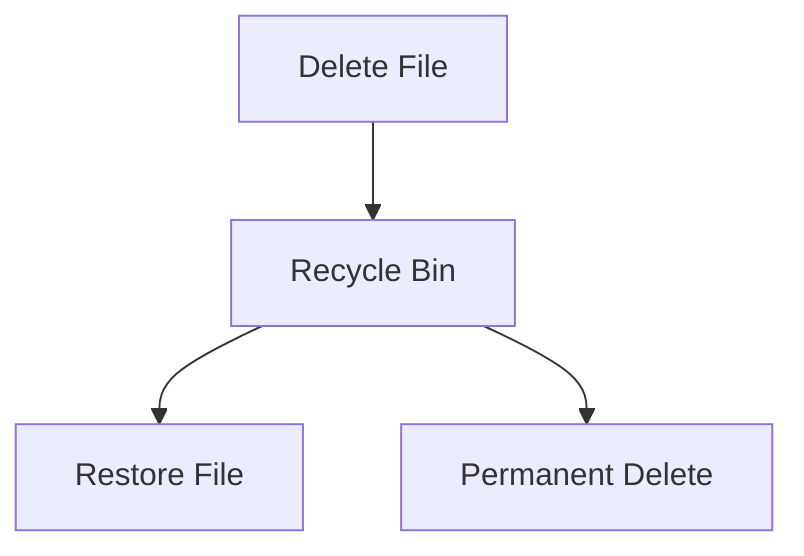

# DOS Commands and Windows 2007

## DOS Commands

### 1. **Internal Commands**

Internal commands are built into the command interpreter and can be executed directly by the operating system without requiring external files.

#### Common Internal Commands:

- **DIR**: Displays the list of files and directories in the current directory.
- **DATE**: Displays or sets the system date.
- **TIME**: Displays or sets the system time.
- **CLS**: Clears the screen.
- **CD (Change Directory)**: Changes the current directory.
- **RD (Remove Directory)**: Deletes an empty directory.
- **MD (Make Directory)**: Creates a new directory.
- **PATH**: Displays or sets a search path for executable files.
- **TYPE**: Displays the contents of a file.
- **DEL (Delete)**: Deletes one or more files.
- **ECHO**: Displays messages or turns command echoing on or off.
- **COPY**: Copies one or more files from one location to another.
- **REN (Rename)**: Renames files.
- **PROMPT**: Changes the appearance of the command prompt.
- **VOL**: Displays the disk volume label and serial number.
- **VER**: Displays the version of DOS currently running.

---

### 2. **External Commands**

External commands require external files to be present on the disk to execute. These are not built into the operating system.

#### Common External Commands:

- **ATTRIB**: Changes file attributes.
- **CHKDSK**: Checks the status of a disk and displays a report.
- **DISKCOPY**: Copies the contents of one floppy disk to another.
- **DISKCOMP**: Compares the contents of two floppy disks.
- **XCOPY**: Copies files and directories, including subdirectories.
- **TREE**: Displays the directory structure of a path or disk.
- **DELTREE**: Deletes a directory and all its contents.
- **DOSKEY**: Recalls DOS commands, allows command-line editing.
- **FORMAT**: Formats a disk for use with DOS.
- **FIND**: Searches for a text string in a file or files.
- **SORT**: Sorts input data.
- **FDISK**: Partitions a hard disk.
- **MORE**: Displays output one screen at a time.
- **SYS**: Transfers system files to make a disk bootable.

**Diagram of Internal vs External Commands**:


````

---

### 3. **Concept of Files and Directories**

In DOS, files are stored in directories. Each directory can contain files or subdirectories, creating a tree-like structure for organization.

- **File**: A named collection of data.
- **Directory**: A special type of file that holds references to other files and directories.

**Diagram of File and Directory Structure**:



---

### 4. **Wild Card Characters**

Wild card characters are used to represent multiple files or patterns in DOS commands.

- **\***: Represents any number of characters.
  - Example: `DIR *.TXT` lists all files with the `.TXT` extension.
- **?**: Represents any single character.
  - Example: `DIR ?.TXT` lists files like `A.TXT`, `B.TXT`, etc.

---

### 5. **Redirection Operators**

Redirection operators allow the input or output of a command to be redirected to files or other commands.

- **>**: Redirects output to a file.
  - Example: `DIR > LIST.TXT` saves the directory listing to `LIST.TXT`.
- **<**: Takes input from a file.
  - Example: `COPY < INPUT.TXT` takes input from `INPUT.TXT`.
- **>>**: Appends output to an existing file.
  - Example: `DIR >> LIST.TXT` appends the directory listing to `LIST.TXT`.

---

## Windows 2007

### 1. **Definition**

**Windows 2007** (often referred to as Windows 7) is an operating system developed by Microsoft as a successor to Windows Vista. It is designed for personal computers, including home and business desktops, laptops, and media center systems.

### 2. **Benefits**

- **User-Friendly Interface**: Windows 7 has an intuitive graphical interface, making it easier for users to interact with the system.
- **Improved Performance**: Windows 7 is faster than its predecessors, especially in terms of boot time and system responsiveness.
- **Security Features**: Enhanced security features like User Account Control (UAC) and improved firewall.

### 3. **Features & Uses of Windows 2007**

- **Taskbar**: Windows 7 introduced an enhanced taskbar with features like pinning programs for quick access and a preview of open windows.
- **Control Panel**: A centralized location for managing system settings, including hardware, software, security, and more.
- **Accessories**: Windows 7 comes with a variety of built-in utilities like Calculator, Notepad, Paint, and Snipping Tool.
- **My Computer**: Provides access to disk drives, devices, and network locations.
- **Recycle Bin**: A special folder where deleted files are temporarily stored, allowing users to recover them if needed.

**Diagram of Windows 7 Features**:



---

### 4. **Control Panel**

The **Control Panel** in Windows 7 is a powerful tool used to configure and manage various system settings like hardware, software, security, and network settings.

- **Hardware and Sound**: Manage devices like printers, audio settings, and device managers.
- **Programs**: Install or uninstall software.
- **System and Security**: Configure system protection, firewall, and backup.

---

### 5. **Accessories**

**Accessories** are built-in applications that provide basic functionality in Windows 7.

- **Notepad**: A simple text editor.
- **Calculator**: Performs basic and advanced calculations.
- **Paint**: A simple graphics editor.
- **Snipping Tool**: Captures screenshots or snippets of your screen.

---

### 6. **Taskbar**

The **Taskbar** in Windows 7 provides quick access to frequently used programs, currently running applications, and system notifications.

- **Pinning Programs**: You can "pin" your favorite programs to the taskbar for quick access.
- **Window Previews**: Hovering over taskbar icons shows previews of open windows.

---

### 7. **My Computer**

**My Computer** (now called **This PC** in later versions) allows users to browse their disk drives, external devices, and network locations.

---

### 8. **Recycle Bin**

The **Recycle Bin** temporarily stores deleted files, giving users the ability to restore accidentally deleted items.

**Diagram of Recycle Bin Flow**:



---

### 9. **Windows 7 File System**

#### a. **FAT32 (File Allocation Table 32)**

- A legacy file system that is compatible with most devices and operating systems but has limitations on file size and partition size.

#### b. **NTFS (New Technology File System)**

- The default file system for Windows 7, supporting large files, disk quotas, encryption, and advanced security features.

---


