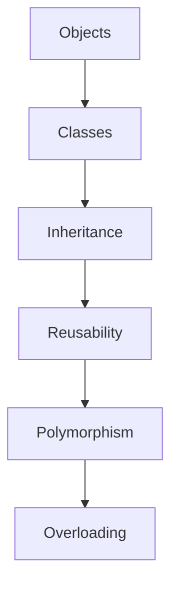

# Object-Oriented Programming (OOPs) in C++

## 1. Need for OOP

As software complexity grows, procedural programming (like in C) becomes harder to manage. OOP allows:

- **Better Code Organization**: Breaks large systems into smaller, manageable parts.
- **Modularity**: Reusable code through objects and classes.
- **Maintenance**: Easier to update and maintain code over time.

### Example:

In a large system managing vehicles:

```cpp
class Car {
    public:
        string brand;
        void honk() {
            cout << "Beep Beep!";
        }
};

Car myCar;
myCar.brand = "Toyota";
myCar.honk(); // Output: Beep Beep!
```
---

## 2. Object-Oriented Approach

OOP focuses on:

- **Objects**: Entities that encapsulate data and behavior.
- **Classes**: Blueprints for creating objects.
- **Interaction**: Objects interact with one another to perform tasks.

---

## 3. Characteristics of OOP Languages

### 3.1. Objects

Objects represent real-world entities.

```cpp
class Dog {
    public:
        string name;
        void bark() {
            cout << "Woof Woof!";
        }
};

Dog myDog;
myDog.name = "Buddy";
myDog.bark(); // Output: Woof Woof!
```

### 3.2. Classes

Classes define properties and behaviors.

```cpp
class Animal {
    public:
        string name;
        void speak() {
            cout << name << " is making a sound.";
        }
};
```

### 3.3. Inheritance

Inheritance allows a new class to inherit properties from an existing class, promoting code reuse.

```cpp
class Vehicle {
    public:
        void start() {
            cout << "Vehicle started.";
        }
};

class Bike : public Vehicle {
    public:
        void ride() {
            cout << "Bike is riding.";
        }
};

Bike myBike;
myBike.start(); // Output: Vehicle started.
```

### 3.4. Reusability

OOP allows code to be reused across different projects and scenarios through inheritance and composition.

### 3.5. Polymorphism

Polymorphism lets functions or methods have different behavior depending on the object.

```cpp
class Shape {
    public:
        virtual void draw() {
            cout << "Drawing a shape.";
        }
};

class Circle : public Shape {
    public:
        void draw() override {
            cout << "Drawing a circle.";
        }
};

Shape* shape = new Circle();
shape->draw(); // Output: Drawing a circle.
```

### 3.6. Overloading

Overloading enables multiple functions with the same name to work differently depending on their parameters.

```cpp
int add(int a, int b) {
    return a + b;
}

double add(double a, double b) {
    return a + b;
}
```

---

## 4. Advantages of OOP

- **Modularity**: Divides the program into objects and classes.
- **Maintainability**: Easier to manage code over time.
- **Reusability**: Promotes the reuse of code in different parts of the program.
- **Scalability**: Can grow easily by adding new classes and methods.

---

## 5. Relationship Between C and C++

- **C**: Procedural language, focuses on functions and step-by-step execution.
- **C++**: Extends C by adding OOP principles, allowing the creation of objects and classes, making the program more modular and manageable.

---

## Programming Basics in C++

### 1. Basic Program Construction

A basic C++ program consists of:

- **Header Files**: These are libraries that provide functions to the program.
- **Main Function**: The entry point where the program execution starts.

Example:

```cpp
#include <iostream>
using namespace std;

int main() {
    cout << "Hello, World!";
    return 0;
}
```

### 2. Output Using `cout`

`cout` is used to display output on the console:

```cpp
cout << "Welcome to C++ programming!";
```

### 3. Preprocessor Directives

Preprocessor directives are commands that are processed before the compilation of code. Commonly used ones include:

```cpp
#include <iostream>
```

### 4. Comments

- **Single-line comments**: `// This is a comment`
- **Multi-line comments**: `/* This is a multi-line comment */`

### 5. Integer and Character Variables

Variables store data that the program manipulates.

```cpp
int num = 10;
char letter = 'A';
```

### 6. Input Using `cin`

`cin` is used to take input from the user:

```cpp
int age;
cin >> age;
```

### 7. Type `bool`

The `bool` type holds two values: `true` and `false`.

```cpp
bool isAvailable = true;
```

### 8. `setw` Manipulator

The `setw` manipulator sets the width of the output field.

```cpp
#include <iomanip>
cout << setw(10) << "Hello";
```

### 9. Type `float`

A `float` variable stores decimal numbers.

```cpp
float pi = 3.14;
```

### 10. Type Conversion

Type conversion converts one type of data to another.

```cpp
int a = 5;
float b = static_cast<float>(a); // Converts int to float
```

### 11. Arithmetic Operators

Arithmetic operators are used to perform mathematical calculations:

- `+`, `-`, `*`, `/`, `%`

### 12. Relational Operators

These operators compare values:

- `==`, `!=`, `<`, `>`, `<=`, `>=`

### 13. Logical Operators

Logical operators combine two or more conditions:

- `&&` (AND), `||` (OR), `!` (NOT)

---

## Diagrams

### OOP Characteristics



---

## Difference Between C and C++

| Feature                  | C Language           | C++ Language                      |
| ------------------------ | -------------------- | --------------------------------- |
| **Programming Paradigm** | Procedural           | Object-oriented                   |
| **Data Structures**      | Structs only         | Classes and structs               |
| **Inheritance**          | Not supported        | Supported                         |
| **Function Overloading** | Not supported        | Supported                         |
| **Encapsulation**        | Not supported        | Supported (private, public)       |
| **Memory Management**    | Manual with pointers | Manual and automatic (new/delete) |
| **Standard Libraries**   | Limited              | Extensive STL                     |
| **Function Modifiers**   | Not available        | Available (const, virtual, etc.)  |

