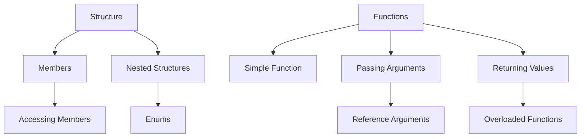

# Loops and Decision Control Statements in C++

## 1. Loops
Loops are used to execute a block of code repeatedly until a condition is met.

### 1.1. `for` Loop
The `for` loop is used when the number of iterations is known beforehand.
```cpp
for (int i = 0; i < 5; i++) {
    cout << "Iteration: " << i << endl;
}
```
**Explanation**:
- Initialization: `int i = 0`
- Condition: `i < 5`
- Update: `i++` (increment after each iteration)

### 1.2. `while` Loop
The `while` loop repeats a block of code while the condition is true.
```cpp
int i = 0;
while (i < 5) {
    cout << "Iteration: " << i << endl;
    i++;
}
```

### 1.3. `do-while` Loop
The `do-while` loop guarantees at least one execution of the code block before checking the condition.
```cpp
int i = 0;
do {
    cout << "Iteration: " << i << endl;
    i++;
} while (i < 5);
```

---

## 2. Decision Control Statements
Decision control statements allow conditional execution of code.

### 2.1. `if` Statement
The `if` statement executes a block of code only if the condition is true.
```cpp
int x = 10;
if (x > 5) {
    cout << "x is greater than 5";
}
```

### 2.2. `if-else` Statement
The `if-else` statement executes one block of code if the condition is true, and another block if it’s false.
```cpp
int x = 3;
if (x > 5) {
    cout << "x is greater than 5";
} else {
    cout << "x is less than or equal to 5";
}
```

### 2.3. `switch` Statement
The `switch` statement evaluates an expression and executes the matching `case`.
```cpp
int day = 2;
switch (day) {
    case 1: cout << "Monday"; break;
    case 2: cout << "Tuesday"; break;
    default: cout << "Invalid day";
}
```

### 2.4. Conditional Operator (`?:`)
A shorthand for the `if-else` statement.
```cpp
int x = 5;
int y = (x > 3) ? 10 : 0;
```
**Explanation**: If `x` is greater than 3, `y` is assigned 10, otherwise 0.

---

## 3. Other Control Statements

### 3.1. `break`
`break` is used to exit a loop or `switch` statement.
```cpp
for (int i = 0; i < 10; i++) {
    if (i == 5) break;
    cout << i << endl;
}
```

### 3.2. `continue`
`continue` skips the current iteration and moves to the next iteration of the loop.
```cpp
for (int i = 0; i < 10; i++) {
    if (i == 5) continue;
    cout << i << endl;
}
```

### 3.3. `goto`
`goto` transfers control to a labeled statement, but it is generally discouraged due to making code harder to understand.
```cpp
int x = 0;
label:
cout << "This is a goto example." << endl;
x++;
if (x < 5) goto label;
```

---

# Structures and Functions in C++

## 1. Structures
Structures in C++ are used to group different data types into a single unit.
```cpp
struct Person {
    string name;
    int age;
};
```
### Example:
```cpp
Person p1;
p1.name = "John";
p1.age = 25;
```

### 1.1. Accessing Structure Members
Structure members can be accessed using the dot `.` operator.
```cpp
cout << p1.name << endl;
cout << p1.age << endl;
```

### 1.2. Structure Within a Structure
You can nest one structure inside another.
```cpp
struct Address {
    string city;
    int zipCode;
};

struct Person {
    string name;
    Address addr;
};
```

### 1.3. Enumerated Data Type
Enums are user-defined data types that consist of named integer constants.
```cpp
enum Weekday { Monday, Tuesday, Wednesday };
Weekday today = Monday;
```

---

## 2. Functions
Functions allow code to be reused and organized.

### 2.1. Simple Functions
A function is defined using the syntax:
```cpp
int add(int a, int b) {
    return a + b;
}
```
Call the function using:
```cpp
int result = add(3, 4);
cout << result;
```

### 2.2. Passing Arguments to Functions
Arguments can be passed by value, meaning a copy is made.
```cpp
void increment(int a) {
    a++;
}
```

### 2.3. Returning Values from Functions
Functions can return values to the calling code.
```cpp
int square(int x) {
    return x * x;
}
```

### 2.4. Reference Arguments
Arguments can also be passed by reference using the `&` symbol. This allows the function to modify the actual variable.
```cpp
void increment(int &a) {
    a++;
}
```

### 2.5. Overloaded Functions
Multiple functions with the same name can exist as long as they have different parameters.
```cpp
int add(int a, int b) {
    return a + b;
}

double add(double a, double b) {
    return a + b;
}
```

---

## 3. Storage Classes
Storage classes define the lifetime and visibility of a variable.

- **auto**: Default storage class for local variables.
- **static**: Variable retains its value between function calls.
- **extern**: Variable defined outside of the current scope.
- **register**: Stores the variable in a CPU register for faster access.

### Example:
```cpp
void counter() {
    static int count = 0;
    count++;
    cout << count;
}
```

---

## 4. Scope Resolution Operator (`::`)
The `::` operator is used to define a function outside of its class or access a global variable that is overshadowed by a local one.
```cpp
class MyClass {
    public:
        void print();
};

void MyClass::print() {
    cout << "Hello, World!";
}
```

---

## Diagram: Structure and Function Relationships

