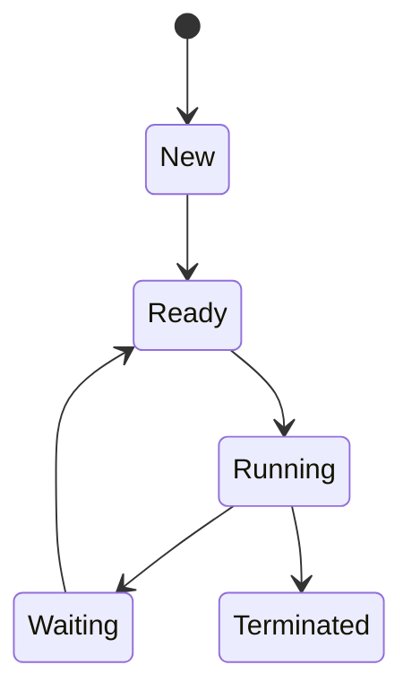
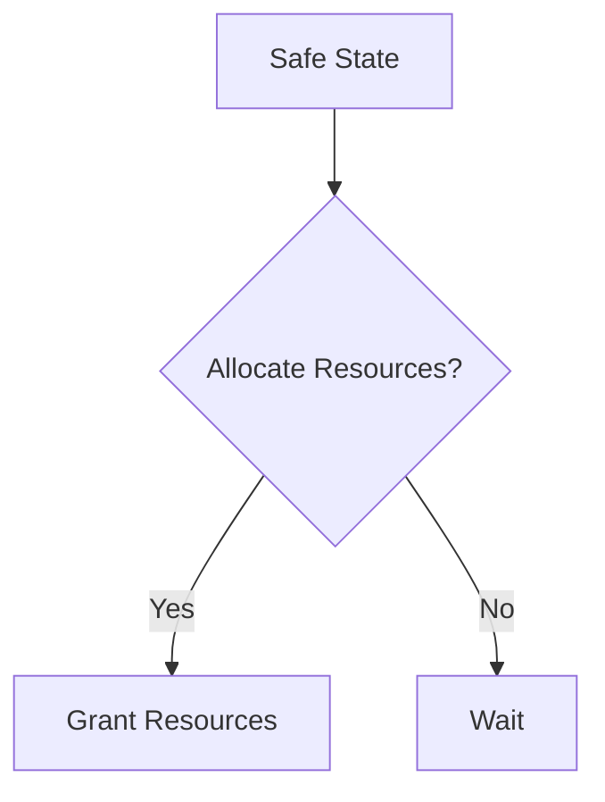
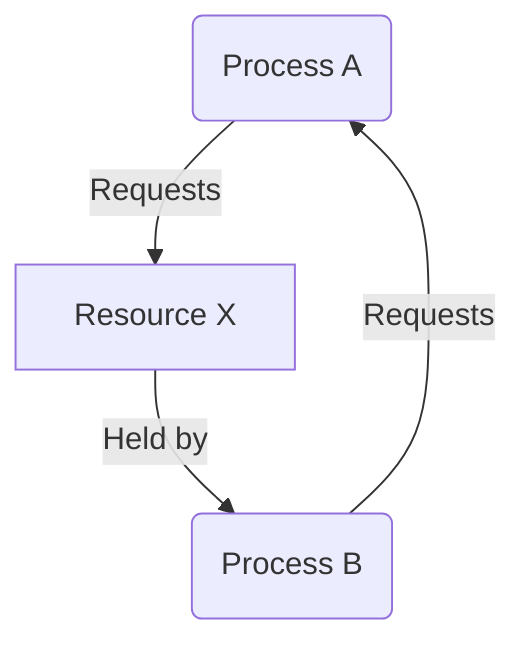

# Processor Management

## 1. Process Overview
A **process** is a program in execution. It goes through various states during its lifecycle in an operating system. Processes require resources like CPU time, memory, files, and I/O devices to execute.

---

## 2. Process States

A process moves through several states during its lifetime:

1. **New**: The process is being created.
2. **Ready**: The process is waiting to be assigned to a CPU.
3. **Running**: Instructions are being executed by the CPU.
4. **Waiting (Blocked)**: The process is waiting for an event (like I/O) to occur.
5. **Terminated**: The process has finished execution.

---

## 3. Process State Transitions

Processes change states depending on various events like the completion of an I/O request or the allocation of a CPU.

---

## 4. Process Control Block (PCB)

The **Process Control Block (PCB)** is a data structure maintained by the operating system to keep track of process information. It includes:
- **Process ID**: Unique identifier for the process.
- **Process State**: Current state of the process.
- **Program Counter**: Address of the next instruction to execute.
- **CPU Registers**: Holds the current working registers.
- **Memory Limits**: Information about the allocated memory.
- **List of Open Files**: Keeps track of files in use.

---

## 5. Operations on Processes

1. **Process Creation**: A new process is created using system calls like `fork()` or `exec()`.
2. **Process Execution**: The operating system schedules the process to run on the CPU.
3. **Process Termination**: A process completes and is removed from the system.
4. **Suspend and Resume**: The operating system can suspend (temporarily halt) or resume a process.

---

## 6. Interrupt Processing

An **interrupt** is a signal that temporarily halts the CPU's current activities to execute a high-priority task (like I/O completion).

1. **Hardware Interrupt**: Generated by hardware devices (e.g., keyboard).
2. **Software Interrupt**: Generated by executing a system call or an error (e.g., divide by zero).

---

## 7. Scheduling Algorithms

Scheduling algorithms decide the order in which processes access the CPU. Common algorithms include:

### 1. First-Come, First-Served (FCFS)
Processes are executed in the order they arrive.

**Example**:
| Process | Burst Time | Waiting Time |
|---------|------------|--------------|
| P1      | 5          | 0            |
| P2      | 3          | 5            |
| P3      | 8          | 8            |

### 2. Shortest Job First (SJF)
The process with the shortest burst time is executed first.

**Example**:
| Process | Burst Time | Waiting Time |
|---------|------------|--------------|
| P2      | 3          | 0            |
| P1      | 5          | 3            |
| P3      | 8          | 8            |

### 3. Round Robin (RR)
Processes are assigned a fixed time slice or quantum and rotate in a cyclic manner.

**Example**:
For time quantum = 2s
| Time | Process Running |
|------|-----------------|
| 0-2  | P1              |
| 2-4  | P2              |
| 4-6  | P3              |

### 4. Priority Scheduling
Processes are executed based on their priority. The process with the highest priority is scheduled first.

**Example**:
| Process | Priority | Burst Time | Waiting Time |
|---------|----------|------------|--------------|
| P1      | 1        | 5          | 0            |
| P3      | 2        | 4          | 5            |
| P2      | 3        | 3          | 9            |

---

## 8. Multiple Processor Scheduling

In systems with more than one processor, scheduling algorithms need to ensure optimal CPU utilization. Some strategies include **load balancing**, where processes are evenly distributed across all processors to prevent any single processor from being overwhelmed.

---

# Deadlock

## 1. Deadlock Problem

A **deadlock** occurs when two or more processes are unable to proceed because each is waiting for the other to release resources.

## 2. Deadlock Characterization

Four necessary conditions must be met for a deadlock to occur:

1. **Mutual Exclusion**: At least one resource must be held in a non-shareable mode.
2. **Hold and Wait**: A process holding at least one resource is waiting to acquire additional resources held by other processes.
3. **No Preemption**: Resources cannot be forcibly taken from a process.
4. **Circular Wait**: A circular chain of processes exists where each process is waiting for a resource held by the next process.

---

## 3. Deadlock Prevention

The system can prevent deadlocks by ensuring that at least one of the four necessary conditions does not hold.

**Example**: Eliminate the **Hold and Wait** condition by requiring processes to request all resources at once before execution.

---

## 4. Deadlock Avoidance

### Banker’s Algorithm
This algorithm ensures that the system never enters an unsafe state by granting a resource only if it leaves the system in a safe state.

**Example**:
- If a process requests resources that exceed the system's capacity to fulfill the request without going into deadlock, the request is denied.

---

## 5. Deadlock Detection

Deadlock detection algorithms run periodically to check if a deadlock has occurred by examining resource allocation and the wait-for graphs.

---

## 6. Recovery From Deadlock

Once deadlock is detected, the system can recover by:
1. **Preempting Resources**: Taking resources away from some processes.
2. **Killing Processes**: Terminating one or more processes to break the deadlock.

---

## Deadlock Avoidance Diagram

This diagram represents a circular wait condition in a deadlock scenario.

