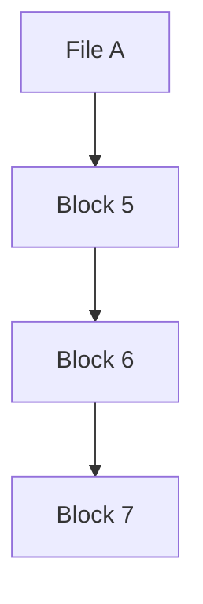
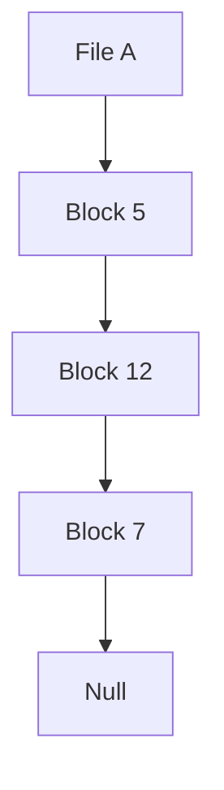
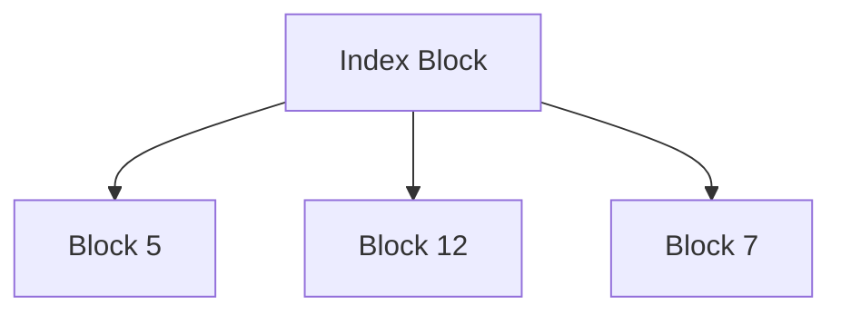

# File Management

File management is a core function of the operating system, responsible for managing files and directories, ensuring efficient storage, retrieval, and manipulation of data.

---

## 1. File Types

A **file** is a collection of related information that is stored on a secondary storage device. Files can be of various types:

1. **Text files**: Contain readable characters (e.g., `.txt`, `.html`).
2. **Binary files**: Contain binary data that can only be interpreted by specific programs (e.g., `.exe`, `.bin`).
3. **Source files**: Contain programming code (e.g., `.c`, `.py`).
4. **Object files**: Compiled versions of source files (e.g., `.o`, `.obj`).

---

## 2. Operations on Files

Operating systems provide various operations to manage files:

1. **Create**: Establish a new file in the file system.
2. **Read**: Retrieve data from a file.
3. **Write**: Insert or modify data in a file.
4. **Delete**: Remove a file from the file system.
5. **Open**: Make a file accessible for operations.
6. **Close**: Close an opened file to free up system resources.

---

## 3. File Support

The operating system supports file operations through the **File System**, which defines how files are stored, retrieved, and organized on disk. Some key features provided by the file system include:

- **File Naming**: Provides unique identifiers for files.
- **File Metadata**: Stores information like the file's creation date, size, type, and permissions.
- **File Organization**: Ensures files are stored efficiently for easy access and management.

---

## 4. Access Methods

There are two primary methods to access files:

### 1. Sequential Access
- **Definition**: Data in the file is accessed in a specific order, from the beginning to the end.
- **Use Case**: Suitable for tape storage or logs where data is processed in order.
  
**Example**:
Reading a log file where entries are processed one after another.

### 2. Direct Access
- **Definition**: Data can be accessed directly, without reading the preceding information.
- **Use Case**: Suitable for random-access devices like hard disks.
  
**Example**:
Jumping directly to a specific record in a database file.

---

## 5. Indexing

**Indexed Access** uses a special index file that contains pointers to blocks of data. This allows quick access to specific file sections by referring to the index.

**Example**:
A large database file where an index points to records, allowing fast retrieval of specific data.

---

## 6. Allocation Methods

Memory allocation methods ensure efficient file storage in secondary memory. Common allocation methods include:

### 1. Contiguous Allocation
- **Definition**: Files are stored in contiguous blocks on the disk. This method is simple and provides fast access, but can lead to external fragmentation.
  
**Example**:
File A is stored in blocks 5-9, File B in blocks 10-14, etc.

### 2. Linked Allocation
- **Definition**: Files are stored in blocks scattered across the disk, with each block containing a pointer to the next block.
  
**Example**:
File A is stored in block 5, which points to block 12, then to block 7, and so on.

### 3. Indexed Allocation
- **Definition**: An index block contains pointers to all the blocks occupied by a file. This method avoids the fragmentation problems of linked allocation.
  
**Example**:
An index block contains the addresses of all blocks occupied by a file.

---

## 7. Free Space Management

Free space management refers to the technique used by the operating system to keep track of available disk space. Common methods include:

1. **Bit Vector**: A bitmap where each bit represents a block (0 for free, 1 for occupied).
2. **Linked List**: A list of free blocks, each pointing to the next available block.
3. **Grouping**: Groups free blocks into clusters for efficient management.
4. **Counting**: Tracks contiguous blocks of free space by noting the starting block and the number of blocks available.

---

## 8. Directory System

A **directory** is a special type of file that contains information about other files, like their locations and attributes. Different directory structures include:

### 1. Single-Level Directory
- **Definition**: All files are stored in one directory. Simple but inefficient for large systems with many users.

### 2. Two-Level Directory
- **Definition**: Each user has their own directory. Provides better organization and separation of files for multi-user systems.

### 3. Tree-Structured Directory
- **Definition**: Directories are organized in a hierarchical tree structure, allowing subdirectories to be created under other directories.

**Example**:
```
root
 ├── user1
 │   ├── file1
 │   └── file2
 └── user2
     ├── file3
     └── file4
```

---

## 9. File Protection

File protection mechanisms ensure that unauthorized users cannot access or modify files. Key methods include:

1. **Access Control Lists (ACLs)**: Specify who can read, write, or execute a file.
2. **File Permissions**: Set specific permissions (read, write, execute) for different user groups (owner, group, others).
3. **Encryption**: Encodes file contents, allowing only authorized users to decrypt and access the file.

**Example**:
In a Unix system, file permissions like `rwxr-xr--` specify that the owner can read, write, and execute, the group can read and execute, and others can only read the file.

---

## File Management Diagrams

### Contiguous Allocation Diagram


### Linked Allocation Diagram


### Indexed Allocation Diagram

