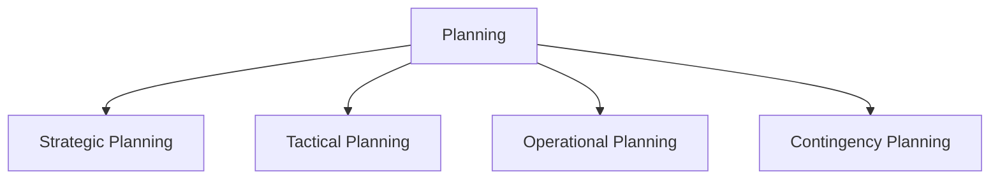
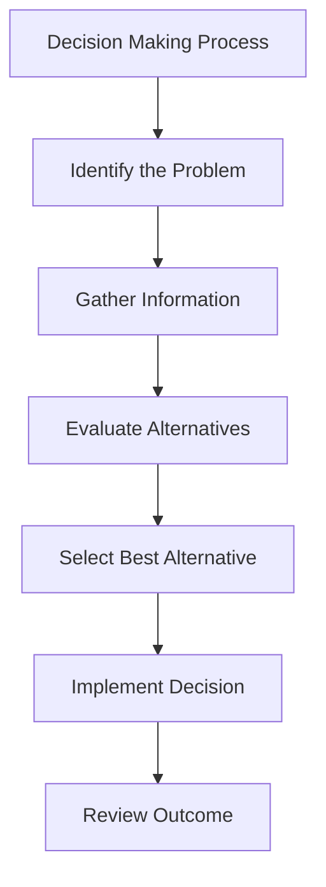
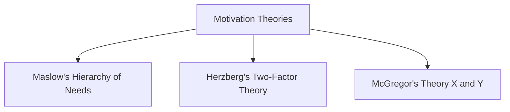
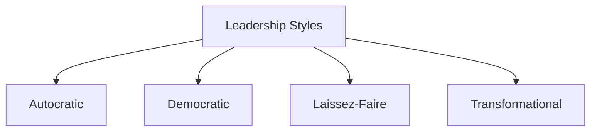

# Planning: Concepts and Types

**Planning** is the process of setting objectives and determining the best way to achieve them.

### Concept of Planning
- Planning involves identifying goals, forecasting future conditions, and deciding on the actions needed to achieve these goals.
- **Example**: A company planning its marketing strategy for the upcoming year to increase brand awareness.

### Types of Planning
1. **Strategic Planning**
   - Long-term planning focused on overall goals and direction.
   - **Example**: A company’s five-year growth plan.

2. **Tactical Planning**
   - Short-term, focused on specific parts of the organization.
   - **Example**: A quarterly sales target plan for a sales team.

3. **Operational Planning**
   - Day-to-day planning that deals with routine tasks.
   - **Example**: Scheduling employee shifts in a retail store.

4. **Contingency Planning**
   - Planning for unexpected situations or emergencies.
   - **Example**: A company’s plan for handling a data breach.

---

## 1. Decision Making Concept

**Decision Making** is the process of choosing the best alternative from available options to achieve a specific objective.

### Steps in Decision Making
1. **Identifying the Problem**: Recognizing what needs to be addressed.
2. **Gathering Information**: Collecting relevant data.
3. **Evaluating Alternatives**: Analyzing possible solutions.
4. **Selecting the Best Alternative**: Choosing the most effective solution.
5. **Implementing the Decision**: Putting the chosen alternative into action.
6. **Reviewing the Decision**: Assessing the outcome to ensure it meets the goal.

**Example**: A manager choosing between different marketing channels to reach a target audience.

---

## 2. Management by Objectives (M.B.O.)

**Management by Objectives (M.B.O.)** is a management technique where managers and employees set and agree upon specific objectives.

### Key Aspects of M.B.O.
- **Goal Alignment**: Aligns individual goals with organizational goals.
- **Participation**: Employees are involved in setting their objectives.
- **Performance Measurement**: Progress is regularly reviewed against objectives.
- **Results-Oriented**: Focuses on achieving results rather than just carrying out activities.

**Example**: A sales team working together with management to set specific quarterly sales targets.

---

## 3. Motivation: Concepts and Theories

**Motivation** is the drive that encourages individuals to take action towards achieving goals.

### Concepts of Motivation
- Motivation determines the effort and persistence individuals put into tasks.
- It can be influenced by intrinsic factors (personal satisfaction) or extrinsic factors (rewards, recognition).

### Theories of Motivation
1. **Maslow’s Hierarchy of Needs**
   - People are motivated by needs arranged in a hierarchy, from basic (physiological) to self-fulfillment (self-actualization).
   - **Example**: Offering career advancement opportunities to meet employees' self-actualization needs.

2. **Herzberg’s Two-Factor Theory**
   - Distinguishes between *motivators* (e.g., achievement, recognition) and *hygiene factors* (e.g., salary, working conditions).
   - **Example**: Providing a comfortable work environment (hygiene) and recognizing employees' efforts (motivator).

3. **McGregor’s Theory X and Theory Y**
   - Theory X: Assumes people dislike work and need control.
   - Theory Y: Assumes people are self-motivated and seek responsibility.
   - **Example**: Adopting a Theory Y approach by giving employees autonomy.

---

## 4. Leadership: Concepts and Styles

**Leadership** is the ability to influence and guide individuals or teams toward achieving goals.

### Concept of Leadership
- Leadership involves motivating, directing, and guiding people to reach organizational objectives.
- **Example**: A team leader inspiring team members to complete a project on time.

### Styles of Leadership
1. **Autocratic Leadership**
   - Centralized decision-making, with leaders having complete control.
   - **Example**: A manager making all the project decisions without consulting the team.

2. **Democratic Leadership**
   - Encourages input and participation from team members.
   - **Example**: A project leader seeking ideas from the team before making a decision.

3. **Laissez-Faire Leadership**
   - Minimal supervision, allowing team members to make decisions.
   - **Example**: A creative agency leader who gives freedom to designers to create concepts.

4. **Transformational Leadership**
   - Inspires and motivates through vision and enthusiasm.
   - **Example**: A CEO who motivates employees with a strong vision for company growth.

