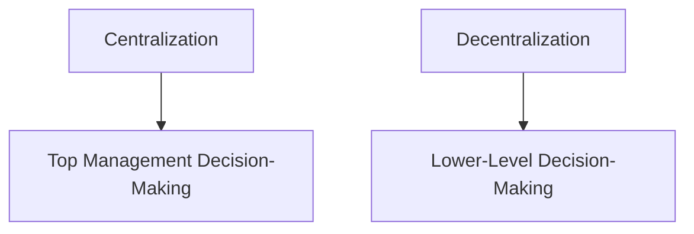
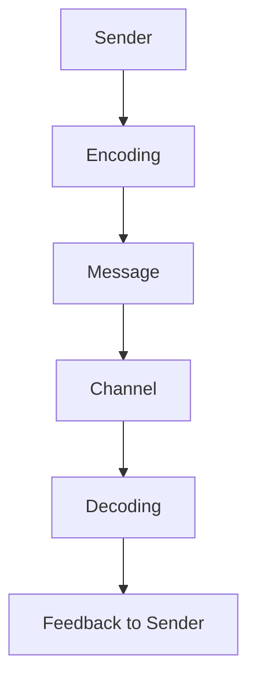
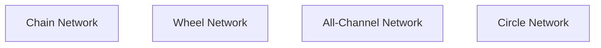
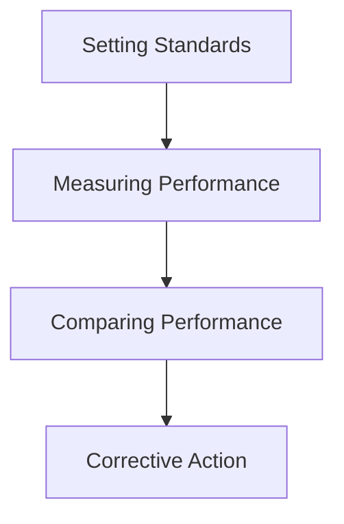
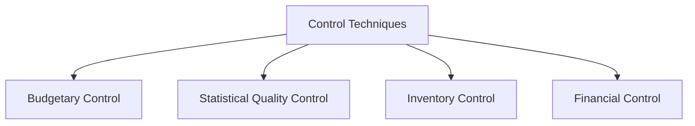

# Organizing: Concepts, Nature, and Significance

**Organizing** is the management function of arranging resources and activities in a structured way to achieve objectives.

### Concept of Organizing
- Organizing involves identifying tasks, grouping them, and assigning roles to ensure effective use of resources.
- **Example**: Dividing a company’s operations into departments such as HR, Marketing, and Sales for better management.

### Nature of Organizing
- **Structured Process**: It creates a framework for smooth workflow and communication.
- **Goal-Oriented**: Organizing aligns resources with the organization’s goals.
- **Dynamic**: Organizations adapt structures based on changing needs.

### Significance of Organizing
- **Resource Optimization**: Ensures effective allocation of resources.
- **Clarity of Roles**: Defines roles and responsibilities clearly.
- **Efficient Communication**: Facilitates coordination within and between departments.

---

## 1. Authority and Responsibility

### Authority
- **Authority** is the right to make decisions, issue commands, and expect obedience.
- **Example**: A manager has the authority to assign tasks to employees.

### Responsibility
- **Responsibility** is the obligation to perform assigned duties.
- **Example**: Employees have the responsibility to complete tasks assigned by their manager.

### Relationship between Authority and Responsibility
- Authority and responsibility must go hand-in-hand for effective management. Delegating authority without responsibility leads to misuse, while assigning responsibility without authority makes task completion difficult.

---

## 2. Centralization and Decentralization

### Centralization
- **Centralization** refers to concentrating decision-making power at the top of the organizational hierarchy.
- **Example**: In a centralized organization, only top management makes major business decisions.

### Decentralization
- **Decentralization** distributes decision-making power to lower levels within the organization.
- **Example**: Branch managers in a decentralized retail chain have authority to make regional decisions.

---

# Communication: Nature, Process, and Types of Communication Networks

**Communication** is the process of sharing information and understanding between individuals or groups within an organization.

### Nature of Communication
- **Continuous Process**: Communication is ongoing and essential for coordination.
- **Two-Way**: It involves both sending and receiving information.
- **Foundation of Relationships**: Builds trust and understanding within the organization.

### Communication Process
1. **Sender**: Initiates the message.
2. **Encoding**: Converting the message into words, symbols, or gestures.
3. **Message**: The information being communicated.
4. **Channel**: The medium (e.g., email, meetings) through which the message is sent.
5. **Decoding**: Receiver interprets the message.
6. **Feedback**: Response from the receiver to the sender.

### Types of Communication Networks
1. **Chain Network**: Follows a linear pattern of communication, often hierarchical.
2. **Wheel Network**: All communication passes through a central figure.
3. **All-Channel Network**: Open communication where all members communicate freely.
4. **Circle Network**: Information flows in a closed-loop, often with limited reach.

---

# Managerial Control: Concepts, Process, and Techniques of Control

**Managerial Control** is the process of monitoring and regulating resources and activities to achieve organizational goals.

### Concept of Managerial Control
- Control helps managers ensure that activities align with planned objectives.
- **Example**: Monitoring employee productivity against targets to maintain efficiency.

### Process of Managerial Control
1. **Setting Performance Standards**: Establish benchmarks or goals.
2. **Measuring Performance**: Assess actual performance.
3. **Comparing Performance**: Compare actual results with standards.
4. **Taking Corrective Action**: Make adjustments to align performance with goals.

---

## Techniques of Control

1. **Budgetary Control**
   - Monitors financial performance against budgets.
   - **Example**: Tracking monthly expenses against the budget.

2. **Statistical Quality Control**
   - Uses statistical methods to monitor production quality.
   - **Example**: Testing samples from a production batch to ensure consistency.

3. **Inventory Control**
   - Manages stock levels to avoid shortages or surpluses.
   - **Example**: Using just-in-time inventory to minimize storage costs.

4. **Financial Control**
   - Analyzes financial statements to assess overall financial health.
   - **Example**: Reviewing profit and loss statements quarterly.

