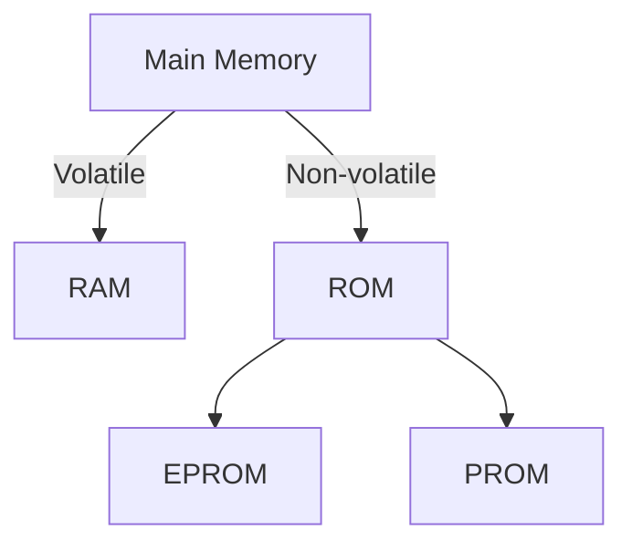
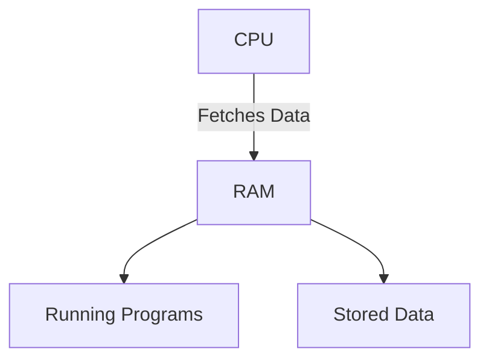
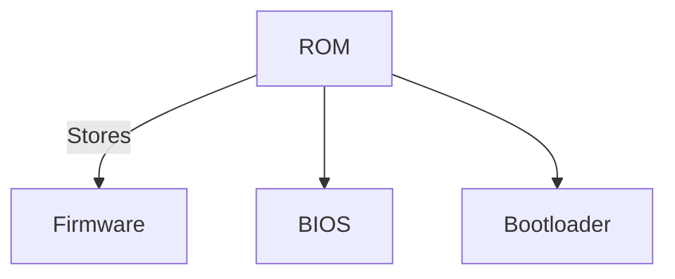
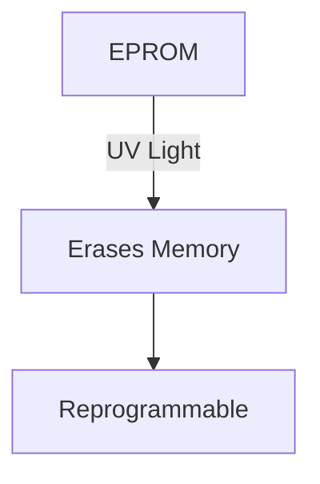
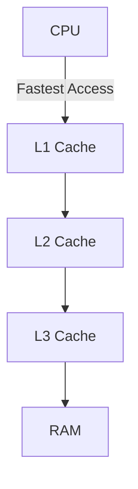
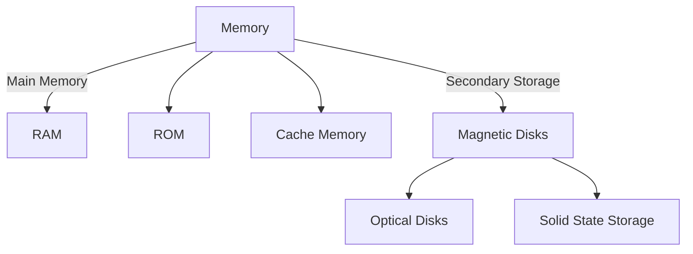

# Main Memory & Secondary Storage Devices

## Memory

### 1. Main Memory Organization

- **Main Memory** (also called **Primary Memory**) is the memory that the CPU directly accesses for processing tasks. It consists of volatile storage that requires power to maintain its data. The CPU fetches, decodes, and executes instructions directly from the main memory.

---

### 2. Main Memory Capacity

- **Main Memory Capacity** is measured in bytes. Modern computers typically have **4GB to 64GB** of RAM. The larger the RAM, the more data can be stored temporarily for faster access by the CPU, improving performance.
- Higher capacity allows users to run multiple applications simultaneously without slowing down the system.

---

### 3. Types of Main Memory

#### a. **RAM (Random Access Memory)**

- **Volatile Memory**: RAM is temporary storage. It stores the data and instructions needed for currently running programs. When the computer is turned off, all information in RAM is lost.
  
**Types of RAM**:
- **Dynamic RAM (DRAM)**: Needs constant refreshing; slower and less expensive.
- **Static RAM (SRAM)**: Faster and more reliable; used in cache memory.

**Diagram of RAM Functionality**:

#### b. **ROM (Read-Only Memory)**

- **Non-volatile Memory**: ROM retains its contents even when the computer is powered off. ROM stores firmware or software that is permanently programmed into the hardware, like the BIOS or bootloader.

**Key Features**:
- Contents are permanently written during manufacturing.
- Used for critical startup processes.
  
**Diagram of ROM Storage**:

#### c. **EPROM (Erasable Programmable Read-Only Memory)**

- A type of ROM that can be erased by exposing it to **ultraviolet (UV) light** and reprogrammed. EPROMs are used in applications that may require occasional updates.
  
**Usage Example**: Embedded systems where firmware needs updates.

**Diagram**:

#### d. **PROM (Programmable Read-Only Memory)**

- A ROM variant that can be programmed once by the user after manufacturing. Once programmed, it cannot be changed or erased. It's used when custom programming of hardware is needed.
  
**Usage Example**: Used in video game cartridges and hardware configurations.

---

### 4. Cache Memory

- **Cache Memory** is a small, high-speed memory placed close to the CPU to store frequently accessed data and instructions. It helps reduce the time it takes for the CPU to retrieve information from main memory.
  
**Levels of Cache**:
- **L1 Cache**: Smallest and fastest, directly integrated into the CPU.
- **L2 Cache**: Larger and slightly slower, often shared between cores.
- **L3 Cache**: Largest and slower but still faster than RAM, shared across multiple cores.

**Diagram of Cache Memory Hierarchy**:

---

### 5. PC Specifications

When discussing memory types, **PC Specifications** can vary widely depending on the use case:

- **RAM**: Typically ranges from **4GB to 64GB** for consumer-grade PCs.
- **ROM**: Often between **16MB to 1GB**, used to store firmware.
- **Cache Memory**: L1, L2, and L3 caches, often measured in **KB or MB**, speed up data access.

---

## Secondary Storage Devices

### 1. Magnetic Tape

- **Magnetic Tape** is a storage medium used mainly for backups and archival data. It is slower than modern storage methods because it requires sequential access, meaning the tape must be wound to the correct location before data can be read or written.

---

### 2. Magnetic Disks

#### a. **Internal Hard Disk**: 
- The primary storage device for most personal computers, hard disks store large amounts of data persistently using magnetic storage.

#### b. **External Hard Drives**: 
- Portable versions of internal hard disks, they connect to the computer via USB or other ports.

#### c. **Floppy Disks**: 
- An obsolete form of magnetic storage with a limited capacity of about **1.44MB**.

---

### 3. Optical Disks

#### a. **CD (Compact Disc)**:
- **700MB** storage capacity. CDs are primarily used for storing music, data, and software.

#### b. **DVD (Digital Versatile Disc)**:
- DVDs offer much higher storage capacity than CDs, ranging from **4.7GB to 8.5GB**, commonly used for movies and software.

#### c. **CD-R and CD-RW**:
- **CD-R** is a write-once format, whereas **CD-RW** allows multiple writes and erases.

---

### 4. Solid State Storage

#### a. **Flash Memory**:
- **Non-volatile** storage technology used in SSDs and USB drives. Flash memory offers fast access speeds and durability since it has no moving parts.

#### b. **USB Drives**:
- Portable, compact storage devices used for transferring data between computers.

---

## Diagram: Memory and Storage Hierarchy

