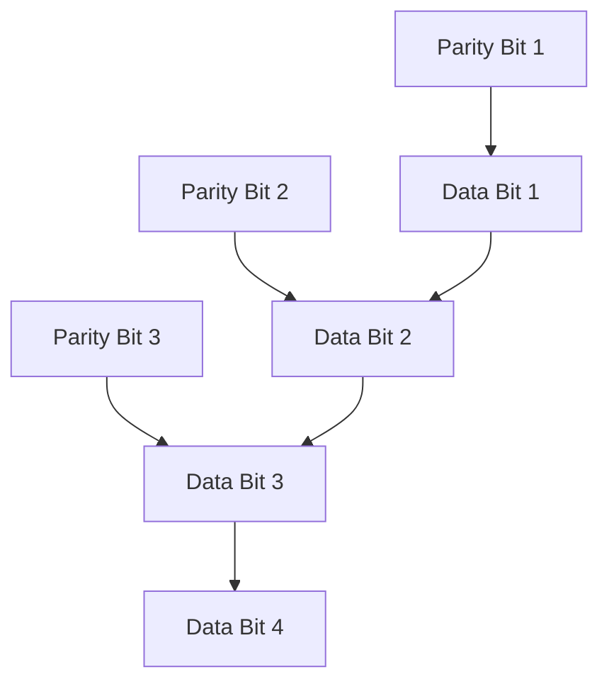

# Data Representation

## 1. Number Systems

### 1.1 Decimal, Binary, Octal, and Hexadecimal Number Systems
- **Decimal**: Base 10 number system (0-9).
- **Binary**: Base 2 number system (0, 1).
- **Octal**: Base 8 number system (0-7).
- **Hexadecimal**: Base 16 number system (0-9, A-F).

---

## 2. Conversion Between Number Systems

### 2.1 Decimal to Binary Conversion
To convert a decimal number to binary, divide the number by 2 and record the remainders. Reverse the remainders to get the binary representation.


**Example:**
Convert decimal `13` to binary:
```
13 ÷ 2 = 6 remainder 1
6 ÷ 2 = 3 remainder 0
3 ÷ 2 = 1 remainder 1
1 ÷ 2 = 0 remainder 1
Binary representation = 1101
```

### 2.2 Binary to Decimal Conversion
To convert a binary number to decimal, multiply each bit by 2 raised to the power of its position from the right (starting at 0).

**Example:**
Convert binary `1101` to decimal:
```
(1 * 2^3) + (1 * 2^2) + (0 * 2^1) + (1 * 2^0) = 8 + 4 + 0 + 1 = 13
```

### 2.3 Decimal to Octal Conversion
To convert decimal to octal, divide the number by 8 and record the remainders. Reverse the remainders for the octal result.

**Example:**
Convert decimal `83` to octal:
```
83 ÷ 8 = 10 remainder 3
10 ÷ 8 = 1 remainder 2
1 ÷ 8 = 0 remainder 1
Octal = 123
```

### 2.4 Octal to Decimal Conversion
Multiply each digit by 8 raised to the power of its position from right to left.

**Example:**
Convert octal `123` to decimal:
```
(1 * 8^2) + (2 * 8^1) + (3 * 8^0) = 64 + 16 + 3 = 83
```

### 2.5 Decimal to Hexadecimal Conversion
To convert decimal to hexadecimal, divide by 16 and record the remainders. Reverse them to get the hexadecimal number.

**Example:**
Convert decimal `254` to hexadecimal:
```
254 ÷ 16 = 15 remainder 14 (E in hexadecimal)
15 ÷ 16 = 0 remainder 15 (F in hexadecimal)
Hexadecimal = FE
```

### 2.6 Hexadecimal to Decimal Conversion
Multiply each digit by 16 raised to the power of its position from right to left.

**Example:**
Convert hexadecimal `FE` to decimal:
```
(15 * 16^1) + (14 * 16^0) = 240 + 14 = 254
```

---

## 3. Binary Coded Decimal (BCD)
BCD is a binary encoding of decimal numbers where each decimal digit is represented by its 4-bit binary equivalent.

**Example:**
Convert decimal `93` to BCD:
```
9 = 1001
3 = 0011
BCD = 1001 0011
```

---

## 4. Hamming Code for Error Detection
The **Hamming code** is used for detecting and correcting errors in data transmission. Redundant bits are added to data bits for error detection.

### 4.1 Hamming Code Example

For a 4-bit data `1011`, the Hamming code adds parity bits to detect and correct a 1-bit error.



---

## 5. Alphanumeric Codes
Alphanumeric codes represent letters and digits using binary patterns. Examples include **ASCII**, **EBCDIC**, and **Unicode**.

### 5.1 ASCII Example
In ASCII, each character is represented by a 7 or 8-bit binary number.

**Example:**
```
A = 01000001
B = 01000010
```

---

## 6. Arithmetic Operations

### 6.1 Binary Addition
Binary addition follows these rules:
```
0 + 0 = 0
0 + 1 = 1
1 + 0 = 1
1 + 1 = 10 (carry 1)
```

**Example of Binary Addition:**
```
  1011
+ 0110
------
  10001
```

### 6.2 Binary Subtraction
Binary subtraction follows these rules:
```
0 - 0 = 0
1 - 0 = 1
1 - 1 = 0
0 - 1 = 1 (borrow 1)
```

**Example of Binary Subtraction:**
```
  1010
-  0011
-------
   0111
```

---

## 7. 1’s and 2’s Complement Notation

### 7.1 1’s Complement
The 1’s complement of a binary number is obtained by inverting all bits (changing 1 to 0 and 0 to 1).

**Example:**
1's complement of `1011` is `0100`.

### 7.2 2’s Complement
The 2’s complement is obtained by adding 1 to the 1’s complement.

**Example:**
2’s complement of `1011`:
```
1's complement = 0100
Add 1 = 0101
```

### 7.3 9’s and 10’s Complement for Decimal Numbers
- **9’s Complement**: Subtract each digit from 9.
- **10’s Complement**: Add 1 to the 9's complement.

**Example:**
For decimal `456`:
```
9's complement = 999 - 456 = 543
10's complement = 543 + 1 = 544
```

---

## 8. Binary Multiplication and Division

### 8.1 Binary Multiplication
Binary multiplication is similar to decimal multiplication, but follows the rules for binary arithmetic.

**Example:**
```
  101 (5)
×  11  (3)
------
  101
+1010
------
  1111 (15)
```

### 8.2 Binary Division
Binary division works similarly to long division in the decimal system.

---

## 9. BCD Arithmetic
In BCD arithmetic, binary coded decimal operations are performed on numbers represented in BCD format.

**Example of BCD Addition:**
```
  1001 0011 (93 in BCD)
+ 0001 0100 (14 in BCD)
--------------
= 1010 0111 -> adjust to valid BCD (107 in decimal becomes 107)
```

---

## 10. Floating-Point Addition and Subtraction
In floating-point arithmetic, numbers are represented in the form:
```
N = M * 2^E
```
where `M` is the mantissa and `E` is the exponent.

### Example of Floating-Point Addition:
```
1.5 (1.5 × 10^0) + 2.5 (2.5 × 10^0) = 4.0
```

