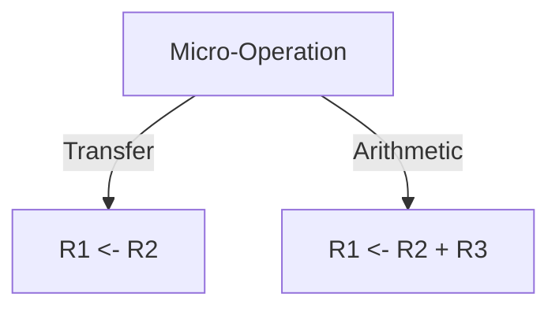
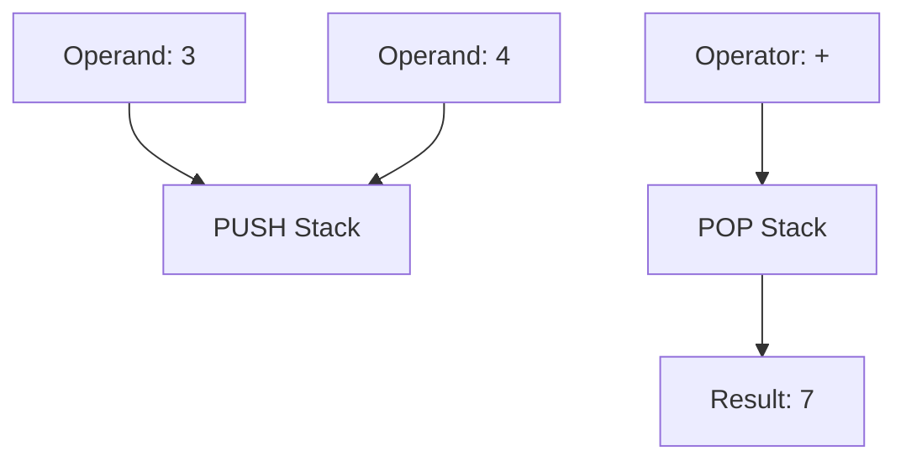
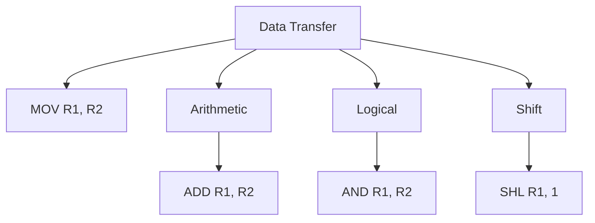
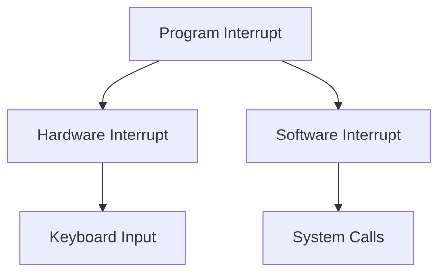

# Central Processing Unit

## 1. Introduction
The **Central Processing Unit (CPU)** is the brain of the computer, responsible for executing instructions from programs. It processes data and manages the flow of information within the computer.

---

## 2. General Register Organization
In a CPU, the **general register organization** refers to the arrangement and management of registers, which are small storage locations used for holding data temporarily.

### 2.1 Control Word
The **Control Word** is a binary code that specifies the operation to be performed by the CPU. It controls the actions of various components during execution.

**Example of Control Word:**
- A control word might specify an operation like **ADD** or **SUB**, along with the source and destination registers.

### 2.2 Examples of Micro-Operations
Micro-operations are basic operations on the data stored in registers. Examples include:

- **Transfer**: Moving data from one register to another.
  - **Example**: `R1 <- R2` (Transfer data from register R2 to R1).
- **Arithmetic Operations**: Performing addition, subtraction, etc.
  - **Example**: `R1 <- R2 + R3` (Add contents of R2 and R3, store in R1).



---

## 3. Stack Organization
Stacks are data structures that operate on a Last-In-First-Out (LIFO) principle. In CPU architecture, there are two main types of stacks:

### 3.1 Register Stack
The **Register Stack** utilizes CPU registers to store data temporarily. It is faster because it operates within the CPU.

**Example:**
- Push operation: `PUSH R1` adds R1 to the stack.
- Pop operation: `POP R1` removes the top element of the stack into R1.

### 3.2 Memory Stack
The **Memory Stack** uses memory to hold data. It is slower compared to the register stack but can handle larger data sets.

**Example:**
- In the memory stack, the operations would be similar but involve memory addresses.

### 3.3 Reverse Polish Notation
**Reverse Polish Notation (RPN)** is a mathematical notation in which operators follow their operands. For example:
- The expression \( (3 + 4) \) is written as \( 3 4 + \).

**Example of Evaluating RPN:**
1. Push `3` onto the stack.
2. Push `4` onto the stack.
3. Pop `3` and `4`, perform addition, and push the result `7` onto the stack.

### 3.4 Evaluation of Arithmetic Expressions
To evaluate expressions using a stack:
1. Push operands onto the stack.
2. Pop the operands when an operator is encountered.
3. Apply the operator and push the result back onto the stack.



---

## 4. Instruction Formats
Instruction formats define the structure of instructions in a CPU. Common types include:

### 4.1 Three-Address Instructions
These instructions specify three operands, usually for complex operations. For example:
```
ADD R1, R2, R3
```
This adds the values in registers R2 and R3 and stores the result in R1.

### 4.2 Two-Address Instructions
These use two operands. The result is stored in one of the operands:
```
ADD R1, R2
```
Here, R1 is updated with the sum of R1 and R2.

### 4.3 One-Address Instructions
These instructions typically have one address and implicitly use a register. For example:
```
INCR R1
```
This increments the value in R1.

---

## 5. Addressing Modes
**Addressing modes** determine how the operand of an instruction is accessed. Common modes include:

### 5.1 Immediate Addressing
The operand is specified directly in the instruction.
```assembly
MOV R1, #5  ; Load immediate value 5 into R1
```

### 5.2 Direct Addressing
The address of the operand is given explicitly.
```assembly
MOV R1, 1000  ; Move the value at memory address 1000 into R1
```

### 5.3 Indirect Addressing
The address of the operand is held in a register or memory location.
```assembly
MOV R1, (R2)  ; Move the value pointed to by R2 into R1
```

---

## 6. Data Transfer and Manipulation

### 6.1 Data Transfer Instructions
These instructions move data from one location to another, such as from memory to a register.
```assembly
MOV R1, R2  ; Transfer data from R2 to R1
```

### 6.2 Data Manipulation Instructions
These perform operations on data, including logical and arithmetic operations.

### 6.3 Arithmetic Instructions
These are used for basic arithmetic operations, such as addition, subtraction, multiplication, and division.
```assembly
ADD R1, R2  ; Add the contents of R1 and R2
```

### 6.4 Logical and Bit Manipulation Instructions
These operations manipulate individual bits within a word or byte, such as AND, OR, NOT, and XOR.
```assembly
AND R1, R2  ; Logical AND of R1 and R2
```

### 6.5 Shift Instructions
Shift instructions move bits left or right within a register, often used for multiplication or division by powers of two.
```assembly
SHL R1, 1  ; Shift R1 left by 1 (multiply by 2)
```



---

## 7. Program Control

### 7.1 Status Bit Conditions
The CPU uses **status bits** (also known as flags) to indicate the status of the operations (e.g., zero, carry, overflow).

### 7.2 Conditional Branch Instructions
These instructions change the flow of control based on certain conditions. For example, an instruction may jump to a different part of the program if a specific condition is met.
```assembly
JZ LABEL  ; Jump to LABEL if the zero flag is set
```

### 7.3 Program Interrupt
**Program interrupts** allow the CPU to respond to asynchronous events, such as I/O operations or errors. This mechanism temporarily halts the current process and transfers control to an interrupt handler.

### 7.4 Types of Interrupts
Interrupts can be categorized into:
- **Hardware Interrupts**: Generated by hardware devices (e.g., keyboard input).
- **Software Interrupts**: Triggered by programs (e.g., system calls).


