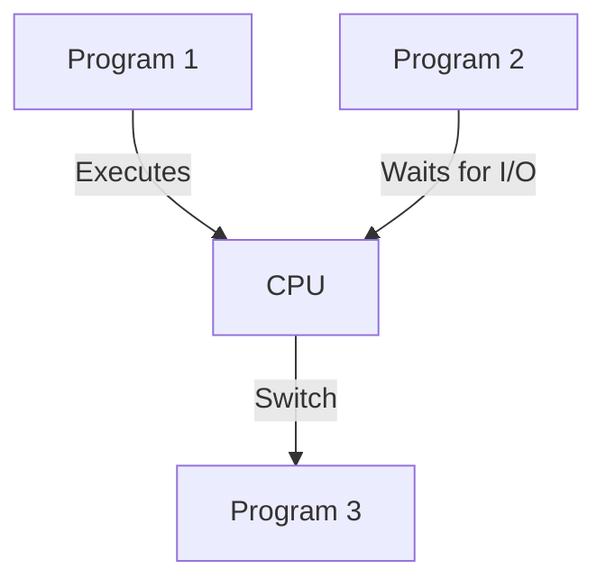
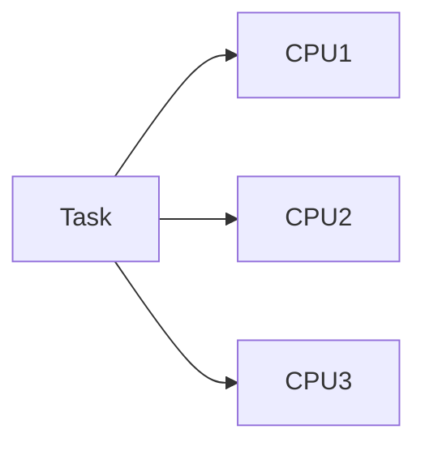
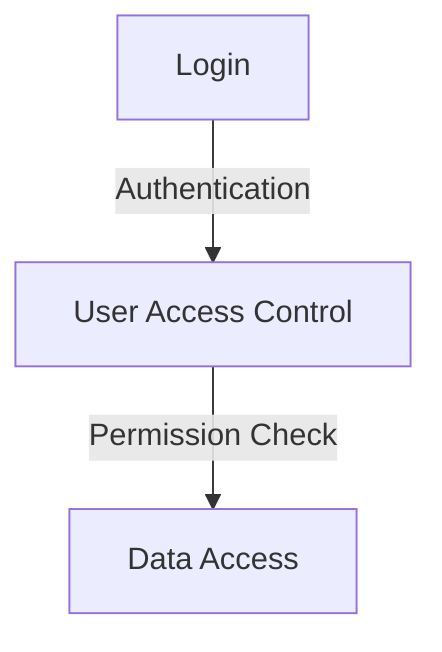
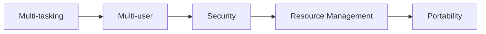

# Operating System Concepts

## 1. Operating System Classification

An **Operating System (OS)** is system software that manages hardware and software resources in a computer. Different OS types are designed to handle specific tasks, ranging from single-user environments to real-time systems.

---

### 1.1 Simple Monitor

A **Simple Monitor** system is an early form of an OS that was designed to monitor and control batch jobs. It lacked advanced features like user interaction or multitasking.

**Example:**

- Early IBM machines used a simple monitor to handle tasks like loading programs into memory and executing them.

### 1.2 Multi-Programming

**Multi-programming** allows multiple programs to reside in memory and execute simultaneously. This improves CPU utilization by ensuring that the CPU is always processing something, even if one program is waiting for I/O.



**Example:**

- While a program is waiting for input/output, the OS switches the CPU to another program.

### 1.3 Time Sharing

**Time Sharing** is a method that allows multiple users to share the system resources simultaneously by allocating time slices to each user’s tasks. This leads to better interaction between users and the system.

**Example:**

- Unix systems in the 1970s allowed multiple users to log in and use the system simultaneously, sharing the CPU in time slices.

### 1.4 Real-Time Systems

**Real-Time Operating Systems (RTOS)** are used in environments where tasks must be completed within a guaranteed time frame. These systems are used in applications where timing is critical.

**Example:**

- Air traffic control systems or industrial control systems where data must be processed immediately to maintain safety and efficiency.

---

### 1.5 Multiprocessor Systems

**Multiprocessor Systems** are those with more than one CPU. These CPUs work together to complete tasks faster by dividing the workload among processors.

**Example:**

- Modern servers often have multiple processors to handle a high volume of requests simultaneously.



---

### 1.6 Batch Processing

In **Batch Processing**, tasks are collected over a period and executed in a batch. There is no user interaction during the execution.

**Example:**

- Payroll systems, where all the employees' data is processed at the end of the month in one batch.

---

### 1.7 Single User

A **Single-User Operating System** allows only one user to perform tasks at any given time.

**Example:**

- **MS-DOS** is an example of a single-user operating system, where only one user can execute commands at a time.

### 1.8 Multi-User

A **Multi-User Operating System** allows multiple users to interact with the system simultaneously. Each user has separate workspaces and resources.

**Example:**

- **Linux** or **Unix**, where multiple users can log into the system remotely, sharing resources like files and processing power.

---

## 2. Operating System Functions and Characteristics

Operating Systems provide various functions and have specific characteristics that help them manage hardware and software resources effectively.

### 2.1 Process Management

**Process Management** is responsible for creating, scheduling, and terminating processes. It ensures that each process gets sufficient CPU time and resources.


**Example:**

- The OS allocates CPU time slices to different processes, ensuring they run in a multitasking environment.

### 2.2 Memory Management

**Memory Management** handles the allocation and deallocation of memory space to programs. It ensures that each program has enough memory to execute properly and prevents conflicts between processes.

**Example:**

- **Virtual memory** allows an OS to use disk space as an extension of physical RAM, enabling larger applications to run efficiently.

### 2.3 File System Management

The **File System** is responsible for managing files and directories on storage devices. It includes file creation, deletion, reading, writing, and permission management.

**Example:**

- NTFS (New Technology File System) in Windows or ext4 in Linux provides file and folder access control, data storage, and file compression.

### 2.4 Device Management

The OS manages all hardware devices connected to the system, such as printers, hard drives, and network cards. It abstracts device functionality and provides a unified interface for users and applications.

**Example:**

- The OS assigns I/O requests to devices and ensures smooth communication between software and hardware using **device drivers**.

### 2.5 User Interface

The **User Interface** provides a way for users to interact with the system. It can be either **Command-Line Interface (CLI)** or **Graphical User Interface (GUI)**.

- **CLI Example**: Command-line interaction with MS-DOS.
- **GUI Example**: Interaction with Windows OS using icons, windows, and menus.

### 2.6 Security and Access Control

The OS enforces security measures to protect data and resources from unauthorized access. It includes user authentication, file permissions, and data encryption.

**Example:**

- In Unix-like systems, users are assigned specific file permissions (`read`, `write`, `execute`) that limit what they can do with files.



---

### Characteristics of Operating Systems

1. **Multi-tasking**: Ability to run multiple tasks concurrently.
2. **Multi-user**: Support for multiple users interacting with the system simultaneously.
3. **Portability**: OS can be transferred from one hardware platform to another.
4. **Security**: OS ensures the security of data and system resources.
5. **Resource Management**: Efficient management of hardware resources like CPU, memory, and I/O devices.



---

## Examples and Diagrams

1. **Multiprocessing Diagram**

   ```mermaid
   graph TD
       A[CPU1] --> B[Shared Memory]
       A --> C[Task 1]
       A --> D[Task 2]
       B --> E[CPU2]
       E --> F[Task 3]
       E --> G[Task 4]
   ```

2. **Real-Time System Example**
   In a **Real-Time OS**, tasks must be completed within strict time constraints. Examples include:
   - Embedded systems in automobiles (brake systems).
   - Medical equipment (heart rate monitors).
   - Industrial robots used in manufacturing.


