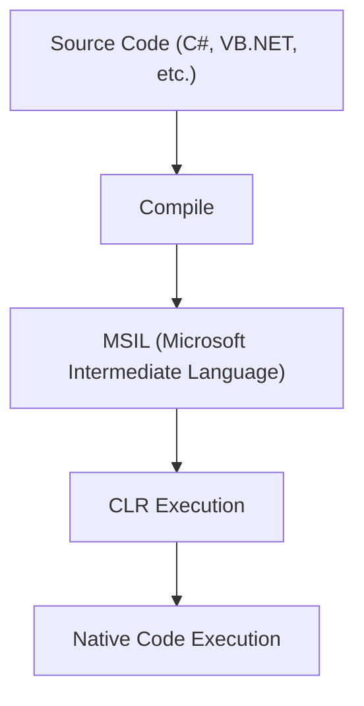

# Long Answer Questions

In this guide, you'll find a collection of essential ASP.net technologies long answer questions and their concise, exam-focused answers. These cover important questions asked in previous held exams and important questions from exam point of view.

---

### Question: Explain the design features of .NET framework.

Answer: The .NET Framework, introduced by Microsoft, is a powerful platform for building a wide range of applications, including web, desktop, and mobile applications. Its design is characterized by features that enhance development efficiency, cross-platform compatibility, and security. Here’s a breakdown of the core design features of .NET:

#### 1. Language Interoperability

- **Definition**: .NET allows developers to write code in multiple languages (such as C#, VB.NET, F#), which can interact seamlessly in a single application.
- **Purpose**: This enables flexibility and reduces barriers for developers skilled in different programming languages.
- **Example**: A project may have components written in both C# and VB.NET, and these can interact and call each other’s methods without any issue.

#### 2. Base Class Library (BCL)

- **Definition**: The BCL is a collection of pre-defined classes, interfaces, and value types, organized into namespaces like `System`, `System.IO`, `System.Net`, and `System.Collections`.
- **Purpose**: Provides developers with common functions for handling data types, strings, I/O operations, networking, and more, which reduces development time.
- **Example**: `System.IO` namespace contains classes for reading and writing files, which simplifies file operations.

#### 3. Common Language Runtime (CLR)

- **Definition**: CLR is the runtime environment for .NET, responsible for executing applications and managing resources.
- **Purpose**: It offers services like memory management, type safety, exception handling, and garbage collection.
- **Example**: When you run a .NET application, the CLR manages memory allocation and deallocation automatically.

#### 4. Security

- **Definition**: .NET includes security features such as Code Access Security (CAS) and role-based security to ensure applications are protected.
- **Purpose**: Provides application-level security, protecting sensitive information and resources.
- **Example**: With CAS, you can limit the permissions of applications to protect resources from unauthorized access.

#### 5. Simplified Deployment

- **Definition**: .NET applications are easier to deploy due to the framework’s support for XCOPY deployment, side-by-side execution, and version control.
- **Purpose**: Simplifies the distribution of applications, making it easier to install and update applications on user machines.
- **Example**: XCOPY deployment allows applications to be copied to a target location without additional setup.

#### 6. Unified Programming Model

- **Definition**: .NET supports a single programming model across different types of applications, including Windows Forms, ASP.NET, WPF, and console applications.
- **Purpose**: This allows developers to use the same framework and language features across different application types.
- **Example**: A developer can use .NET libraries and classes in both a Windows desktop application and a web application.

#### 7. Scalability and Performance

- **Definition**: .NET applications are designed to be scalable and perform well under high-load conditions.
- **Purpose**: Enhances efficiency with features like caching, garbage collection, and JIT (Just-In-Time) compilation.
- **Example**: The CLR’s garbage collector optimizes memory usage, which improves performance in large-scale applications.

#### 8. Platform Independence and Portability

- **Definition**: The .NET Framework is designed to be cross-platform with .NET Core and .NET 5+ versions.
- **Purpose**: Enables applications to run across various operating systems and devices.
- **Example**: .NET Core and .NET 5+ applications run on Windows, macOS, and Linux.

These features collectively make .NET a robust, versatile, and efficient platform for modern application development.

---

### Question: What is Common Language Runtime (CLR)? What are the Major Services Provided by CLR?

Answer: The **Common Language Runtime (CLR)** is the runtime environment of the .NET Framework. It serves as a virtual machine that manages the execution of .NET applications and provides essential services like memory management, exception handling, security, and more. By handling these tasks, the CLR simplifies development and ensures consistent performance across applications.

Following are the major services provided by CLR:

#### 1. Memory Management

- **Definition**: CLR manages memory allocation and deallocation for .NET applications using automatic garbage collection.
- **Purpose**: Helps prevent memory leaks by reclaiming unused memory.
- **Example**: If an object is no longer referenced, the CLR’s garbage collector will automatically free up memory.

#### 2. Type Safety

- **Definition**: CLR enforces strict type safety to ensure that variables are used consistently according to their declared types.
- **Purpose**: Prevents type errors and improves application reliability.
- **Example**: An attempt to assign a string to an integer variable will cause a type mismatch error, detected at runtime.

#### 3. Exception Handling

- **Definition**: CLR provides a unified model for managing exceptions, ensuring that errors are handled consistently across .NET applications.
- **Purpose**: Simplifies error handling and enhances application stability.
- **Example**: If an exception occurs in a .NET application, the CLR will handle it using the `try-catch` structure.

#### 4. Security

- **Definition**: CLR provides Code Access Security (CAS) and role-based security to control access to resources and data.
- **Purpose**: Helps protect applications from unauthorized access and malicious code.
- **Example**: CAS allows developers to restrict access to sensitive resources like file systems or databases.

#### 5. Cross-Language Interoperability

- **Definition**: CLR enables different .NET languages to work together by using a common type system and language specifications.
- **Purpose**: Allows for seamless integration of code written in different .NET languages within the same application.
- **Example**: A method written in VB.NET can be called by C# code without modification, as both languages compile to a common Intermediate Language (IL).

#### 6. Just-In-Time (JIT) Compilation

- **Definition**: JIT compiles the intermediate code (MSIL) into native machine code at runtime, optimizing performance.
- **Purpose**: Ensures that code runs efficiently on any hardware without needing pre-compilation for each specific system.
- **Example**: The JIT compiler converts the intermediate language to native code just before execution, improving performance.

#### 7. Debugging and Profiling Support

- **Definition**: CLR provides debugging and profiling tools to help developers analyze and troubleshoot code.
- **Purpose**: Allows developers to track application performance and diagnose issues.
- **Example**: Developers can use the CLR’s debugging tools to set breakpoints and analyze program flow in real time.

### How CLR Works - Example



In this example:

The CLR first takes the compiled MSIL code, which is a language-independent code.
The Just-In-Time compiler (part of CLR) then converts MSIL into native machine code specific to the system's CPU architecture.
The CLR executes this native code, handling memory, security, and other system resources.
These services make the CLR a powerful and essential part of the .NET Framework, providing consistency, security, and performance across all .NET applications.

---

### Question: Explain how accessibility of inherited properties and methods is achieved in VB.NET ?

Answer: In VB.NET, the accessibility of inherited properties and methods is governed by access modifiers, which control the visibility and accessibility of class members. The main access modifiers are **Public**, **Private**, **Protected**, **Friend**, and **Protected Friend**. These modifiers determine how inherited members can be accessed in derived classes and outside classes.

following are the access modifiers in VB.NET :

1. **Public**

   - **Definition**: Members declared as Public are accessible from any other class or module.
   - **Inheritance**: Public members of a base class can be accessed in derived classes without restrictions.
   - **Example**:

     ```vb
     Public Class BaseClass
         Public Property PublicProperty As String
     End Class

     Public Class DerivedClass
         Inherits BaseClass
         Public Sub AccessProperty()
             PublicProperty = "Accessible" ' Accessible here
         End Sub
     End Class
     ```

2. **Private**

   - **Definition**: Members declared as Private are accessible only within the defining class.
   - **Inheritance**: Private members are not accessible in derived classes.
   - **Example**:

     ```vb
     Public Class BaseClass
         Private Property PrivateProperty As String
     End Class

     Public Class DerivedClass
         Inherits BaseClass
         Public Sub AttemptAccess()
             ' Cannot access PrivateProperty here - will cause a compile error
         End Sub
     End Class
     ```

3. **Protected**

   - **Definition**: Members declared as Protected are accessible within the defining class and in derived classes.
   - **Inheritance**: Protected members can be accessed directly in derived classes.
   - **Example**:

     ```vb
     Public Class BaseClass
         Protected Property ProtectedProperty As String
     End Class

     Public Class DerivedClass
         Inherits BaseClass
         Public Sub AccessProperty()
             ProtectedProperty = "Accessible" ' Accessible here
         End Sub
     End Class
     ```

4. **Friend**

   - **Definition**: Members declared as Friend are accessible only within the same assembly (project).
   - **Inheritance**: Friend members can be accessed in derived classes within the same assembly.
   - **Example**:

     ```vb
     Public Class BaseClass
         Friend Property FriendProperty As String
     End Class

     Public Class DerivedClass
         Inherits BaseClass
         Public Sub AccessProperty()
             FriendProperty = "Accessible" ' Accessible here
         End Sub
     End Class
     ```

5. **Protected Friend**

   - **Definition**: Members declared as Protected Friend are accessible from derived classes and from any class in the same assembly.
   - **Inheritance**: They combine the features of Protected and Friend access modifiers.
   - **Example**:

     ```vb
     Public Class BaseClass
         Protected Friend Property ProtectedFriendProperty As String
     End Class

     Public Class DerivedClass
         Inherits BaseClass
         Public Sub AccessProperty()
             ProtectedFriendProperty = "Accessible" ' Accessible here
         End Sub
     End Class
     ```

#### Summary of Accessibility

- **Public**: Accessible everywhere.
- **Private**: Accessible only within the defining class.
- **Protected**: Accessible in the defining class and derived classes.
- **Friend**: Accessible within the same assembly.
- **Protected Friend**: Accessible in derived classes and within the same assembly.

This flexible access control mechanism allows developers to design classes with appropriate encapsulation and visibility of their properties and methods, enhancing code safety and maintainability.

---

### Question: Define Namespaces. How namespace is different in NET framework ?

Answer: A **namespace** is a logical grouping of related classes, interfaces, structures, enumerations, and delegates within a program. It serves as a container to organize code and prevent naming conflicts, especially in large applications. By categorizing types into namespaces, developers can maintain cleaner and more manageable code.

#### Example of a Namespace in VB.NET:

```vb
Namespace MyApplication.Utilities
    Public Class MathHelper
        Public Function Add(a As Integer, b As Integer) As Integer
            Return a + b
        End Function
    End Class
End Namespace
```

#### How Namespaces Differ in the .NET Framework:

1. **Hierarchical Organization**

   - Namespaces in the .NET Framework can be nested, creating a hierarchical structure that organizes classes and functionalities. For example, the `System` namespace contains several sub-namespaces like `System.Collections`, `System.IO`, and `System.Net`.

2. **Global Namespace**

   - The .NET Framework provides a global namespace that allows developers to access types without needing to specify a namespace when it's defined in the global context. This means if a class is declared without a namespace, it automatically belongs to the global namespace.

3. **Importing Namespaces**

   - Developers can use the `Imports` statement in VB.NET to include namespaces, simplifying the code and allowing access to types without fully qualifying their names. For example:

     ```vb
     Imports System.Text

     Public Class Example
         Public Sub UseStringBuilder()
             Dim sb As New StringBuilder()
             sb.Append("Hello, World!")
         End Sub
     End Class
     ```

4. **Framework Library Organization**

   - The .NET Framework includes a rich library of predefined namespaces that group related classes and functionalities, making it easier for developers to locate and use necessary resources. Common namespaces include:
     - `System`: Contains fundamental classes and base classes.
     - `System.Collections`: Provides classes for collections like lists and dictionaries.
     - `System.IO`: Contains classes for input and output operations, such as file handling.

5. **Versioning and Compatibility**
   - Namespaces in the .NET Framework are versioned, allowing multiple versions of a namespace to coexist for backward compatibility. This means that different versions of assemblies can use the same namespace without conflict, ensuring smooth upgrades and maintenance.

---

### Question: Explain different Web form code Models in detail.

Answer: In ASP.NET, **Web Forms** use code models to organize the code behind a webpage. The two main models are:

1. **Single-File Code Model**
2. **Code-Behind Code Model**

These models help keep the **UI** and **server-side logic** organized, making development easier and code easier to understand. 

#### 1. Single-File Code Model

The **Single-File Code Model** places both the HTML markup and the server-side code in the same `.aspx` file. This setup is useful for simpler web pages or smaller projects where all the code can be managed in one place.

Features of Single-File Code Model:
- **Single File**: Both HTML and server logic are written in the same `.aspx` file.
- **Inline Code**: Server-side code is written within `<script runat="server">` tags.
  
 #### Example:
```csharp
<%@ Page Language="C#" %>
<html>
<body>
    <form runat="server">
        <asp:Label ID="lblGreeting" runat="server" Text="Hello"></asp:Label>
        <asp:Button ID="btnClick" runat="server" Text="Click Me" OnClick="Button_Click" />
    </form>
    <script runat="server">
        protected void Button_Click(object sender, EventArgs e)
        {
            lblGreeting.Text = "Hello, ASP.NET!";
        }
    </script>
</body>
</html>
```

#### Advantages:
- **Easy for Small Projects**: Quick to set up and edit since all code is in one file.
- **Simple for Beginners**: Easier to understand for smaller tasks or simple pages.

#### Drawbacks:
- **Less Organized**: Mixing UI and logic makes it harder to read in larger projects.
- **Limited Scalability**: Not ideal for complex applications.

#### 2. Code-Behind Code Model

The **Code-Behind Code Model** separates the HTML in the `.aspx` file from the server-side logic in a `.aspx.cs` or `.aspx.vb` file. This separation improves maintainability and is widely used in larger applications.

Features of Code-Behind Code Model:
- **Separate Files**: One file contains the UI (`.aspx`), while the code-behind file (`.aspx.cs` or `.aspx.vb`) has the server-side logic.
- **Clear Organization**: Separating logic from UI helps in making code more readable and maintainable.

#### Example:
#### .aspx File (UI):
```csharp
<%@ Page Language="C#" CodeFile="Example.aspx.cs" Inherits="Example" %>
<html>
<body>
    <form runat="server">
        <asp:Label ID="lblMessage" runat="server" Text="Welcome"></asp:Label>
        <asp:Button ID="btnGreet" runat="server" Text="Greet" OnClick="btnGreet_Click" />
    </form>
</body>
</html>
```

#### .aspx.cs File (Code-Behind):
```csharp
using System;
public partial class Example : System.Web.UI.Page
{
    protected void btnGreet_Click(object sender, EventArgs e)
    {
        lblMessage.Text = "Hello from Code-Behind!";
    }
}
```

#### Advantages:
- **Better for Larger Projects**: Separates code, making it more maintainable and organized.
- **Easy to Debug**: Code changes can be made independently from UI changes.

#### Drawbacks:
- **More Complex**: Requires handling multiple files, which may be harder for beginners.

---

### Question: Explain in detail HTML Server Controls.

Answer: In ASP.NET, **HTML Server Controls** are HTML elements that are enhanced to run on the server. They allow web developers to use standard HTML elements like text boxes, buttons, and divs, but with the added functionality of server-side processing, making them interactive and dynamic. These controls can be accessed and modified on the server using ASP.NET code, making it easier to manage data and respond to user actions.

Key Features of HTML Server Controls:

HTML Server Controls have unique properties and features that make them different from regular HTML elements:

1. **Run on Server**: These controls are processed on the server, allowing the server to handle events and logic behind the scenes.
2. **Accessed Using Server-Side Code**: You can access and manipulate these controls in server-side code using C# or VB.NET.
3. **Use `runat="server"` Attribute**: To make an HTML element a server control, add the `runat="server"` attribute.

#### Example:
Here’s how to turn a standard HTML `<input>` element into an HTML Server Control in ASP.NET:

```csharp
<input type="text" id="txtName" runat="server" />
<button id="btnSubmit" runat="server" onserverclick="btnSubmit_Click">Submit</button>
```

In this example:
- `txtName` and `btnSubmit` are now HTML Server Controls and can be accessed on the server.
- The `btnSubmit_Click` function can be defined in server-side code to process the button click event.

### Common HTML Server Controls and Their Uses

ASP.NET provides support for various HTML elements as server controls, each with unique purposes in web development:

1. **HTML Input Controls**:
   - Examples: `<input type="text">`, `<input type="password">`, `<input type="checkbox">`
   - Usage: Collect user inputs such as text, passwords, or choices (checkboxes) and process them on the server.

2. **HTML Button Controls**:
   - Examples: `<button>`, `<input type="submit">`
   - Usage: Trigger server-side events like form submission or other actions defined in the server code.

3. **HTML Select Control**:
   - Example: `<select>`
   - Usage: Provides a dropdown menu to users. Selected options can be accessed and processed on the server.

4. **HTML Table Control**:
   - Example: `<table>`
   - Usage: Displays tabular data that can be dynamically created or modified on the server.

5. **HTML Div and Span Controls**:
   - Examples: `<div>`, `<span>`
   - Usage: Used to structure or style the webpage and dynamically show or hide content based on server logic.

#### Example with Server-Side Code:
```csharp
<html>
<body>
    <form runat="server">
        <input type="text" id="txtInput" runat="server" />
        <button id="btnProcess" runat="server" onserverclick="ProcessInput">Process</button>
    </form>
</body>
</html>
```

#### **Server-Side Code (.aspx.cs)**
```csharp
protected void ProcessInput(object sender, EventArgs e)
{
    string input = txtInput.Value;  // Access the text entered in txtInput
    // Process the input as needed
}
```

Here, the text box input is accessed using `txtInput.Value` in the server code, allowing for any custom processing or validation.

---
