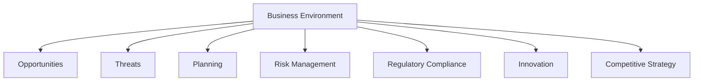
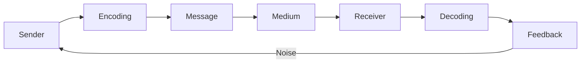
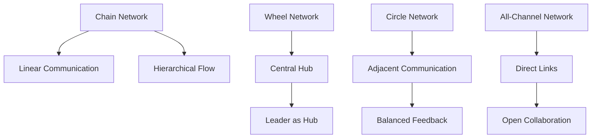

# Long Answer Questions

In this guide, you'll find a collection of essential Business Practice and Management long answer questions and their concise, exam-focused answers. These cover important questions asked in previous held exams and important questions from exam point of view.

---

### Question: Define the Business Environment. Explain the Importance of Business Environment in Decision-Making.

Answer: The **business environment** refers to the external and internal factors that influence a company’s operations and decision-making. It includes the forces, institutions, and individuals that affect the business’s activities, performance, and survival. The environment is dynamic and constantly changing, and businesses must adapt to it to remain competitive.

#### Types of Business Environment:

1. **Internal Environment**:

   - **Ownership Structure**: The legal structure of the organization, such as partnerships, corporations, or sole proprietorships.
   - **Management**: The leadership style, organizational culture, and internal policies.
   - **Resources**: Availability and management of financial, human, and physical resources.

2. **External Environment**:
   - **Micro Environment**: Factors directly impacting the company, such as suppliers, competitors, customers, and market trends.
   - **Macro Environment**: Larger societal forces that affect the business, including economic, political, legal, social, technological, and environmental factors (PESTLE).

#### Importance of Business Environment in Decision-Making:

Understanding the business environment is crucial for effective decision-making. It helps businesses adapt to challenges, seize opportunities, and plan for the future. Here’s why:

1. **Helps in Identifying Opportunities**:

   - By analyzing the external environment, businesses can identify new market trends, consumer demands, and technological advancements that can be leveraged to gain a competitive edge.
   - Example: A company that detects an emerging trend of eco-friendly products can develop and market sustainable goods.

2. **Facilitates Planning and Strategy Formulation**:

   - A business can formulate long-term strategies by understanding the potential opportunities and threats in the market. It also helps in anticipating future challenges and preparing accordingly.
   - Example: A company in the technology industry may plan for the next few years by monitoring developments in artificial intelligence and machine learning.

3. **Risk Management**:

   - The business environment helps identify potential risks like changes in government policies, economic downturns, or technological disruptions. Awareness of these risks allows businesses to make informed decisions to mitigate them.
   - Example: During a recession, businesses may cut costs, reduce investments, or delay new projects.

4. **Guides Regulatory Compliance**:

   - Understanding the legal and political environment ensures that businesses comply with national and international regulations, avoiding penalties and legal issues.
   - Example: A business involved in international trade must keep track of changing tariffs, trade agreements, and regulations.

5. **Promotes Innovation**:

   - A rapidly changing environment can inspire innovation. Businesses that keep up with technological advancements or shifts in consumer behavior are more likely to introduce new and improved products and services.
   - Example: Companies in the mobile phone industry constantly innovate with new features to cater to changing consumer preferences.

6. **Informs Competitive Strategy**:
   - The external environment provides insights into competitors’ strengths and weaknesses, which help businesses adjust their competitive strategies.
   - Example: A company can adopt a price-cutting strategy or improve its product features to stay ahead of competitors.

#### Diagram: Business Environment Influencing Decision-Making

---

### Question: Discuss the Various Forms of Business Organizations.

Answer: A business organization refers to an entity formed to carry out business activities. The structure of a business determines how it operates, its legal responsibilities, and how profits and losses are shared. There are several forms of business organizations, each with its advantages and disadvantages, depending on the needs of the business and its owners.

#### 1. Sole Proprietorship

A **sole proprietorship** is the simplest form of business organization where a single individual owns and operates the business.

- **Characteristics**:
  - The owner has complete control over the business.
  - Profits and losses are directly linked to the owner.
  - The owner is personally liable for all business debts and obligations.
  - The business does not require formal registration, making it easy to start.

- **Advantages**:
  - Simple to set up and operate.
  - Full control and decision-making power.
  - Direct receipt of profits.
  - Minimal regulatory requirements.

- **Disadvantages**:
  - Unlimited liability, which means personal assets are at risk.
  - Limited access to capital.
  - The business can be adversely affected by the owner’s personal circumstances.
  
**Example**: A local bakery owned and operated by one individual.

---

#### 2. Partnership

A **partnership** is a business organization where two or more individuals share ownership and responsibilities for managing the business. The relationship is governed by an agreement between the partners.

- **Characteristics**:
  - The partners share profits, losses, and management responsibilities.
  - Partners may have limited or unlimited liability depending on the type of partnership.
  - Common types: **General Partnership** (all partners share liability) and **Limited Partnership** (some partners have limited liability).

- **Advantages**:
  - Shared decision-making and responsibilities.
  - Access to more capital than a sole proprietorship.
  - Combined expertise and resources of partners.

- **Disadvantages**:
  - Unlimited liability for general partners.
  - Disagreements between partners can disrupt the business.
  - Limited lifespan as it depends on the partnership agreement.

**Example**: A law firm where two or more lawyers run the business together.

---

#### 3. Limited Liability Partnership (LLP)

A **Limited Liability Partnership (LLP)** combines the flexibility of a partnership with the limited liability of a corporation.

- **Characteristics**:
  - Partners have limited liability, meaning their personal assets are protected.
  - It is a legal entity separate from its owners.
  - LLPs are governed by an agreement specifying the rights, responsibilities, and profit-sharing among partners.

- **Advantages**:
  - Limited liability for all partners.
  - Flexibility in management and operation.
  - Partners are not personally liable for the debts of the business.

- **Disadvantages**:
  - More formal structure and legal compliance requirements than a partnership.
  - Profits are taxed as personal income for the partners, which can lead to higher tax burdens.

**Example**: A consulting firm formed by a group of professionals.

---

#### 4. Corporation (Company)

A **corporation** (or company) is a legal entity separate from its owners, formed under corporate law. It can be publicly or privately owned and is managed by a board of directors.

- **Characteristics**:
  - The business is a separate legal entity from its owners (shareholders).
  - Shareholders’ liability is limited to their investment in the company.
  - Corporations can raise capital by issuing shares of stock.
  - Governed by a board of directors and managed by executives.

- **Advantages**:
  - Limited liability for shareholders.
  - Ability to raise capital through the sale of stock.
  - Perpetual existence, as the company continues even if the ownership changes.
  - Easier to expand and acquire resources.

- **Disadvantages**:
  - Complex to set up and operate, with more legal and regulatory requirements.
  - Profits are subject to double taxation (corporation tax and dividend tax).
  - More formal management structure and decision-making process.

**Example**: A multinational company like Apple Inc. or Microsoft Corporation.

---

#### 5. Cooperative Society

A **cooperative** is a voluntary association of individuals who come together to meet common economic, social, and cultural needs through a jointly-owned enterprise.

- **Characteristics**:
  - Owned and controlled by its members, who have equal voting rights regardless of their investment.
  - Profits are distributed among the members based on their contribution, rather than their investment.
  - Operates on the principle of mutual help and cooperation.

- **Advantages**:
  - Democratic control by members.
  - Limited liability for members.
  - Profits are shared based on member participation, not capital contribution.
  - Encourages collective action and pooling of resources.

- **Disadvantages**:
  - Limited ability to raise capital.
  - Decision-making can be slower due to the democratic structure.
  - Members may lack business expertise.

**Example**: A dairy cooperative where local farmers pool their resources to sell milk collectively.

---

#### 6. Joint Stock Company

A **joint stock company** is a business entity that issues shares of stock to raise capital, and the shareholders are the owners of the company.

- **Characteristics**:
  - Shares can be bought and sold on the stock market.
  - Shareholders’ liability is limited to their investment in shares.
  - Managed by a board of directors elected by the shareholders.

- **Advantages**:
  - Easy access to capital through the sale of shares.
  - Limited liability for shareholders.
  - Perpetual existence.

- **Disadvantages**:
  - Extensive regulatory requirements and compliance.
  - Possible conflicts between management and shareholders.
  - Profits are taxed at the corporate level and again at the shareholder level (if dividends are paid).

**Example**: A publicly traded company like Reliance Industries or Coca-Cola.

---

### Question: Define Management. Explain its Main Characteristics. Explain Management Process in Detail.

Answer: Management is the process of planning, organizing, leading, and controlling resources to achieve organizational goals efficiently and effectively. It involves coordinating human, financial, and physical resources to fulfill the objectives of an organization.

#### Main Characteristics of Management:

1. **Goal-Oriented**:
   - Management aims to achieve specific objectives that contribute to the success of the organization. Every action taken by managers is aligned with these goals.

2. **Pervasive**:
   - Management is required in all types of organizations, whether they are large or small, profit or non-profit, and in all industries.

3. **Continuous Process**:
   - Management is an ongoing process involving planning, organizing, and controlling. These activities are repeated regularly to ensure the organization operates smoothly.

4. **Social Process**:
   - Management involves people (employees, managers, stakeholders) and focuses on their interaction, motivation, and collaboration to achieve the organizational goals.

5. **Universal**:
   - The principles and techniques of management are applicable universally across different types of organizations and cultures.

6. **Integrating Function**:
   - Management coordinates various functions (production, marketing, finance, human resources) to ensure they work together towards common objectives.

---

#### Management Process:

The management process refers to the series of actions or steps taken to plan, organize, lead, and control an organization’s resources.

1. **Planning**:
   - This is the first step in the management process, where goals are set, and strategies are formulated to achieve them. It involves identifying objectives, creating action plans, and forecasting future events.
   
   **Example**: A company plans to increase sales by 15% in the next quarter.

2. **Organizing**:
   - Organizing involves arranging resources (people, materials, technology) and tasks to achieve the planned goals. It includes defining roles, responsibilities, and the structure of the organization.
   
   **Example**: Assigning roles to employees and setting up departments such as finance, HR, and marketing.

3. **Leading**:
   - Leading is the process of motivating, guiding, and directing employees to work towards achieving organizational goals. It involves communication, leadership, and decision-making.
   
   **Example**: A manager motivating the team through regular feedback and encouragement.

4. **Controlling**:
   - Controlling involves monitoring performance, comparing it with the set goals, and taking corrective actions if necessary. It ensures that the organization is on track to achieve its objectives.
   
   **Example**: A manager reviewing quarterly sales data and taking corrective actions if sales targets are not met.

---

### Question: Explain Different Principles of Management in Detail.

Answer: Principles of management are fundamental guidelines that help managers in making decisions and handling situations efficiently and effectively. These principles were developed by various management theorists, most notably Henri Fayol. The following are the key principles of management:

---

#### 1. Division of Work
   - **Explanation**: This principle suggests that work should be divided into smaller tasks to improve efficiency. When employees specialize in specific tasks, they can become more skilled and productive.
   - **Example**: In a manufacturing plant, dividing work into specific tasks like assembly, quality check, and packaging allows workers to develop expertise in each area.

---

#### 2. Authority and Responsibility
   - **Explanation**: Authority refers to the right to give orders and make decisions, while responsibility is the obligation to complete the assigned task. Both should go hand in hand to ensure effective management.
   - **Example**: A manager has the authority to direct employees and the responsibility to ensure that tasks are completed on time.

---

#### 3. Discipline
   - **Explanation**: Discipline is the commitment to organizational rules and norms. Employees must adhere to policies, procedures, and guidelines to maintain order and achieve goals.
   - **Example**: Employees following safety protocols in a factory to prevent accidents and maintain a safe working environment.

---

#### 4. Unity of Command
   - **Explanation**: This principle states that each employee should receive orders from only one superior to avoid confusion and conflict. Multiple bosses could lead to conflicting instructions, leading to inefficiency.
   - **Example**: A factory worker reports to one supervisor, avoiding conflicting instructions from multiple managers.

---

#### 5. Unity of Direction
   - **Explanation**: This principle emphasizes that all efforts in an organization should be directed towards achieving common goals. There should be a unified plan and coordinated action.
   - **Example**: In a company, all departments such as marketing, finance, and production should align their activities towards increasing overall sales.

---

#### 6. Subordination of Individual Interest to General Interest
   - **Explanation**: The interest of the organization should always take precedence over the individual interests of employees. Personal objectives should align with organizational goals.
   - **Example**: Employees working towards team goals, even if it requires some personal sacrifices, to ensure the company’s success.

---

#### 7. Remuneration
   - **Explanation**: Compensation for work should be fair and motivating for employees. Adequate remuneration helps maintain employee satisfaction and encourages high performance.
   - **Example**: A company offers competitive salaries, bonuses, and benefits to keep employees motivated and reduce turnover.

---

#### 8. Centralization and Decentralization
   - **Explanation**: Centralization refers to decision-making being concentrated at the top of the organization, while decentralization refers to spreading decision-making across lower levels. The degree of centralization or decentralization should depend on the situation.
   - **Example**: In a centralized organization, decisions are made by top management, while in a decentralized company, middle or lower-level managers are empowered to make decisions.

---

#### 9. Scalar Chain
   - **Explanation**: This principle refers to a chain of authority that runs from the top of the organization to the bottom. The chain of command must be respected for effective communication and coordination.
   - **Example**: In an organization, communication flows from the CEO to department heads and down to the employees through the established hierarchy.

---

#### 10. Order
   - **Explanation**: This principle emphasizes the need for a systematic arrangement of people, materials, and resources to achieve efficiency. A well-organized workplace ensures that tasks can be completed smoothly.
   - **Example**: In a warehouse, tools, and materials are neatly arranged so workers can access them quickly, reducing downtime and increasing productivity.

---

#### 11. Equity
   - **Explanation**: Equity refers to fairness and justice in the treatment of employees. Managers must treat employees with kindness, fairness, and respect, creating a positive and motivating environment.
   - **Example**: Treating employees equally while ensuring promotions are based on performance rather than favoritism.

---

#### 12. Stability of Personnel
   - **Explanation**: This principle suggests that organizations should focus on reducing employee turnover and creating job stability. A stable workforce leads to greater efficiency and morale.
   - **Example**: A company that invests in employee training and career growth opportunities reduces attrition and retains experienced workers.

---

#### 13. Initiative
   - **Explanation**: Managers should encourage employees to take initiative and come up with new ideas. It leads to increased motivation, creativity, and innovation.
   - **Example**: Employees are encouraged to propose ideas for improving processes, which enhances their involvement and creativity.

---

#### 14. Esprit de Corps
   - **Explanation**: This principle emphasizes the importance of teamwork and harmony among employees. Strong relationships and cooperation foster a positive work culture.
   - **Example**: Organizing team-building activities or promoting collaboration among departments to strengthen teamwork.

---

### Question: What is MBO? Explain Its Process and Importance in Management.

Answer: **MBO (Management by Objectives)** is a strategic management model that focuses on defining clear, measurable objectives for employees, aligning them with organizational goals, and regularly evaluating performance against these objectives. It is a participative approach where both managers and employees work together to set goals, ensuring that individual and organizational objectives are aligned.

MBO was introduced by Peter Drucker in 1954 as a way to improve organizational performance through setting clear, measurable goals.

---

### Process of MBO

The process of Management by Objectives generally involves the following steps:

---

#### 1. Setting Organizational Goals
   - **Explanation**: The first step in MBO is setting broad organizational goals. These goals should be clear, specific, and achievable. The management team outlines the direction and priorities for the organization.
   - **Example**: An organization's goal could be "Increase market share by 10% within the next fiscal year."

---

#### 2. Setting Individual Objectives
   - **Explanation**: After setting organizational goals, individual objectives are set in collaboration with employees. These personal objectives should support the overall goals of the organization. The manager and employee discuss and agree on individual performance targets.
   - **Example**: A sales representative's objective could be "Achieve monthly sales target of $50,000."

---

#### 3. Action Plans
   - **Explanation**: Employees develop action plans detailing the steps they will take to achieve the set objectives. This includes resources required, strategies, and timelines for each task.
   - **Example**: A sales representative plans a strategy involving cold calls, client meetings, and follow-ups to achieve sales targets.

---

#### 4. Periodic Reviews and Feedback
   - **Explanation**: Regular progress reviews and feedback sessions between managers and employees ensure that the objectives are on track. These reviews help identify challenges, modify action plans, and improve performance.
   - **Example**: Monthly meetings between a manager and the sales representative to review progress towards sales goals and address any obstacles.

---

#### 5. Performance Evaluation
   - **Explanation**: At the end of the set period, the performance is evaluated. This involves measuring actual performance against the defined objectives. Employees are assessed on whether they have achieved their targets.
   - **Example**: A final review of the sales representative's performance to determine if they met their $50,000 target.

---

#### 6. Rewards and Recognition
   - **Explanation**: If employees meet their objectives, they are rewarded with recognition, bonuses, or promotions. This reinforces the behavior and encourages further alignment with organizational goals.
   - **Example**: The sales representative who met the target is given a bonus or recognition at a company meeting.

---

### Importance of MBO in Management

---

#### 1. Goal Clarity
   - **Explanation**: MBO provides clear, well-defined objectives for employees at all levels. This clarity ensures everyone in the organization understands their roles and responsibilities, leading to better focus and productivity.
   - **Example**: An employee knowing exactly what is expected helps them plan their work and avoid distractions.

---

#### 2. Employee Motivation and Engagement
   - **Explanation**: Involving employees in the goal-setting process motivates them to perform better. When employees see how their individual contributions align with the company's goals, they are more likely to be engaged and committed.
   - **Example**: Employees feel more accountable and motivated when they have a say in setting their goals.

---

#### 3. Performance Measurement
   - **Explanation**: MBO provides a systematic method to measure performance. The regular evaluation against clear objectives helps to assess productivity and areas of improvement.
   - **Example**: Sales representatives know that meeting their targets will be assessed, motivating them to perform better.

---

#### 4. Improved Communication
   - **Explanation**: The MBO process requires constant communication between employees and managers. This improves understanding, builds trust, and ensures that everyone is on the same page.
   - **Example**: Regular reviews allow managers to give constructive feedback and employees to discuss challenges.

---

#### 5. Better Coordination and Alignment
   - **Explanation**: MBO helps align individual goals with the organization’s objectives. This ensures that all departments and employees are working toward the same purpose, leading to better coordination.
   - **Example**: A sales team's target of increasing market share aligns with the marketing department’s goal of launching a new campaign.

---

#### 6. Objective-based Decision Making
   - **Explanation**: Since objectives are clearly defined, managers can make more objective decisions based on facts and performance metrics rather than subjective opinions.
   - **Example**: If a sales team is not meeting its target, MBO provides a basis for decision-making, such as providing additional training or support.

---

### Question: Define Motivation. Explain Different Theories of Motivation.

Answer: **Motivation** is the psychological force that drives individuals to take action to achieve specific goals. It energizes behavior, directing it toward the attainment of personal or organizational objectives. In a workplace context, motivation is crucial as it directly influences productivity, job satisfaction, and the overall performance of employees.

Motivation is both an internal and external factor, comprising intrinsic rewards (such as personal satisfaction) and extrinsic rewards (such as salary or recognition). Understanding motivation helps managers create environments that encourage employees to perform at their best.

---

### Theories of Motivation

There are several well-known theories of motivation, each providing unique insights into why people act in certain ways and how managers can leverage these insights to boost productivity and job satisfaction.

---

#### 1. Maslow's Hierarchy of Needs Theory

- **Concept**: Proposed by Abraham Maslow, this theory suggests that human needs are arranged in a hierarchy, from basic to complex. Individuals are motivated to fulfill lower-level needs before progressing to higher-level needs.
- **Hierarchy Levels**:
  1. **Physiological Needs**: Basic needs such as food, water, and shelter.
  2. **Safety Needs**: Security and stability, including job security.
  3. **Social Needs**: Relationships, love, and belonging.
  4. **Esteem Needs**: Self-respect, recognition, and status.
  5. **Self-Actualization**: Realizing personal potential and growth.
  
- **Application in Workplace**: Managers can create motivational strategies based on employees' current needs, such as job security for safety or providing development opportunities for self-actualization.

---

#### 2. Herzberg’s Two-Factor Theory

- **Concept**: Frederick Herzberg's theory, also known as the Motivation-Hygiene Theory, divides workplace factors into two categories:
  - **Hygiene Factors**: External factors that, if absent, lead to dissatisfaction (e.g., salary, work conditions, company policies).
  - **Motivators**: Internal factors that drive satisfaction and motivation, such as achievement, recognition, and responsibility.
  
- **Application in Workplace**: Managers can ensure that hygiene factors are adequate to prevent dissatisfaction and focus on motivators to boost employee engagement and motivation.

---

#### 3. McClelland’s Theory of Needs

- **Concept**: David McClelland’s theory identifies three primary needs that motivate people:
  1. **Need for Achievement (nAch)**: Desire to accomplish goals and excel.
  2. **Need for Power (nPow)**: Desire to influence and control others.
  3. **Need for Affiliation (nAff)**: Desire for close, friendly relationships.
  
- **Application in Workplace**: Managers can tailor roles to meet individual needs, such as assigning challenging tasks to high-achievers or leadership roles to those with a strong need for power.

---

#### 4. Vroom's Expectancy Theory

- **Concept**: Proposed by Victor Vroom, this theory emphasizes that individuals are motivated when they believe:
  1. **Effort** will lead to good performance.
  2. **Performance** will result in desirable rewards.
  3. The **rewards** satisfy personal goals.
  
- **Application in Workplace**: Managers can motivate employees by clearly linking performance with rewards and ensuring that the rewards align with employees’ values.

---

#### 5. Alderfer's ERG Theory

- **Concept**: Clayton Alderfer restructured Maslow's hierarchy into three categories:
  - **Existence Needs**: Basic needs like food and safety.
  - **Relatedness Needs**: Social relationships and belonging.
  - **Growth Needs**: Personal development and self-esteem.
  
- **Application in Workplace**: Managers can address employees' existence needs by providing job security, foster a team environment for relatedness, and create growth opportunities to satisfy personal development needs.

---

#### 6. McGregor’s Theory X and Theory Y

- **Concept**: Douglas McGregor categorized management views of employees into two contrasting theories:
  - **Theory X**: Assumes employees are inherently lazy, requiring strict supervision and control.
  - **Theory Y**: Believes employees are self-motivated, seek responsibility, and can be self-directed.
  
- **Application in Workplace**: Managers adopting Theory Y approaches create a more motivating work environment by trusting employees, encouraging participation, and providing opportunities for growth.

---

### Question: Define Communication. Explain Process and Types of Communication Networks.

Answer: **Communication** is the process of exchanging information, ideas, emotions, and messages between individuals or groups. In a business context, communication plays a crucial role in coordinating tasks, making decisions, resolving conflicts, and fostering a collaborative environment. Effective communication enables clear understanding and strengthens relationships within an organization.

Communication can be verbal, non-verbal, or written, and occurs both within and between organizational levels, influencing productivity, morale, and overall performance.

---

### Process of Communication

The communication process consists of several essential stages, ensuring that the intended message is understood correctly. These stages include:

1. **Sender**: The person who initiates the message, generating an idea or purpose for communication.
2. **Encoding**: The sender translates the idea into words, symbols, or gestures to form the message.
3. **Message**: The information or content conveyed by the sender.
4. **Medium**: The channel or method used to deliver the message (e.g., email, face-to-face, phone).
5. **Receiver**: The person or group to whom the message is directed.
6. **Decoding**: The receiver interprets and makes sense of the message.
7. **Feedback**: The receiver’s response, confirming if the message was understood correctly.
8. **Noise**: Any external or internal barrier that can distort or interfere with the message, such as background sounds or misunderstandings.

---

#### Diagram: The Communication Process

The success of communication depends on how well each stage is executed, minimizing misunderstandings and ensuring clarity.

---

### Types of Communication Networks

In organizations, communication networks refer to the pathways through which information flows between individuals or departments. Different network types serve various purposes and can influence organizational efficiency and culture.

---

#### 1. Chain Network

- **Structure**: Information flows in a linear sequence from one person to another.
- **Features**: Suitable for hierarchical structures where each person reports to a direct superior.
- **Example**: Communication between a team leader and team members in a top-down manner.
  
#### 2. Wheel Network

- **Structure**: All communication passes through a central person or leader who acts as the hub.
- **Features**: Effective in centralized decision-making, where the leader controls information flow.
- **Example**: In a project team, the manager acts as the central node, sharing information with each team member individually.
  
#### 3. Circle Network

- **Structure**: Each member communicates with two adjacent members, forming a circular connection.
- **Features**: Allows for more balanced communication and feedback; each person plays an equal role in sharing information.
- **Example**: Departments within an organization where each team communicates with adjacent departments.

#### 4. All-Channel (Star) Network

- **Structure**: Every member can communicate directly with every other member in the network.
- **Features**: Common in teams with open communication, fostering collaboration and quick feedback.
- **Example**: Small teams working closely together where everyone shares information freely.

---

#### Diagram: Types of Communication Networks

---

### Question: Define Control. Discuss Techniques of Control.

Answer: **Control** in management refers to the process of monitoring and regulating organizational activities to ensure they align with set goals and standards. Control helps managers detect and correct deviations from plans, measure performance, and make informed adjustments to maintain productivity and efficiency.

The control process includes setting performance standards, measuring actual performance, comparing it with the standards, and taking corrective actions if needed. It is a continuous activity that guides an organization toward achieving its objectives.

---

### Techniques of Control

Organizations use a variety of control techniques to monitor activities and ensure effective management. These techniques can be broadly classified into traditional and modern methods:

---

#### 1. Budgetary Control

- **Definition**: Budgetary control is the process of setting financial budgets, then monitoring and comparing actual financial performance against these budgets.
- **Purpose**: It helps in managing finances by establishing cost limits and providing benchmarks for expenditures and revenues.
- **Example**: Departments within a company are allocated specific budgets for operating costs, and their spending is monitored against these budgets.

---

#### 2. Financial Ratios

- **Definition**: Financial ratios are quantitative measures used to evaluate a company’s financial health and performance. Common ratios include liquidity ratios, profitability ratios, and leverage ratios.
- **Purpose**: They offer insights into financial efficiency, profitability, and solvency.
- **Example**: The debt-to-equity ratio helps assess a company's financial leverage and risk level by comparing total liabilities to shareholders' equity.

---

#### 3. Standard Costing

- **Definition**: Standard costing involves setting cost standards for products or services and comparing them with actual costs to analyze variances.
- **Purpose**: This technique identifies cost deviations and areas for cost reduction or efficiency improvement.
- **Example**: If the actual cost of manufacturing a product exceeds the standard cost, management can investigate and address the reasons for the variance.

---

#### 4. Break-even Analysis

- **Definition**: Break-even analysis determines the point at which total revenue equals total costs, meaning there is no profit or loss.
- **Purpose**: It helps businesses understand the level of sales needed to cover costs, guiding pricing and production decisions.
- **Example**: A company calculates that it needs to sell 10,000 units of its product to break even. This analysis informs sales targets.

---

#### 5. Statistical Quality Control (SQC)

- **Definition**: SQC uses statistical methods to monitor and control production quality, identifying variations in the manufacturing process.
- **Purpose**: This technique helps maintain consistent product quality, reducing defects and production waste.
- **Example**: Control charts are used to track product quality indicators over time, identifying trends that may lead to quality issues.

---

#### 6. Performance Appraisal

- **Definition**: Performance appraisal is the evaluation of employees' job performance against established standards and objectives.
- **Purpose**: This technique motivates employees, identifies training needs, and aligns individual performance with organizational goals.
- **Example**: Managers conduct annual reviews, providing feedback and setting new targets for employee improvement.

---

#### 7. Inventory Control

- **Definition**: Inventory control monitors and manages the stock levels of goods to ensure adequate supply without overstocking.
- **Purpose**: It optimizes inventory costs, ensures smooth production, and reduces the risk of stockouts or excess inventory.
- **Example**: A retailer uses the Economic Order Quantity (EOQ) model to determine optimal reorder points and minimize holding costs.

---

### Question: What is Organizing? Discuss the Significance of Organizing as a Structure and as a Process.

Answer: Organizing** in management is the process of arranging resources, people, and tasks systematically to achieve organizational goals effectively. It involves dividing work, grouping tasks, assigning responsibilities, and establishing authority relationships to create a coordinated structure.

Organizing provides a framework that helps in managing and controlling various activities, leading to effective goal attainment.

---

### Significance of Organizing

Organizing has dual significance — as a **structure** and as a **process**. Both aspects play vital roles in enhancing efficiency, fostering teamwork, and facilitating management.

---

#### 1. Organizing as a Structure

Organizing as a structure refers to the framework within which roles, responsibilities, and authority are defined. It involves setting up the formal relationships among different levels and departments in an organization. 

Significance of Organizing as a Structure:

- **Clear Chain of Command**: Establishes a hierarchy where each employee knows their role, responsibilities, and to whom they report.
- **Defines Authority and Responsibility**: Clearly outlines who is responsible for what tasks, reducing confusion and enhancing accountability.
- **Efficient Resource Utilization**: Optimizes resources (people, equipment, finances) by allocating them where they are needed most.
- **Coordination Across Functions**: Enables alignment and coordination across departments, minimizing conflicts and overlaps.
- **Organizational Stability**: Provides a stable structure that supports business continuity and adaptability to changes.

---

#### Example of Organizing as a Structure

In a manufacturing company, the organization may be structured into departments such as production, sales, finance, and HR, with each department head reporting to top management. This structure clarifies each department's purpose, the hierarchy, and roles within it.

---

#### 2. Organizing as a Process

Organizing as a process involves a series of activities for arranging resources and tasks. This process includes defining tasks, grouping them into manageable units, assigning roles, and establishing authority relationships.

Steps in the Organizing Process:

1. **Identifying Activities**: Determine the necessary tasks to achieve the organization’s objectives.
2. **Grouping Activities**: Cluster related tasks into units (departments or teams) based on their nature.
3. **Assigning Tasks**: Allocate responsibilities to individuals or teams according to their skills and the requirements of each role.
4. **Delegating Authority**: Provide managers and employees with the authority needed to carry out their tasks.
5. **Establishing Relationships**: Define reporting and coordination lines between different roles and departments.

Significance of Organizing as a Process:

- **Efficient Task Execution**: Streamlines activities to ensure all tasks are performed as planned, improving productivity.
- **Improved Communication**: Establishes clear lines of communication, reducing miscommunication and improving information flow.
- **Enhanced Adaptability**: Allows quick reallocation of resources and modification of roles in response to changing conditions.
- **Better Control and Supervision**: Helps managers monitor task progress and make adjustments as needed.

---

#### Example of Organizing as a Process

A project manager organizes a project by first listing all tasks, then grouping them into phases (e.g., design, development, testing). Tasks are assigned to team members, each given specific responsibilities and the authority to make decisions within their roles, ensuring smooth project progression.

---

