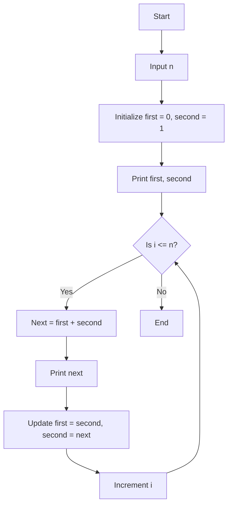

# Long Answer Questions

In this guide, you'll find a collection of essential C language long answer questions and their concise, exam-focused answers. These cover important questions asked in previous held exams and important questions from exam point of view.

---

### (i) write an Algorithm and draw flow chart to Find and Print Fibonacci Sequence.

The Fibonacci sequence is a series of numbers where each number (after the first two) is the sum of the two preceding ones. Here's the algorithm to generate the Fibonacci sequence up to `n` terms:

1. **Start**
2. Declare variables `n`, `first = 0`, `second = 1`, `next`.
3. Input the value of `n` (the number of terms to be printed).
4. Print `first` and `second`.
5. Repeat steps 6-8 for `i = 3` to `n`.
6. Calculate the next term as:  
   `next = first + second`.
7. Print `next`.
8. Update `first = second` and `second = next`.
9. End.

### Example:
For `n = 5`, the output will be: `0 1 1 2 3`

### Flowchart to Find and Print Fibonacci Sequence

Below is the flowchart that represents the algorithm:



This flowchart provides a visual representation of how the Fibonacci sequence is generated step-by-step.

Here’s a detailed explanation of data types in C along with examples, written in MDX format:

---

### (ii) What is a Data Type?

In C, a **data type** defines the type of data a variable can store, specifying the size and type of values the variable can hold. C offers several built-in data types for managing different kinds of data like integers, floating-point numbers, and characters.

### Types of Data Types in C

1. **Primitive Data Types (Basic Data Types)**
2. **Derived Data Types**
3. **User-Defined Data Types**

---

### 1. Primitive Data Types (Basic Data Types)

These are the fundamental data types provided by the C language. They define the basic characteristics of data such as integer numbers, floating-point numbers, and characters.

#### (i) Integer (`int`)

The `int` data type is used to store whole numbers (positive or negative). The size of `int` is typically 4 bytes, but it may vary depending on the system.

#### Example:
```c
int age = 25;
```

Here, `age` is an integer variable that stores the value 25.

- **Signed int**: Can store both negative and positive integers.
- **Unsigned int**: Can store only positive numbers (and zero), but with a wider range.

```c
unsigned int num = 100;  // Can store only positive integers
```

#### (ii) Character (`char`)

The `char` data type is used to store individual characters. It occupies 1 byte of memory, and each character is represented by an ASCII value.

#### Example:
```c
char grade = 'A';
```

Here, the variable `grade` stores the character 'A'.

- **Signed char**: Stores characters or small integers with negative and positive values.
- **Unsigned char**: Stores only positive characters or integers.

#### (iii) Floating-point (`float`, `double`)

These data types are used to store decimal numbers. The `float` occupies 4 bytes, while `double` (which stands for double-precision floating-point) occupies 8 bytes, allowing for more precision.

#### Example:
```c
float price = 25.75;
double distance = 123456.789123;
```

- **Float**: Stores single-precision floating-point numbers.
- **Double**: Stores double-precision floating-point numbers.

#### (iv) Void (`void`)

The `void` data type is used to indicate that a function does not return any value or that a pointer has no associated type.

#### Example:
```c
void displayMessage() {
    printf("Hello, World!");
}
```

---

### 2. Derived Data Types

Derived data types are formed using basic data types and include arrays, pointers, functions, and structures.

#### (i) Arrays

An array is a collection of elements of the same data type, stored in contiguous memory locations.

#### Example:
```c
int numbers[5] = {1, 2, 3, 4, 5};
```

Here, `numbers` is an array of integers with 5 elements.

#### (ii) Pointers

Pointers store the memory address of a variable. The pointer data type depends on the type of the variable it points to (e.g., `int*`, `char*`).

#### Example:
```c
int a = 10;
int *ptr = &a;  // Pointer storing the address of variable 'a'
```

#### (iii) Functions

A function is a block of code that performs a specific task and may or may not return a value. Functions can also accept arguments and return values of different data types.

#### Example:
```c
int sum(int a, int b) {
    return a + b;
}
```

---

### 3. User-Defined Data Types

These are data types defined by the user based on the requirements of the program. C allows users to define their own data types, such as `struct`, `union`, and `enum`.

#### (i) Structure (`struct`)

A structure is used to group different types of variables under a single name.

#### Example:
```c
struct Student {
    int id;
    char name[50];
    float grade;
};
```

Here, `Student` is a structure that contains an integer `id`, a character array `name`, and a float `grade`.

#### (ii) Union (`union`)

A union is similar to a structure, but it allows storing different data types in the same memory location. Only one member can be accessed at a time.

#### Example:
```c
union Data {
    int i;
    float f;
    char str[20];
};
```

#### (iii) Enumerations (`enum`)

An `enum` is a user-defined data type consisting of named integer constants.

#### Example:
```c
enum Days { Sunday, Monday, Tuesday, Wednesday, Thursday, Friday, Saturday };
```

Here, `Days` is an enumeration with constant values representing the days of the week.

---

### Summary of Data Types in C:

| Data Type  | Size        | Range (for 32-bit system)               | Example Declaration      |
|------------|-------------|-----------------------------------------|--------------------------|
| `int`      | 4 bytes     | -2,147,483,648 to 2,147,483,647         | `int num = 100;`          |
| `char`     | 1 byte      | -128 to 127 (signed)                    | `char letter = 'A';`      |
| `float`    | 4 bytes     | 3.4E-38 to 3.4E+38                      | `float price = 19.99;`    |
| `double`   | 8 bytes     | 1.7E-308 to 1.7E+308                    | `double distance = 1234.56;` |
| `void`     | 0 bytes     | No value                                | `void display();`         |

---

### (iii) What is an Operator?

An **operator** in C is a symbol that tells the compiler to perform specific mathematical, relational, or logical operations on one or more operands. Operators are fundamental in programming as they enable developers to manipulate data and variables effectively. 

### Types of Operators in C

C language includes several types of operators, categorized based on their functionality. The major types are:

1. **Arithmetic Operators**
2. **Relational Operators**
3. **Logical Operators**
4. **Bitwise Operators**
5. **Assignment Operators**
6. **Conditional (Ternary) Operator**
7. **Special Operators**

---

### 1. Arithmetic Operators

Arithmetic operators are used to perform mathematical calculations.

| Operator | Description           | Example               |
|----------|-----------------------|-----------------------|
| `+`      | Addition              | `a + b`               |
| `-`      | Subtraction           | `a - b`               |
| `*`      | Multiplication        | `a * b`               |
| `/`      | Division              | `a / b`               |
| `%`      | Modulus (Remainder)   | `a % b`               |

#### Example:
```c
int a = 10, b = 3;
int sum = a + b;         // sum = 13
int remainder = a % b;   // remainder = 1
```

### 2. Relational Operators

Relational operators are used to compare two values. They return either true (1) or false (0).

| Operator | Description           | Example               |
|----------|-----------------------|-----------------------|
| `==`     | Equal to              | `a == b`              |
| `!=`     | Not equal to          | `a != b`              |
| `>`      | Greater than          | `a > b`               |
| `<`      | Less than             | `a < b`               |
| `>=`     | Greater than or equal | `a >= b`              |
| `<=`     | Less than or equal    | `a <= b`              |

#### Example:
```c
if (a > b) {
    printf("a is greater than b");
}
```

### 3. Logical Operators

Logical operators are used to combine multiple boolean expressions.

| Operator | Description           | Example               |
|----------|-----------------------|-----------------------|
| `&&`     | Logical AND           | `a && b`              |
| `||`     | Logical OR            | `a || b`              |
| `!`      | Logical NOT           | `!a`                  |

#### Example:
```c
if (a > b && a > 0) {
    printf("a is positive and greater than b");
}
```

### 4. Bitwise Operators

Bitwise operators perform operations on bits and are used to manipulate binary numbers.

| Operator | Description           | Example               |
|----------|-----------------------|-----------------------|
| `&`      | Bitwise AND           | `a & b`               |
| `|`      | Bitwise OR            | `a | b`               |
| `^`      | Bitwise XOR           | `a ^ b`               |
| `~`      | Bitwise NOT           | `~a`                  |
| `<<`     | Left Shift            | `a << 2`              |
| `>>`     | Right Shift           | `a >> 2`              |

#### Example:
```c
int a = 5;  // 0101 in binary
int b = 3;  // 0011 in binary
int result = a & b; // result = 1 (0001 in binary)
```

### 5. Assignment Operators

Assignment operators are used to assign values to variables. The basic assignment operator is `=`.

| Operator | Description                     | Example               |
|----------|---------------------------------|-----------------------|
| `=`      | Simple assignment               | `a = b`               |
| `+=`     | Add and assign                  | `a += b` (same as `a = a + b`) |
| `-=`     | Subtract and assign             | `a -= b` (same as `a = a - b`) |
| `*=`     | Multiply and assign             | `a *= b` (same as `a = a * b`) |
| `/=`     | Divide and assign               | `a /= b` (same as `a = a / b`) |
| `%=`     | Modulus and assign              | `a %= b` (same as `a = a % b`) |

#### Example:
```c
int a = 10;
a += 5;  // a = 15
```

### 6. Conditional (Ternary) Operator

The conditional operator is a shorthand way of expressing conditional statements. It takes three operands.

#### Syntax:
```c
condition ? expression_if_true : expression_if_false;
```

#### Example:
```c
int a = 5, b = 10;
int max = (a > b) ? a : b;  // max = 10
```

### 7. Special Operators

These include operators like sizeof, comma, pointer, and member selection operators.

| Operator | Description                     | Example               |
|----------|---------------------------------|-----------------------|
| `sizeof` | Returns the size of a data type| `sizeof(int)`         |
| `,`      | Comma operator                  | `a = (b = 3, b + 2)`  |
| `->`     | Member selection (pointer)      | `ptr->member`         |
| `.`      | Member selection                | `structVar.member`    |

#### Example:
```c
int size = sizeof(a);  // Returns the size of variable 'a'
```

