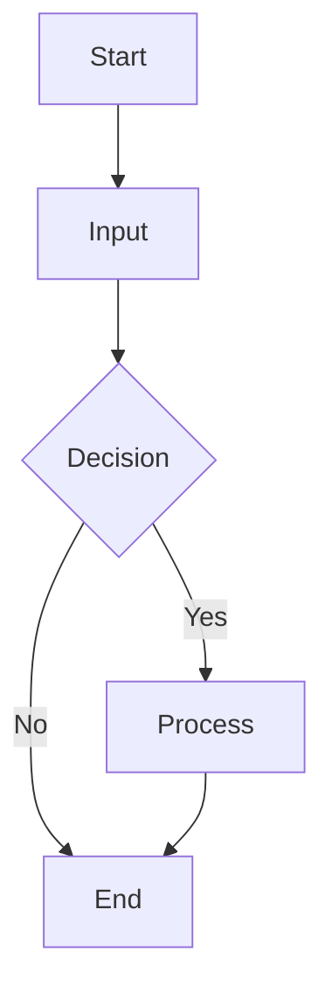
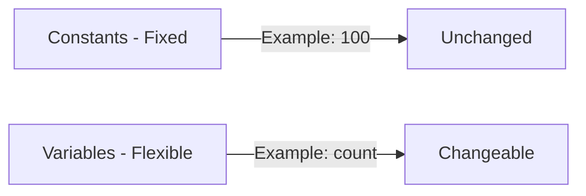
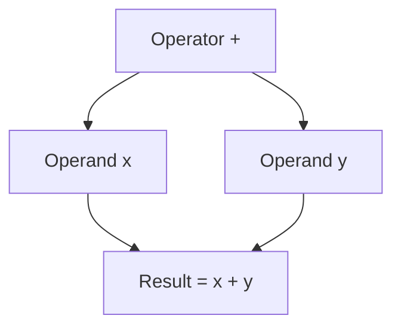
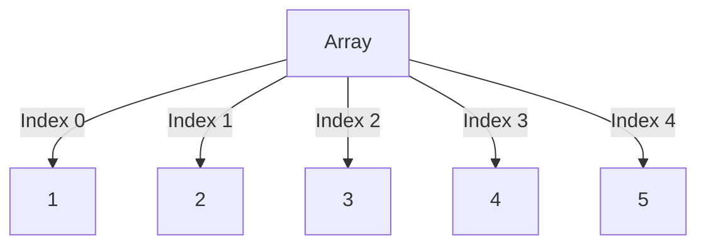

# Short Answer Questions

In this guide, you'll find a collection of essential C language short answer questions and their concise, exam-focused answers. These cover important questions asked in previous held exams and important questions from exam point of view.

---

### Question: Why is C called a structured language?

Answer: C is called a structured language because it promotes a systematic approach to program design using functions, loops, and conditionals. This organization allows developers to break down complex problems into manageable modules, facilitating code reusability and maintainability. Structured programming avoids the use of `goto` statements, providing clearer control flow, which enhances program readability.

#### Example:

```c
#include <stdio.h>

void displayMessage() {
    printf("Hello, world!\n");
}

int main() {
    displayMessage();
    return 0;
}
```

This program demonstrates how a function is used to structure the code.

---

### Question: What are the different symbols of a flowchart?

Answer: 
1. **Oval (Terminator)**: Represents the Start and End points of a process.
2. **Rectangle (Process)**: Indicates a process, action, or instruction that needs to be performed.
3. **Diamond (Decision)**: Represents a decision point that branches the flow based on a condition (Yes/No).
4. **Parallelogram (Input/Output)**: Used for input or output operations, like reading data or displaying results.
5. **Arrow (Flow Line)**: Shows the direction of the flow of control between symbols.

#### Example Flowchart:



Flowcharts are essential for visualizing algorithms and understanding the logical flow of a program.

---

### Question: Differentiate between constant and variable.

Answer:
- **Constant**: A constant is a fixed value that remains unchanged throughout the program. For example, in C, a constant can be declared using the `const` keyword:
  ```c
  const int maxUsers = 100;
  ```

- **Variable**: A variable is a symbolic name for a storage location that can hold different values during program execution. For example:
  ```c
  int count = 0;
  count = 5; // Variable updated
  ```

#### Summary:

- Constants provide stability, while variables allow for flexibility in code.
  


---

### Question: Explain what is an operand? What is its relationship with operators?

Answer: An **operand** is a quantity on which an operator performs an action in an expression. In the expression `a + b`, both `a` and `b` are operands, and `+` is the operator that defines the addition operation.

#### Example:

```c
int x = 10;
int y = 5;
int result = x + y; // x and y are operands, + is the operator
```

Operands can be variables, constants, or more complex expressions, while operators define the type of operation (arithmetic, relational, logical, etc.) to be performed on those operands.

#### Common Operators:
- **Arithmetic Operators**: `+`, `-`, `*`, `/`
- **Relational Operators**: `==`, `!=`, `<`, `>`



Thus, operands and operators work together to form expressions that produce results.

---

### Question: Is it possible to declare and initialize an array in C simultaneously? If yes, how?

Answer: Yes, it is possible to declare and initialize an array in C simultaneously. This can be achieved using the following syntax:

```c
int arr[5] = {1, 2, 3, 4, 5};
```

In this example, an integer array named `arr` is declared with a size of 5 and initialized with the values 1 through 5. The size can also be omitted during initialization, and the compiler will automatically determine the size:

```c
int arr[] = {1, 2, 3, 4, 5};  // Compiler infers the size as 5
```

#### Diagram:



Simultaneous declaration and initialization ensure that the array is properly set up with known values at the outset, which helps with efficient memory allocation.

---

### Question: What are the characteristics of C language?

Answer:
1. **Structured Language**: C supports breaking programs into functions, enabling modularity.
2. **Low-Level Access**: It provides access to hardware via pointers and direct memory manipulation.
3. **Portable**: Programs written in C can be compiled and executed on different platforms with minimal changes.
4. **Efficient and Fast**: C programs are compiled to machine code, ensuring faster execution.
5. **Rich Standard Library**: C offers extensive libraries that simplify programming tasks.
6. **Procedural Language**: C emphasizes procedure (function) calls, facilitating code organization.

---

### Question: What are Identifiers?

Answer: Identifiers in C are names given to variables, functions, arrays, or user-defined types. They must begin with a letter or an underscore, followed by alphanumeric characters. Identifiers are case-sensitive, and they must not match C keywords like `int`, `if`, or `return`.

#### Example:

```c
int age;  // 'age' is an identifier
```

---

### Question: Explain Break Statement.

Answer: A `break` statement in C is used to exit a loop (`for`, `while`, `do-while`) or a `switch` block prematurely. When the `break` statement is executed, control passes to the first statement following the loop or switch block, stopping further iteration.

#### Example:

```c
for (int i = 0; i < 10; i++) {
    if (i == 5) {
        break;  // Loop terminates when i equals 5
    }
}
```

---

### Question: Differentiate between formal argument and actual argument.

Answer:
- **Formal Argument**: Variables defined in a function’s declaration, which receive values when the function is called.
- **Actual Argument**: The real values or variables passed to a function at the time of the function call.

#### Example:

```c
void sum(int a, int b) {  // 'a' and 'b' are formal arguments
    // function body
}

sum(5, 10);  // 5 and 10 are actual arguments
```

---

### Question: What are Escape Sequences?

Answer: Escape sequences in C are special character combinations starting with a backslash (`\`), used to represent non-printable or special characters in a string or character. Common escape sequences include:
- `\n` : Newline
- `\t` : Tab
- `\\` : Backslash
- `\'` : Single Quote

#### Example:

```c
printf("Hello\nWorld");  // Prints 'Hello' and moves to a new line before printing 'World'
```